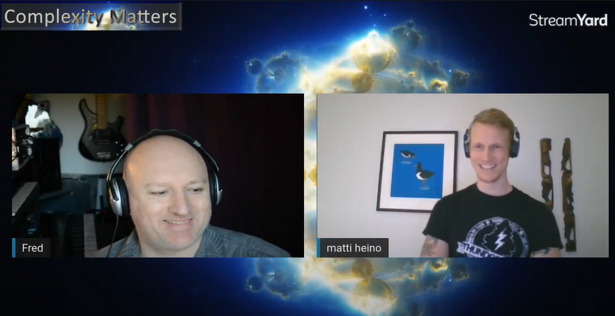
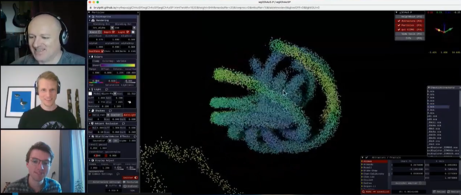

*On [Fred Hasselman](https://complexity-methods.github.io/)'s initiative, we started a new show where we host a live-streamed discussion on complexity topics. I will gather a list of episodes with synopses in this post.*

Note: [The next episode](https://youtu.be/kWvalC2at2E) is scheduled to take place on 12 January at 12:30 CET, when we interrogate [Travis Wiltshire](https://scholar.google.com/citations?hl=en&user=JFjMvx0AAAAJ&view_op=list_works&sortby=pubdate) on issues regarding team dynamics!

**S01E01: [Complexity in psychological self-ratings](https://www.youtube.com/watch?v=3bhsEUTBT4Y&feature=youtu.be).**

https://www.youtube.com/watch?v=3bhsEUTBT4Y&feature=youtu.be

We discussed Merlijn Olthof's new paper [Complexity in psychological self-ratings: implications for research and practice](https://doi.org/10.1186/s12916-020-01727-2). Links are found in video comments on the YouTube page, but here are some extras:

- Fabian Dablander's [talk on early warning signals](https://www.youtube.com/watch?v=055Ou_aqKUQ).
- [Santa Fe Institute's Complexity Explorer](https://www.complexityexplorer.org/) with great courses on the topic (more general than psychology-related). See especially anything by David Feldman (videos on their [YouTube channel](https://www.youtube.com/user/ComplexityExplorer/playlists), too).
- Paper mentioned: [Multifractality Versus (Mono-) Fractality as Evidence of Nonlinear Interactions Across Timescales: Disentangling the Belief in Nonlinearity From the Diagnosis of Nonlinearity in Empirical Data](https://doi.org/10.1080/10407413.2017.1368355)
- The [R package casnet](https://fredhasselman.com/casnet/) (*An R toolbox for studying Complex Adaptive Systems and NETworks*) was mentioned; you can do a whole bunch of cool stuff with it.
- Matti's paper (preprint updated recently with transition networks): [Studying behaviour change mechanisms under complexity](https://psyarxiv.com/fxgw4/).
- Some [resources on machine learning and dynamical systems here](http://www.fields.utoronto.ca/activities/20-21/dynamical) (thanks Travis Wiltshire for pointing it out!)

*Additional resources:*

- [Lectures from a mini-course](http://www.mattiheino.com/complexity-channel) and a reading list (see bottom of post)
- [Talks from a symposium](http://www.mattiheino.com/besp) on complexity in behaviour change matters
- [Course slides](http://www.mattiheino.com/carma) from CARMA: Critical Appraisal of Research Methods and Analysis
- [Me interviewing Fred Hasselman](http://www.mattiheino.com/interaction-not-interaction) on issues regarding mediation, moderation and interaction

