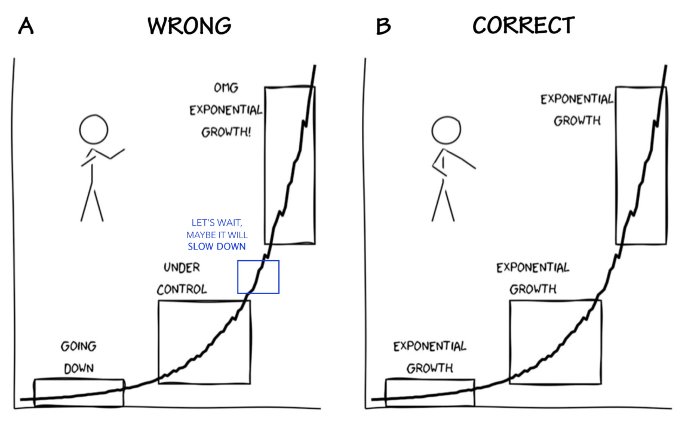

*This is a series of five videos (in Finnish), outlining what I currently consider the most important facets of Finnish pandemic preparedness.* *Also published at motivationselfmanagement.com*

*PÄIVITYS 27.03.2021:* Ennustan, että tulemme poistamaan rajoitukset liian aikaisin, mikä johtaa alla esitetyn mukaisesti uusiin ongelmiin, yllätyksiin ja viivästyksiin epidemian poistamisessa Suomesta. Mikäli tälle ennustukselle haluaa laittaa kapuloita rattaisiin, voi käydä allekirjoittamassa [uuden kansalaisaloitteen](https://www.kansalaisaloite.fi/fi/aloite/8215) (en ole itse ollut mukana sen laatimisessa).

---

Videoissa alla selitän asiat, jotka näen tärkeimpinä ja tieteellistä tarkastelua parhaiten kestävinä näkökulmina suomalaiseen pandemiavasteeseen. Näkemykset eivät ole Behaviour Change & Well-being -tutkimusryhmän, Valtioneuvoston kanslian käyttäytymistieteellisen neuvonantoryhmän, tai Citizen Shield -pandemiavalmiushankkeen virallisia kantoja.

**Osa 0: Johdatus käyttäytymiseen, järjestelmiin ja keskinäisriippuvaisuuteen.**

https://youtu.be/DydnLD1LBwE

**Osa 1: Leveysrajoitteisista hännistä.**

https://youtu.be/IaO1BmDZ01s

**Osa 2: Noususta, tuhosta ja oikea-aikaisuudesta.** *[Erratum: Eksponentiaalisen kasvun/laskun selityksessä pitäisi tarkalleen ottaen olla ison R:n sijaan pieni r – kyseessä siis eksponentiaalisen yhtälön r-kasvuparametri, ei tartuttavuusluku R0]*

https://youtu.be/x-KeDA2e0Uk

Tässä vielä yksi pointti siitä, miten kasvu hahmotetaan ([lähde](https://twitter.com/yaneerbaryam/status/1378394306390679554/photo/1)):

**Osa 3: Ikävien yllätysten minimoinnista.**

https://youtu.be/HmfA6dmc1jk

**Osa 4: Resilienssistä ja yhteenveto.**

https://youtu.be/tS9n7lxqYdU

Videoissa mainittu tilannekuvaa ylläpitävä verkkosivu:

[epidemia.fi](http://pandemia.fi)

Relevantteja blogipostauksia:

- [Itseohjautuvat kansalaiset, kriisinkestävä yhteiskunta](https://mattiheino.com/2020/08/17/itseohjautuvuus/)
- [Suomen tie ulos kriisistä](https://mattiheino.com/2020/05/04/bar-yam/)
- [Suomenkielisiä työkaluja COVID-19 taisteluun; yksilöille, yrityksille ja päätöksentekijöille](https://mattiheino.wordpress.com/2020/03/24/koronavirus-suomeksi/)
- [How uncertainty makes decisions easier, not harder](https://www.motivationselfmanagement.com/2020/09/15/uncertainty/)
- [Mindfulness for burning cities and viral pandemics](https://www.motivationselfmanagement.com/2020/03/01/mindfulness-face/)

**Kanadan tilanteesta:**

https://www.canada.ca/en/public-health/services/diseases/2019-novel-coronavirus-infection/latest-travel-health-advice.html

https://travel.gc.ca/travel-covid

**Mainittuja/relevantteja julkaisuja:**

0. Cirillo, P. & Taleb, N. N. Tail risk of contagious diseases. *Nature Physics* **16**, 606–613 (2020).

1.Rauch, E. M. & Bar-Yam, Y. Long-range interactions and evolutionary stability in a predator-prey system. Phys. Rev. E 73, 020903 (2006).

2.Kollepara, P. K., Siegenfeld, A. F., Taleb, N. N. & Bar-Yam, Y. Unmasking the mask studies: why the effectiveness of surgical masks in preventing respiratory infections has been underestimated. arXiv:2102.04882 [q-bio] (2021).

3.Siegenfeld, A. F. & Bar-Yam, Y. The impact of travel and timing in eliminating COVID-19. Communications Physics 3, 1–8 (2020).

4.Taleb, N. N., Bar-Yam, Y. & Cirillo, P. On single point forecasts for fat-tailed variables. International Journal of Forecasting (2020) doi:10/ghgvdx.

5.Siegenfeld, A. F., Taleb, N. N. & Bar-Yam, Y. Opinion: What models can and cannot tell us about COVID-19. PNAS (2020) doi:10.1073/pnas.2011542117.

6.Wong, V., Cooney, D. & Bar-Yam, Y. Beyond Contact Tracing: Community-Based Early Detection for Ebola Response. PLoS Currents (2016) doi:10.1371/currents.outbreaks.322427f4c3cc2b9c1a5b3395e7d20894.

7.Shen, C., Taleb, N. N. & Bar-Yam, Y. Review of Ferguson et al ‘Impact of non-pharmaceutical interventions...’ (2020).

**Kirjallisuutta eliminaatio-/segmentaatiostrategiasta:**

1.Geoghegan, J. L., Moreland, N. J., Le Gros, G. & Ussher, J. E. New Zealand’s science-led response to the SARS-CoV-2 pandemic. Nat Immunol 22, 262–263 (2021).

2.The Lancet Infectious Diseases. The COVID-19 exit strategy—why we need to aim low. The Lancet Infectious Diseases S1473309921000803 (2021) doi:10/gh4kvk.

3.Morell, M., Estrada, K., Dominguez, E., Perez, A. & Montesino, D. The Efficacy of Long-Term Elimination Efforts: A Case Study on New Zealand’s SARS. 20.

4.Baker, M. G., Kvalsvig, A. & Verrall, A. J. New Zealand’s COVID‐19 elimination strategy. Medical Journal of Australia 213, 198 (2020).

5.Summers, D. J. et al. Potential lessons from the Taiwan and New Zealand health responses to the COVID-19 pandemic. The Lancet Regional Health - Western Pacific 4, 100044 (2020).

6.Heywood, A. E. & Macintyre, C. R. Elimination of COVID-19: what would it look like and is it possible? The Lancet Infectious Diseases 20, 1005–1007 (2020).

7.Wilson, N., Boyd, M., Kvalsvig, A., Chambers, T. & Baker, M. Public Health Aspects of the Covid-19 Response and Opportunities for the Post-Pandemic Era. pq 16, (2020).

8.Elimination of covid-19. A practical roadmap by segmentation. m4907 (2021).

9.Priesemann, V. et al. An action plan for pan-European defence against new SARS-CoV-2 variants. The Lancet S0140673621001501 (2021) doi:10/ghtzqn.

10.Sachs, J. D. et al. Lancet COVID-19 Commission Statement on the occasion of the 75th session of the UN General Assembly. The Lancet 396, 1102–1124 (2020).

11.Lee, A., Thornley, S., Morris, A. J. & Sundborn, G. Should countries aim for elimination in the covid-19 pandemic? BMJ 370, m3410 (2020).

12.Blakely, T. et al. The probability of the 6‐week lockdown in Victoria (commencing 9 July 2020) achieving elimination of community transmission of SARS‐CoV‐2. Medical Journal of Australia 213, 349 (2020).

13.Priesemann, V. et al. Calling for pan-European commitment for rapid and sustained reduction in SARS-CoV-2 infections. The Lancet 397, 92–93 (2021).

14.Baker, M. G., Wilson, N. & Blakely, T. Elimination could be the optimal response strategy for covid-19 and other emerging pandemic diseases. BMJ 371, m4907 (2020).

15.Blakely, T., Thompson, J., Bablani, L., Andersen, P., Ouakrim, D. A., Carvalho, N., Abraham, P., Boujaoude, M.-A., Katar, A., Akpan, E., Wilson, N., & Stevenson, M. (2021). Determining the optimal COVID-19 policy response using agent-based modelling linked to health and cost modelling: Case study for Victoria, Australia. MedRxiv, 2021.01.11.21249630. https://doi.org/10/gjh8x5
