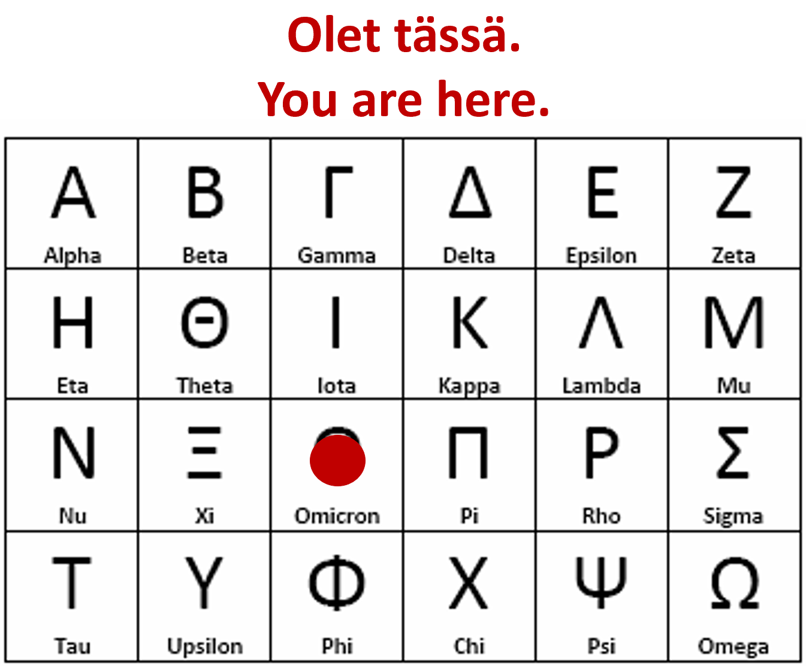

*This post lays out, in a nutshell, why I care about pandemics and how I think we should reasonably treat them.*

*Päivitys 23.12.2021:* Alkuperäinen kirjoitus oli kesäkuussa 2021. Kirjoitus tarkastettu tällä päivämäärällä, ja todettu entistäkin ajankohtaisemmaksi (päivitetty ainoastaan Olet tässä -kuva).

**Kysymys:** *Miksi pandemioista pitäisi välittää?*

**Vastaus:** Tiedämme, että historiallisesti pandemioiden kuolonuhrit noudattavat äärimmäisen paksuhäntäistä todennäköisyysjakaumaa (esim. GPD-jakaumasta\* todennäköisyys yli miljardin kuolonuhrin pandemialle ~1%).

(\*parametrit: xi = 1.62, mu = 0, beta = 1.1747 \* 10^6; ks. [tämä](https://www.nature.com/articles/s41567-020-0921-x))

Tiedämme myös, että riskiarvio on alakanttiin, koska globaali verkostoituneisuus on viimeisen 100 vuoden aikana lisääntynyt räjähdysmäisesti. Tämä lisää erilaisten dominoefektien todennäköisyyttä, jolloin seuraukset voivat olla tuhoisat (ks. esim. [tämä](https://www.nature.com/articles/s41599-020-0403-x) tai [tämä](https://www.sciencedirect.com/science/article/pii/S1462901120308637)). Koronapandemia oli tätä taustaa vasten erinomainen valmiusharjoitus, sillä se ei pyyhkinyt suurta osaa ihmiskuntaa planeetalta – mikä on pitkällä tähtäimellä paitsi mahdollista, myös todennäköistä, mikäli kaikkialta pääsee kaikkialle kaiken aikaa (ks. [tämä](https://link.aps.org/doi/10.1103/PhysRevE.73.020903)).

**Kysymys:** *Mitä tarkoitat, kun sanot "vanha normaali"?*

**Vastaus:** Tarkoitan 1900-luvun loppupuolella kehittynyttä mielialaa, jossa ajateltiin, että 1) pandemioista ei tarvitse välittää ja 2) naiivi skientismi on ([epävarmuustekijöiden myöntämisen ja kontrolloinnin sijaan](https://motivationselfmanagement.com/uncertainty)) ratkaisu käytännössä kaikkiin ihmiskuntaa kohtaaviin ongelmiin.

**Kysymys:** *Mitä tarkoitat, kun sanot "uusi normaali"?*

**Vastaus:** Tarkoitan tilannetta, jossa yhteiskunnan jatkuvuus varmistetaan, jotta voidaan nauttia saavutetuista eduista kuten vapaudesta, terveydestä ja hyvästä elämästä.

**Kysymys:** *Miltä tämä sitten näyttäisi?*

**Vastaus:** Jokapäiväinen elämä näyttäisi samalta kuin vuonna 2019, lukuunottamatta sitä, että aggressiivisten tartuntatautien esiintymisalueille matkustavien tulisi palatessaan käydä luotettavassa testissä tai viettää aikaa esim. karanteenihotellissa. Meillä olisi lisäksi arsenaalissamme *irtikytkeytymiskyvykkyyttä*: uusien, vakavien patogeenien ilmaantuessa jossain päin maailmaa, voisimme pystyttää palomuureja globaalin virusverkoston oville. Tämä pitäisi voida tehdä mahdollisimman vähän ihmisten elämää ja yhteiskunnan toimintoja häiriten – tavoitteena olisi, ettei se näkyisi millään tapaa jokapäiväisessä elämässä (rajojen yli säännöllisesti esim. työnsä vuoksi liikkuvat voisivat jatkaa liikkumista haettuaan siihen luvan).

Irtikytkeytyminen olisi aina väliaikaista ja sitä lyhyempää, mitä nopeammin uhkaavan patogeenin riskiarviointi saataisiin tehtyä. Sen hyväksyttävyyttä tulisi arvioida kuuntelemalla kaikkia kansan sosioekonomisia luokkia: ei ole lainkaan itsestäänselvää, että varakkaiden tulisi voida matkustaa (aina, kaikkialle, ja kaiken aikaa), mikäli se tarkoittaa haavoittuvampien ryhmien elämän merkittävää häiriintymistä (esim. kirjastojen ja muiden julkisten palveluiden sulku, tulonmenetykset ja vaikeasti toteutettavat etätyövaatimukset, jne.)

Käytännössä tämä tarkoittaisi hälytysjärjestelmää, jonka lauetessa testausta ja karanteeneja otettaisiin käyttöön mieluummin liian nopeasti kuin liian hitaasti, sillä mikäli järjestelmä pettää ja uusi patogeeni pääseekin maahan, kansalaisten elämä häiriintyy mahdollisesti hyvinkin merkittävästi (ks. vuoden 2020 keväällä alkanut sulkujojoilu läntisellä pallonpuoliskolla). Toisin sanoin: liikkumis- ja muut rajoitukset maan sisällä ovat seurausta rajatoimien epäonnistumisesta.

> Liikkumis- ja muut rajoitukset maan sisällä ovat seurausta rajatoimien epäonnistumisesta.

Atlantinpuolisessa Kanadassa, Australiassa ja Uudessa-Seelannissa on viimeisen reilun vuoden aikana kehitetty toimintamalleja tämän toteuttamiseksi, ja aiheesta opitaan koko ajan lisää. Suomesta koronavirus on käytännössä eliminoitu useita kertoja – muualla maassa tosin HUS:ia tehokkaammin – joten tähän on meillä moniin maihin nähden hyvät edellytykset. Rajoituksia täälläkin on kuitenkin jouduttu jatkamaan, koska niiden aiheuttama vaivannäkö on ehkä arvioitu pienemmäksi, kuin rajojen terveysturvallisuuden turvaamisen aiheuttama vaivannäkö.

**Kysymys:** *Kuulostaa kamalan hankalalta ja meillähän on jo rokote?*

**Vastaus:** Olen huolissani neljästä asiasta, mikäli [eliminaatio-/segmentaatiostrategiaa](https://www.youtube.com/watch?v=BG2cvShKpk4) ei oteta käyttöön, tai irtikytkeytymiskyvykkyyttä aleta pikimmiten rakentamaan:

1. Uudet variantit. Kuinka kauan haluamme tanssia uusien boosteri- ja kausirokotusten kanssa toivoen, että sellainen voittaa kilpajuoksun uutta virusvarianttia vastaan?
2. Pitkä COVID. Mitä riskeeraamme altistamalla rokottamattomat ihmisryhmät taudille?
3. Kansalaisvaltioiden lisääntynyt riippuvuus lääkeyhtiöjättiläisistä. Onko se toivottavaa?
4. Seuraava pandemia. Jos emme muuta mitään, kuinka paljon haluamme lyödä vetoa sen puolesta, että saamme ensi kerralla rokotteen ennen kuin korjaamaton vahinko on tapahtunut?

Kuten THL:n seminaarissa [esitin](https://twitter.com/Heinonmatti/status/1406631493783412738), meidän tulisi tehdä kansana päätöksiä siitä, millaisia arvoja haluamme toteuttaa pandemiauhkien kanssa toimiessa. Kun tämä on yhdessä sovittu, pienemmille yksiköille (AVIt, maakunnat, kaupungit, kylät, naapurustot, perheet, yksilöt) täytyy antaa autonomiaa toteuttaa koonsa puolesta omaan vaikutuspiirinsä kuuluvia käytännön torjuntatoimien toteutuksia, omia vahvuuksiaan hyödyntäen. Mutta parasta olisi, jos proaktiivinen ja tehokas viranomaisvaste pääosiltaan poistaisi kansalaisten *tarpeen* käyttää omia resurssejaan tartuntataudin selättämiseksi.

Haluan korostaa, että tämä ei ole mikään *"Rajatkii!"*-sotahuuto. Esimerkiksi verkostotieteen pohjalta voidaan kylmän viileästi tehdä johtopäätös, että resilienttien järjestelmien osat eivät ole kaikki yhteydessä toisiinsa kaiken aikaa (ks. esim. [tämä](http://www.sciencemag.org/cgi/doi/10.1126/science.1225244)). Mika Salmisen [sanoin](https://www.mtvuutiset.fi/artikkeli/thl-n-salmiselta-suorat-sanat-hallituksen-kaavailemasta-maahantulomallista-tassahan-tuli-meidan-rajamallimme-testattua/8180144#gs.4h7wx2): *Eihän korona itsestään mistään ilmesty, vaan rajojen yli se tulee.*

Kiinnostuneille tutkimusviitteitä alla.

Tässä vielä 3,5 minuuttia pähkinänkuorta siitä, mitä "laipiointi" eliminaatio- / segmentaatiostrategiassa tarkoittaa. Video on pätkä [Arjen Resilienssi -webinaarista](https://blogi.thl.fi/elamaa-koronaviruksen-kanssa-nelja-keinoa-vahvistaa-arjen-resilienssia-pandemiassa/); sanon siinä tartuntojen olevan menossa kohti nollaa, koska tapahtuma oli ennen kesäkuun lopun deltaorgioita.

https://www.youtube.com/watch?v=BG2cvShKpk4

**Lukemistoa:**

- Baker, M. G., Wilson, N., & Blakely, T. (2020). Elimination could be the optimal response strategy for covid-19 and other emerging pandemic diseases. BMJ, 371, m4907. <https://doi.org/10/ghqk9h>
- Balsa-Barreiro, J., Vié, A., Morales, A. J., & Cebrián, M. (2020). Deglobalization in a hyper-connected world. Nature Palgrave Communications, 6(1), 1–4. <https://doi.org/10/gjfxwz>
- Flyvbjerg, B. (2020). The law of regression to the tail: How to survive Covid-19, the climate crisis, and other disasters. Environmental Science & Policy, 114, 614–618. <https://doi.org/10/gjkjwz>
- Hansson, S. O. (2004). Fallacies of risk. Journal of Risk Research, 7(3), 353–360. <https://doi.org/10/c7567q>
- Horton, R. (2021). Offline: The case for No-COVID. *Lancet*, *397*(10272), 359. <https://doi.org/10.1016/S0140-6736(21)00186-0>
- Hyvönen, A.-E., Juntunen, T., Mikkola, H., Käpylä, J., Gustafsberg, H., Nyman, M., Rättilä, T., Virta, S., & Liljeroos, J. (2019). Kokonaisresilienssi ja turvallisuus: Tasot, prosessit ja arviointi [Raportti]. Valtioneuvoston kanslia. <https://julkaisut.valtioneuvosto.fi/handle/10024/161358>
- Iwata, K., & Aoyagi, Y. (2021). Elimination of covid-19: A practical roadmap by segmentation. BMJ, n349. <https://doi.org/10/gjqpxt>
- Käyttäytymistieteellisen neuvonantohankkeen työryhmä. (2021). Vaikuttavat valinnat päätöksenteon tukena: Käyttäytymistieteellinen neuvonanto -hankkeen loppuraportti [Sarjajulkaisu]. Valtioneuvoston kanslia. <https://julkaisut.valtioneuvosto.fi/handle/10024/163138>
- Matti TJ Heino, Markus Kanerva, Maarit Lassander, & Ville Ojanen. (2021). Koronaväsymystä? Vai inhimillistä kyllästymistä, turhautumista, tottumista ja pyrkimystä normaaliin (Käyttäytymistieteellisen neuvonantoryhmän raportteja). <https://vnk.fi/hanke?tunnus=VNK127:00/2020>
- Martela, F., Hankonen, N., Ryan, R. M., & Vansteenkiste, M. (2020). Motivating Voluntary Compliance to Behavioural Restrictions: Self-Determination Theory–Based Checklist of Principles for COVID-19 and Other Emergency Communications. *European Review of Social Psychology*. 10.1080/10463283.2020.1857082
- Morales, A. J., Norman, J., & Bahrami, M. (Toim.). (2021). COVID-19: A Complex Systems Approach. STEM Academic Press. <https://stemacademicpress.com/stem-volumes-covid-19>
- Priesemann, V., Balling, R., Brinkmann, M. M., Ciesek, S., Czypionka, T., Eckerle, I., Giordano, G., Hanson, C., Hel, Z., Hotulainen, P., Klimek, P., Nassehi, A., Peichl, A., Perc, M., Petelos, E., Prainsack, B., & Szczurek, E. (2021). An action plan for pan-European defence against new SARS-CoV-2 variants. The Lancet, S0140673621001501. <https://doi.org/10/ghtzqn>
- Priesemann, V., Brinkmann, M. M., Ciesek, S., Cuschieri, S., Czypionka, T., Giordano, G., Gurdasani, D., Hanson, C., Hens, N., Iftekhar, E., Kelly-Irving, M., Klimek, P., Kretzschmar, M., Peichl, A., Perc, M., Sannino, F., Schernhammer, E., Schmidt, A., Staines, A., & Szczurek, E. (2021). Calling for pan-European commitment for rapid and sustained reduction in SARS-CoV-2 infections. The Lancet, 397(10269), 92–93. <https://doi.org/10/ghp8kb>
- Rauch, E. M., & Bar-Yam, Y. (2006). Long-range interactions and evolutionary stability in a predator-prey system. *Physical Review E*, *73*(2), 020903. <https://doi.org/10/d9zbc4>
- Siegenfeld, A. F., & Bar-Yam, Y. (2020). The impact of travel and timing in eliminating COVID-19. Nature Communications Physics, 3(1), 1–8. <https://doi.org/10/ghh8hg>
- World Health Organization Regional Office for Europe. (2020). *Pandemic fatigue: Reinvigorating the public to prevent COVID-19: policy considerations for Member States in the WHO European Region* (WHO/EURO:2020-1160-40906-55390). Article WHO/EURO:2020-1160-40906-55390. <https://apps.who.int/iris/handle/10665/335820>
