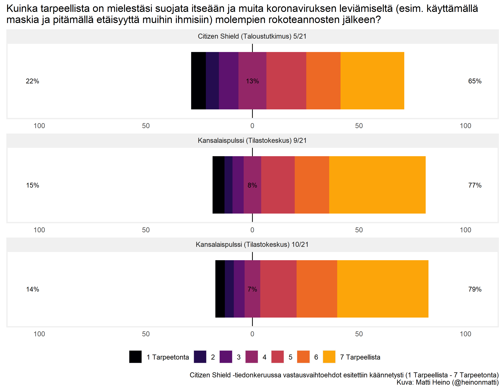
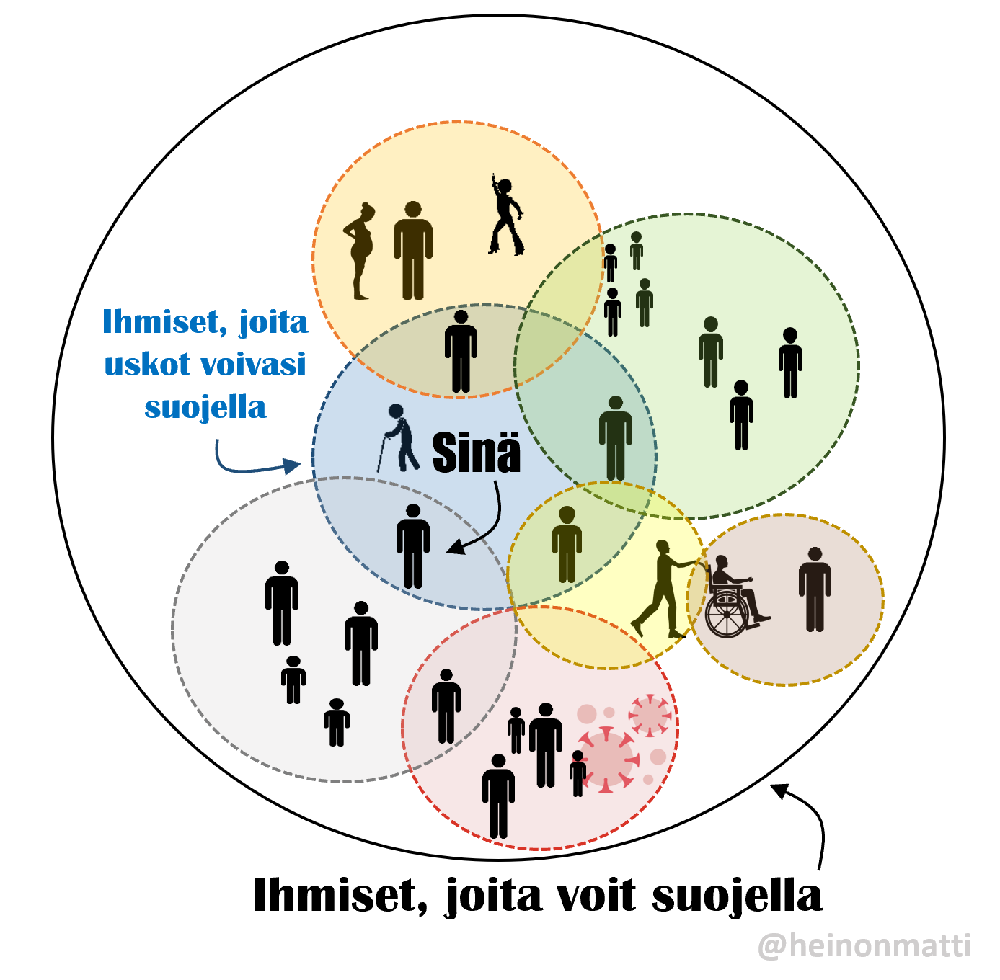

*Most people in Finland want to protect others from COVID, wheras decision makers and the media are planning celebrations of the end of the pandemic. Meanwhile, the healthcare system is getting overwhelmed fast. The only solution may be self-organisation.*

Maaliskuun lopulla [ennustin](https://mattiheino.com/2021/03/07/valmius/), että tulemme avaamaan yhteiskunnan liian aikaisin. Ennen kesälomia yritin varoitella toistamasta deltamuunnoksen kohdalla samaa virhettä, joka edellisten varianttien tapauksessa oltiin tehty. Kesällä kausivaihtelutoiveet saivat kyytiä, ja delta murtautui Salpalinjan läpi – yhteisen kamppailun sijaan kuitenkin päätettiin, että kansalaisille (lue: aikuisille) rokoteaseistusta tarjoamalla vihollisen metkuista ei tarvitsisi välittää.

En ole ennen kokenut samanlaista ristiriitaa kansainvälisiin kokemuksiin perustuvien [suositusten](https://www.ecdc.europa.eu/sites/default/files/documents/covid-19-rapid-risk-assessment-16th-update-september-2021.pdf) ja suomalaisen median välillä. Olin ällistynyt:

*"Me haluamme avata yhteiskunnan, me tulemme sen tekemään [...] Me luovumme näistä kaikista rajoituksista, mitä meillä on. Se on hallituksen tahto."* ([linkki](https://www.is.fi/politiikka/art-2000008297043.html))

*"Korona loppuu siinä vaiheessa, kun kukin meistä itse päättää lakata pelkäämästä"* ([linkki](https://www.hs.fi/kotimaa/art-2000008243137.html))

Alla olevasta kuvasta näkyy, että yli 75% kansalaisista pitää suojautumistoimia edelleen tarpeellisena:

Olen yrittänyt kertoa ihmisten jatkuvaa suojautumista ihmetteleville toimittajille, [etteivät ihmiset ole suosituksia sokeasti noudattavia robotteja](https://yle.fi/uutiset/3-12091118), vaan sopeuttavat toimintaansa tilannekohtaisesti ja ajan myötä muuttuvaan riskiarvioon pohjaten. Tämä on ollut monille vaikea ymmärtää, ja koko pandemian ajan hallitukset ja "asiantuntijat" ovat pelänneet laajamittaista paniikkia, jos ihmisille annetaan liian huolestuttavaa informaatiota. Aiheesta on olemassa [erinomainen blogipostaus](https://erehdys.wordpress.com/2021/09/30/pelkopandemia/) ja olen itsekin kirjoittanut [itseohjautuvuuden tärkeydestä](https://mattiheino.com/2020/08/17/itseohjautuvuus/), joten sanottakoon vain, että tämä on [tieteellisen kirjallisuuden näkökulmasta päätöntä](https://twitter.com/M_B_Petersen/status/1447907514964656131?s=20). Keinotekoisen turvallisuudentunteen pakkosyöttäminen kansalaisille johtaa ongelmiin.

Tähän väliin on hyvä muistuttaa mieliin, että taistelu virusta vastaan on taistelua esim. monielinvaurioita, aivovammoja ja pitkäaikaisia työ-/koulupoissaoloja vastaan, kuolemista puhumattakaan. *Viruksen kanssa eläminen* tarkoittaa näiden lisääntymisen kanssa elämistä.

Takaisin sodankäyntiin. Perinteisessä sodankäynnissä voidaan karkeasti erotella kaksi keinovalikoimaa:

a) Ne joilla saadaan aikaan nopeasti laaja-alainen vaikutus (panssarivaunupataljoonat aavikolla, mattopommitukset kaupungissa, laivasto avomerellä). Nämä keinot mahdollistaa korkean tason koordinaatio, ja koronatilanteessa niitä voi verrata massarokotuksiin, liikkumisrajoituksiin, rajojen terveysturvallisuuden varmistamiseen karanteenein, sekä testaa-jäljitä-eristä -infrastruktuuriin. Vuonna 2020 Suomessa näitä ajettiin puolivillaisesti, [yllättyen yhä uudelleen](https://medium.com/brandin-kirjasto/mik%C3%A4%C3%A4n-ei-ole-niin-vaarallista-kuin-toistuvat-yll%C3%A4tykset-e54c3b63fdf9) asioista, jotka eivät vaikuttaneet kovin yllättäviltä.

b) Toinen kategoria sisältää keinoja, joilla saavutetaan pieniä paikallisia voittoja, mahdollisesti vuosien tai vuosikymmenten kuluessa kerääntyen (autonomisesti toimivat sissiryhmät tai muut paikallisväestöön integroituneet erikoisjoukot). Näissä keinoissa "johtoportaalla", mikäli sellaista on, ei edes välttämättä ole ajantasaista tietoa siitä, mitä joukot tekevät ja missä. Koronatilanteessa niitä voi verrata omatoimiseen pikatestaukseen ennen tapaamisia, ilmanpuhdistinten hankkimiseen työpaikoille ja kouluihin, (FFP2-)maskien käyttöön tilannekohtaisesti, ja kuplautumiseen, ts. vain tietyn porukan kanssa tapaamiseen sekä flunssaoireista tälle porukalle tiedottamiseen. Vuoden 2021 syksyyn asti tämä kategoria pääosin puuttui Suomen koronavasteesta.

Mutta emmekö voisi vain *suojella riskiryhmiä*? Toki, mutta vaikkei tämä tarkoittaisikaan miljoonan ihmisen eristämistä, on mahdotonta tietää, tuleeko tapaamasi henkilö tapaamaan jonkun, joka ei ole voinut ottaa rokotetta – tai on ottanut 1-2 annosta, mutta teho on ehtinyt hiipua. Onneksi tämä toimii myös toisin päin: suojautumalla voi suojata paljon suurempaa porukkaa, kuin tulee ajatelleeksi. Kysymykseksi muodostuukin: "Ketään ei jätetä" vai "ketäs jätettäisiin jotta ei tarvitsisi tehdä vaivalloisia asioita?"

> Kysymykseksi muodostuukin: "Ketään ei jätetä" vai "ketäs jätettäisiin jotta ei tarvitsisi tehdä vaivalloisia asioita"?

Suomessa on pitkälti tukahdutettu keskustelu [eliminaatiostrategiasta](https://mattiheino.com/2021/06/28/irtikytkeytymiskyvykkyys/), vaikka se onkin ainoa tunnettu pitkän tähtäimen ratkaisu pandemioihin, jotka aiheuttavat yleisvaarallista tartuntatautia. Poliitikkojen ja virkamiesten on kuitenkin vaikea sitoutua mihinkään, mikä saattaisi nostaa heidät tikunnokkaan. Viranhaltijalle on turvallista tehdä niin, kuin kaikki muutkin tekevät; parasta politiikkaa on vastuuttaa kansalaisia sen sijaan, että virkakoneisto lähtisi suorittamaan jotain vaivalloista, mikä voi epäonnistua. Nyt, kun tälle linjalle on lähdetty uuden maskisuosituksen myötä, realisti valmistautuu pitkään sissisotaan, jossa yllämainitun a-osaston keinoihin ei voi luottaa – vaikka toivo toki elää.

Ehkä hallitus voisikin antaa maskisuosituksen tapaisen, virallisen "oman harkinnan mukaan" toteutettavan ilmahygieniasuosituksen, pikatestaussuosituksen ja kuplautumissuosituksen. Virkamiesten haasteet toteuttaa tehtäviään tuovat suomalaisille erinomaisen tilaisuuden oppia paikallisesti itseorganisoituvaa turvallisuustoimintaa. Mutta [kokonaisstrategian epäonnistumista ei voi vierittää rokottamattomille](https://www.cbc.ca/news/health/alberta-fourth-wave-surge-hospitals-icu-covid-19-1.6197263), niin kätevää kuin se olisikin kaiken [epidemian vähättelyn](https://erehdys.wordpress.com/2021/09/30/pelkopandemia/) jälkeen.

Toimimalla nyt omatoimisesti ennakoiden – pikatestit, FFP2-maskit (myös [uudelleenkäytettynä](https://citizenshield.fi/2021/08/19/tiivis-maski-on-paras-maski/)), tuuletus, ilmanpuhdistus, kontaktien rajoittaminen – voimme vielä estää [mustan joulun](https://www.is.fi/kotimaa/art-2000008340072.html).
