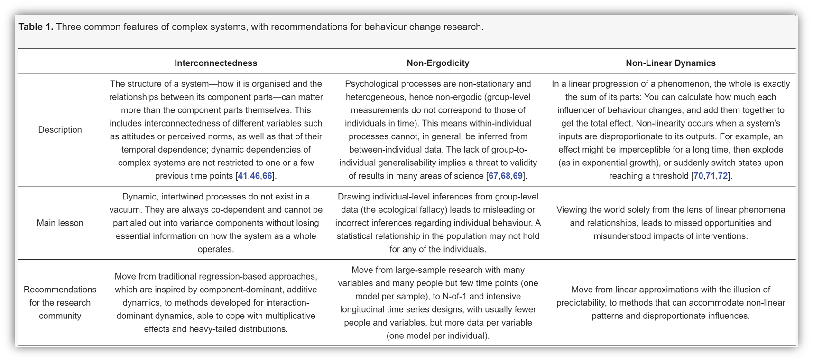
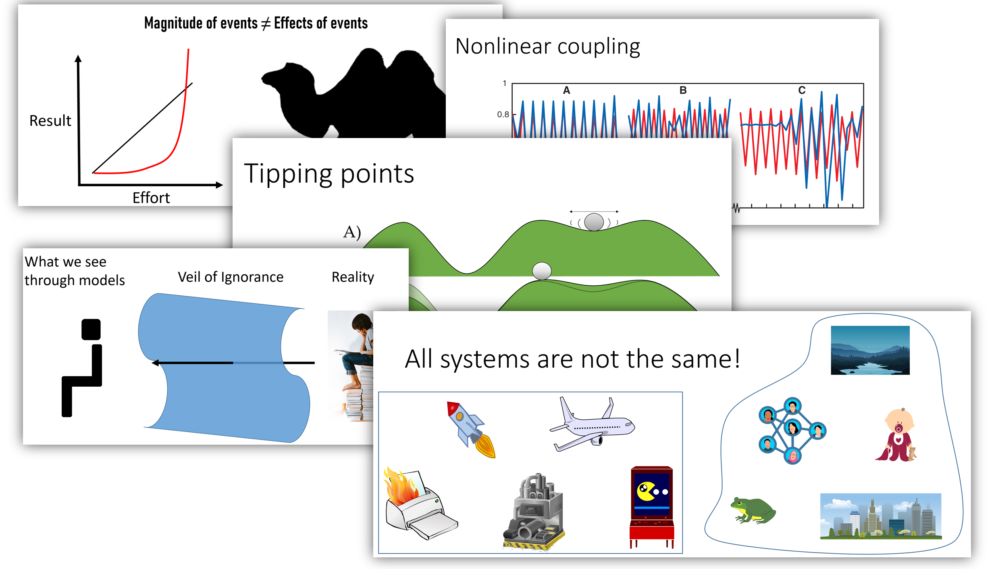

*This is an introductory post about *[this paper](https://www.mdpi.com/2076-328X/11/5/77)**. *The paper introduces to the object of study in "behaviour change science", i.e. complex systems – which include most human systems from individuals to communities and nations.*

In a health psychology conference many years ago (when we still travelled for that sort of thing), I wandered into the conference venue a bit late, and the sessions had already started. There was just one other person in the hallways, looking a bit lost. I was scared to death of another difficult-to-escape presentation cavalcade about how someone came up with p-values under 0.05, so I made some joke about our confusion and ended up preventing his attendance, too. Turned out he was a physicist recently hired in a behavioural medicine research group, sent to the conference to get his first bearings about the field. Understandably, he was confused with a hint of distraught: "I don't understand a word about what these people talk about. And I've been to several sessions already *without having seen a single equation*!" (nb. if you don't think this is funny, you're probably not a social scientist.)

Given that back then I was finding my first bearings on network science, we had a lot to talk about during the rest of the conference. I don't remember much about the conference, but I remember him making an excellent point about learning: The best way to learn anything is to talk to someone who's just learned about the thing. While not yet mega-experts, they still have an idea of where you stand, and can hence make things much more understandable than those, who already swim in a sea of concepts unfamiliar to you.

In a [recent paper](http://mdpi.com/2076-328X/11/5/77) about behaviour change as a topic of research, we tried to do exactly this. I know I'm crossing the chasm where I'm not yet the mega-expert, but am already losing the ability to see what people in my field find hard to grasp. I presented the paper in a research seminar and people found it quite challenging, but on the other hand, I've never seen such ultra-positivity from reviewers*.* So maybe it's helpful to some.

> This impeccably written manuscript provides a thorough, state-of-the-art review of complex adaptive systems, particularly in the context of behavior change, and it does an excellent job explaining difficult concepts.
>
> - Reviewer 2

Here's a quick test to see if it might be valuable to you. Have a look at this table, and if you think all is clear, you can skip the piece with good conscience:

I also made a video introduction to the topic. If you're in a rush, you can just run through a [pdf of the slides](https://drive.google.com/uc?export=download&id=1PB2CxutpBkniE0QYTBQiubK0BDB22ycR).

https://youtu.be/fn5g5WgYtLQ

If you're in an even bigger rush, the picture below gives a quick synopsis. To find out more, check out [this post](http://www.mattiheino.com/besp). You might also be interested in [What Behaviour Change Science is Not](https://mattiheino.com/2024/04/25/behaviour-change-via-negativa/).

