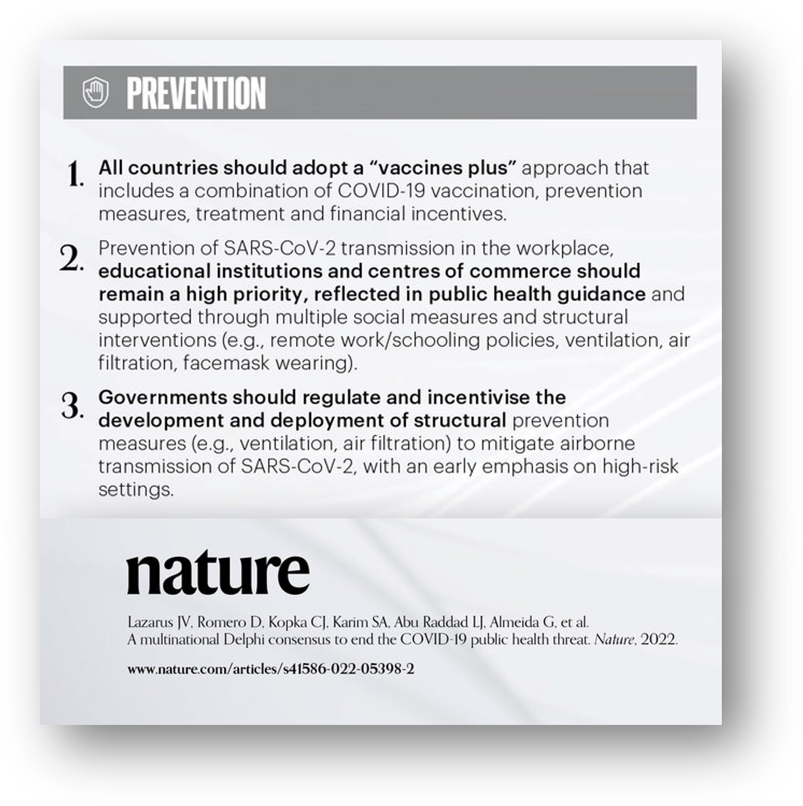
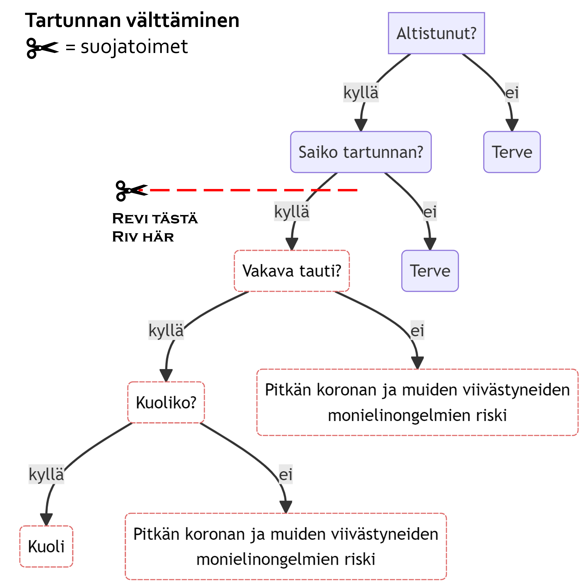
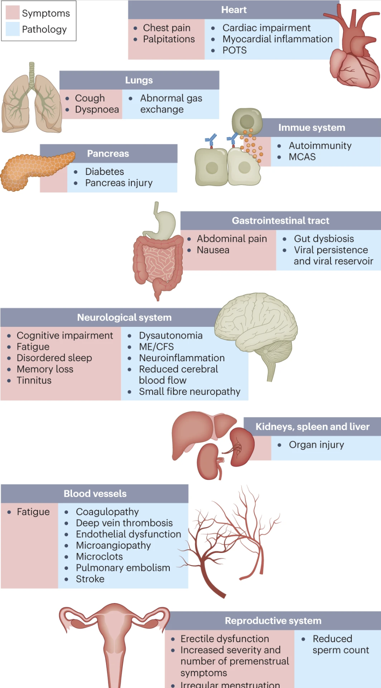
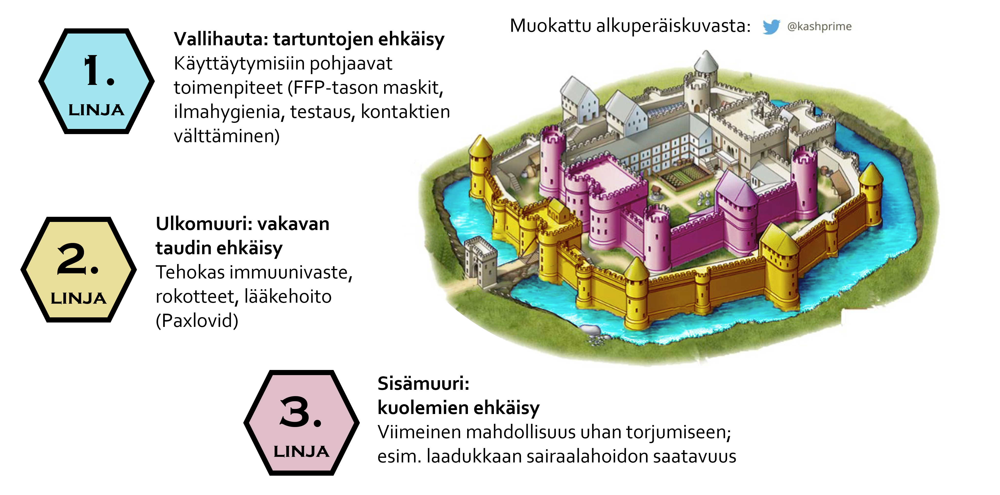

English summary: *This post outlines two key points missing from Finnish public discussion in 2023. It was originally published on January* *16*, *and has been audited for its continuing relevance on August 31. The main scientific points are made [here](https://royalsociety.org/-/media/policy/projects/impact-non-pharmaceutical-interventions-on-covid-19-transmission/covid-19-examining-the-effectiveness-of-non-pharmaceutical-interventions-executive-summary.pdf) (non-pharmaceutical interventions like masks work, particularly when they're combined with other measures; see text for explanation of non-linear compounding), [here](https://doi.org/10.1016/j.lanepe.2022.100574) (mass testing can end the pandemic), [here](https://doi.org/10.1038/s41586-022-05398-2) (international consensus we should not let the pandemic run amok), [here](https://www.nature.com/articles/s41579-022-00846-2) (long covid is a biological disease) and [here](https://www.thelancet.com/journals/lancet/article/PIIS0140-6736(22)02489-8/fulltext) (novel pathogens call for a swift and prudent elimination approach).*

Suomessa vallitsee neljäntenä pandemiavuonna tilanne, jota on hankala kuvata muulla termillä kuin *aika jännä.* Korona on esitetty suomalaisille lähinnä hengitystieinfektiona, ei monielinsairautena, [joka se kuitenkin on](https://www.nature.com/articles/s41579-022-00846-2). Kansalaisille ei myöskään ole kunnolla viestitty, että sairastettu korona voi immuunijärjestelmän vahvistamisen sijaan [heikentää sitä kokonaisvaltaisesti](https://thetyee.ca/Analysis/2022/09/23/Top-Immunologist-Dropping-COVID-Hubris/) – eikä tämä koske vain riskiryhmiä, vaan myös nuoria ja perusterveitä. Tämän hetken käsityksen mukaan lapset sairastavat koronan yleensä lievin oirein. Millainen vaikutus vasta kehittyvään elimistöön on kokonaisimmuniteettia mahdollisesti vahingoittavalla monielinsairaudella, sitä emme vielä tarkalleen tiedä, vaikka tiedämmekin pandemioiden jättävän [vuosikymmenten mittaisia jälkiä](https://www.nature.com/articles/d41586-022-00414-x) sairastuneisiin. [Ylikuolleisuutta on juuri nyt enemmän](https://www.laakarilehti.fi/terveydenhuolto/onko-koronakuolemia-paljon-vai-mihin-taalla-kuollaan/) kuin koskaan sotien jälkeen, [eikä sitä ole enää mahdollista kieltää](https://worldaccordingtomatti.blog/2023/01/17/kaikki-paitsi-elama-on-turhaa/), mutta johtavat terveysviranomaiset [tuntuvat olevan kiinnostuneempia](https://mobile.twitter.com/HeikkiRay/status/1612495401961066515) *"pelon"* hillinnästä; kuin mitään ei olisi tehtävissä. Jännää on myös se, että kuolemista ääneen puhumiseen suhtaudutaan aggressiivisesti vähätellen, ja esim. Väestöliiton peräänkuuluttama itsenäinen selvitys aiheesta herättää vastustusta.

Käsittelen kuitenkin seuraavassa kahta tärkeintä asiaa, joiden viestinnässä on ajettu päin puuta: tartuntojen torjunnan *kannattavuus*, ja sen *mahdollisuus*.

# 1. Tartuntoja kannattaa torjua

*Kuva 1: Kansainvälisen* *386 asiantuntijaa sisältäneen paneelin* *t**ärkeimmät ennaltaehkäisyä koskevat pandemiasuositukset.* *Klikkaa suuremmaksi. [Lähde](https://doi.org/10.1038/s41586-022-05398-2).*

Vuonna 2021 Suomessa siirryttiin torjumaan tartuntojen sijaan vakavaa sairastumista ja kuolemia. Tammikuussa 2023 taas [WHO edelleen suosittaa](https://www.youtube.com/watch?v=POloTTb3ock) mm. “Wear a mask when you’re around other people”, ja kehottaa [10 päivän eristykseen](https://www.who.int/publications/i/item/WHO-2019-nCoV-clinical-2023.1) oireellisen koronan tapauksessa. Heinä-elokuussa WHO painottaa koronaviruksen [olevan edelleen iso ongelma](https://www.linkedin.com/feed/update/urn:li:activity:7085284328405970944), mutta seurantajärjestelmien lakkauttamisen johdosta se ei näy enää virallisissa luvuissa. Syksyn aallon edessä [hallitusten ei pitäisi laiminlyödä velvollisuuksiaan](https://twitter.com/mvankerkhove/status/1695312057275424802). Lancet-tiedelehdessä [kannustetaan](https://www.thelancet.com/journals/lancet/article/PIIS0140-6736(22)02489-8/fulltext) koherenttiin eliminaatiostrategiaan uusien taudinaiheuttajien torjunnassa. Tartuntojen torjunnan tärkeyttä painotti myös kansainvälisten asiantuntijoiden [konsensustutkimus](https://doi.org/10.1038/s41586-022-05398-2), joka julkaistiin v. 2022 lopulla arvostetussa Nature-tiedelehdessä. Se on tällä hetkellä yksi tieteellisen julkaisemisen tunnetun historian [eniten huomiota](https://www.altmetric.com/details/138006212#score) saaneista tutkimuksista, mutta Suomessa siitä ei ole tietääkseni edes uutisoitu (sidonnaisuusilmoitus: olin itse mukana kirjoittajana).

Miksi tartuntoja kannattaa torjua? Koska yhden tartunnan torjumalla torjuu samalla koko ketjun tartuntojen seurauksia. Tätä sanotaan kansanterveystieteessä *preventioksi*; myös muita tauteja, kuten tyypin 2 diabetesta on huomattavasti halvempaa hoitaa ennaltaehkäisevästi, kuin kalliita hoitoja ja sairaspaikkoja lisäämällä. Päätöspuudiagrammi alla tiivistää, miten paljon jossittelua voi vähentää välttämällä tartunnan.

*Kuva 2: Yksinkertaistettu heuristinen päätöspuu riskinhallinnan suunnitteluun. Sakset sisältävät jäljempänä kohdassa 2. esitellyt suojatoimet, jotka poistavat yhtälöstä kaikki katkoviivan alla olevat polut. Kuva keskittyy yksilöön ja siitä puuttuu esim. tartunnan levittämisen seuraukset läheisiin, sekä sairaspoissaolojen vaikutukset kansantaloudelle.*

*Kuva 3: Mille kaikelle koronatartunta altistaa? Klikkaa suuremmaksi. [Lähde](https://www.nature.com/articles/s41579-022-00846-2).*

Päätöspuusta huomannet pitkän koronan riskin, joka ilmenee tartunnan saaneilla – ja vain tartunnan saaneilla. Pitkän koronan kustannukset Suomessakin [lasketaan jo miljardeissa](https://www.mediuutiset.fi/uutiset/taloustieteen-professori-antti-ripatti-pitkittyneen-koronan-kustannukset-nousevat-miljardeihin-euroihin/9919a3ea-2cac-4438-99d9-566c90b5cf3e), ja tilanne on pidempään suojaustoimia vailla olleissa maissa [vielä heikompi](https://www.mckinsey.com/industries/healthcare-systems-and-services/our-insights/one-billion-days-lost-how-covid-19-is-hurting-the-us-workforce). Sairauteen liittyvistä biologisista mekanismeista tuli vastikään Nature-tiedelehdessä [kokoava artikkeli](https://www.nature.com/articles/s41579-022-00846-2), jossa peräänkuulutettiin tiedotuskampanjaa, joka toisi pitkään koronaan liittyvät riskit kansalaisten tietoisuuteen. Kiinnostuksella odotan, koska sellainen nähdään Suomessa.

# 2. Tartuntoja voidaan torjua

Vaikka mediassa on viimeisen kolmen vuoden aikana näkynyt paljon näyttöön pohjaamattomia lausuntoja siitä, ettei tartuntoja voisi torjua, käyttäytymistieteiden pohjalta tämä on ollut aina mahdollista – ja on sitä edelleen. On siis selvää, että tartuntoja [*voidaan* torjua](https://www.theguardian.com/world/2023/aug/24/lockdowns-face-masks-unequivocally-cut-spread-covid-study-finds?CMP=share_btn_tw). Käyttäytymisiin perustuvia suojatoimia on viittä tyyppiä:

- Hengityssuojainten käyttö
- Ilmahygieniatoimet (tuuletus ja ilmanpuhdistinten hankinta, mahdollisesti jossain vaiheessa myös [UV-valo](https://yle.fi/a/3-11805311))
- Kontaktien välttäminen
- Testaus & eristys
- Rokotusten ottaminen

Näitä voidaan toteuttaa eri tasoilla; esim. kontaktien välttelyn alin taso työpaikoilla on turvavälien pitäminen ja työvuorojen porrastus, ylin taas 100% etätyö. Halutessaan pitää tartunnat poissa yhdellä tempulla ja jättäessään muut toimet pääosin tekemättä, Kiina joutui vetämään testauksen ja eristyksen lockdown-asentoon asti. Torjuntatyö on kuitenkin huomattavasti helpompaa, kun ei luota suojakeinoista vain yhteen. Esimerkiksi *Lancet Regional Health - Europe*:ssa julkaistut [viimeisimmät laskelmat osoittavat](https://www.sciencedirect.com/science/article/pii/S2666776222002708) mahdolliseksi sen, että jos kahdesti viikossa tehtävän sylkitestin lisäksi otetaan ainakin väliaikaisesti käyttöön mm. FFP-tasoiset hengityssuojaimet, epidemia voidaan *päättää* – inhimillisesti ja taloudellisesti halvemmalla*,* kuin mitä sen kanssa kärvistely tällä hetkellä maksaa. Tämä johtuu suojatoimien ns. [epälineaarisesta kertautumisesta](https://academic.oup.com/jtm/article/doi/10.1093/jtm/taab144/6365138):

> Ajatellaan, että Jesse käyttää FFP2-suojainta tiivistämättä sitä kunnolla kasvoilleen, ja sitä käyttämällä laskee tartunnan saamisen todennäköisyyttään ¼:aan alkuperäisestä. Hän tapaa muita ihmisiä huoneessa, jossa on toteutettu ilmahygieniatoimia, jotka vähentävät maskittomien tartunnan saamisen todennäköisyyttä ¼:aan alkuperäisestä. Mikä on Jessen suojakerroin? Se ei ole ⅛ lähtötilanteesta, vaan tartunnan todennäköisyys on 1/16 lähtötilanteeseen verrattuna. Jos tilassa olleet ihmiset ovat tehneet koronatestit, jotka maskien ja ilmahygienian tavoin pudottaisivat tartuntatodennäköisyyttä ¼:aan lähtötilanteesta (koska positiivisen tuloksen saaneet jäivät kotiin, mutta testit olivat epätarkkoja), Jessen todennäköisyys saada tartunta olisi 1/(4³) = 1/64 suojattomaan lähtötilanteeseen verrattuna.

[Huom. luvut on valikoitu selkeyden vuoksi; niiden ei ole tarkoitus kuvastaa kunkin toimenpiteen todellista vaikuttavuutta, joka voi tilanteesta riippuen olla suurempi tai pienempi.]

Edellä mainituissa Lancet-laskelmissa näkyy strategian erinomainen vakaus; se toimii, vaikka monet jättäisivät noudattamatta sitä, ja vaikka virus muuntuisi entistä tartuttavammaksi. Torjunta kannattaa, vaikka ei ole saavutettaisikaan koronaviruksen pysyvää paikallista eliminaatiota, jonka jatkuvuuteen tarvittaisiin kansainvälistä koordinaatiota. Tikkari- tai sylkitesti – vaikka hampaidenpesun yhteydessä – pari kertaa viikossa olisi pieni hinta [eduista, joita saavutetaan](https://www.sciencedirect.com/science/article/pii/S2666776221002805) alhaisemmilla tartuntaluvuilla niin taloudelle kuin terveydelle. Kaiken lisäksi vastaavan strategian logistiikkaa on jo [pilotoitu Saksassa](https://www.sciencedirect.com/science/article/pii/S2666776222002708) yli 3 kertaa Suomen kokoisella alueella. Jos testiin yhdistettäisiin influenssa ja RSV, olisimme jo aivan uudella tasolla tartuntatautien torjunnassa.

Kuva alla näyttää vielä kertaalleen, mistä tartuntojen torjunnassa on kyse. Julkisessa keskustelussa peräänkuulutettu sairaalapaikkojen [ja krematorioiden](https://yle.fi/a/74-20011931) lisääminen on varmasti tärkeää, vertautuen linnan sisimpiin suojarakenteisiin. **Meidän pitäisi kuitenkin työskennellä sen eteen, että niitä tarvittaisiin entistä vähemmän.**

*Kuva 4: Suojatoimet käsitteellistettyinä linnan osiksi. Kirjoitushetkellä (syksy 2023) Suomessa laskusilta on vielä ala-asennossa. Muokattu Kashif Pirzadan [alkuperäisversiosta](https://twitter.com/KashPrime/status/1495481310546178048).*

Kaikkiin variantteihin purevia pan-koronarokotteita on jo olemassa ja nyt selvitetään, jos joku kustantaisi kalliit kokeet turvallisuuden varmistamiseksi. Niitäkin odotellessa – kun kerran vaihtoehtojakin on – olisi viisasta olla tekemättä peruuttamatonta tuhoa terveydelle ja taloudelle. Myös siinä tapauksessa, että pääkärsijät olisivatkin niitä bussin alle heitettyjä “riskiryhmäläisiä”.

> *“Hallituksen moraalinen testi on siinä, kuinka se kohtelee elämänsä alkutaipaleella olevia; lapsia. Niitä jotka ovat taipaleensa lopussa; vanhuksia. Niitä jotka ovat elämän varjoissa; sairaita, puutteenalaisia ja vammaisia”*
>
> - Hubert H. Humphrey, 1977

**Lisälukemistoa:**

Pandemian päättäminen testaamisen voimin: Philippe, et al. (2023). Mass testing to end the COVID-19 public health threat. *The Lancet Regional Health – Europe.* <https://doi.org/10.1016/j.lanepe.2022.100574>

Kansainvälinen asiantuntijakonsensus: Lazarus, et al. (2022). A multinational Delphi consensus to end the COVID-19 public health threat. *Nature*.<https://doi.org/10.1038/s41586-022-05398-2>

Yleistajuinen koonti tärkeimmistä koronan vaikutuksista: <https://thetyee.ca/Analysis/2022/09/23/Top-Immunologist-Dropping-COVID-Hubris/>

Yleistajuinen minivideosarja pitkästä koronasta vaikutuksineen: <https://www.youtube.com/watch?v=M4tGFiLXsIk&list=PLzyLGd4jQxQ-zNjmOUR43ha53AjXHU3HH>

Aiempaa tieteellistä kirjallisuutta tartuntoja minimoivista strategioista:

- Baker, M. G., Durrheim, D., Hsu, L. Y., & Wilson, N. (2023). COVID-19 and other pandemics require a coherent response strategy. *The Lancet*. <https://doi.org/10.1016/S0140-6736(22)02489-8>
- Czypionka, et al. (2022). The benefits, costs and feasibility of a low incidence COVID-19 strategy. *The Lancet Regional Health.* <https://doi.org/10.1016/j.lanepe.2021.100294>
- Dowdle, et al. (1998). The principles of disease elimination and eradication. *Bulletin of the World Health Organization*. <https://www.ncbi.nlm.nih.gov/pmc/articles/PMC2305684/>
- Oliu-Barton et al. (2021). Green zoning: An effective policy tool to tackle the Covid-19 pandemic. *Health Policy*. <https://doi.org/10.1016/j.healthpol.2021.06.001>
- Su, et al. (2022). The Advantages of the Zero-COVID-19 Strategy. *International Journal of Environmental Research and Public Health.* <https://doi.org/10.3390/ijerph19148767>
