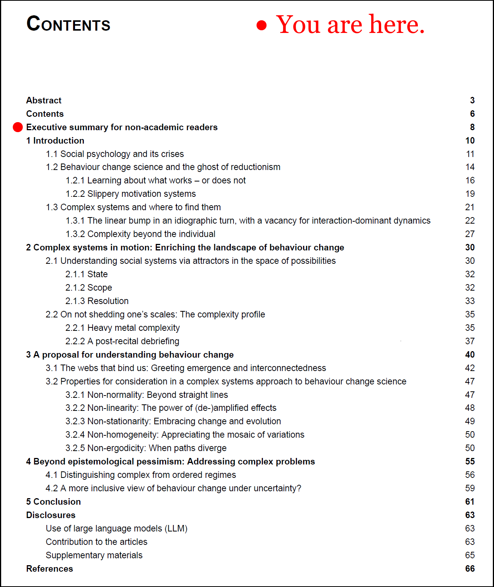

*"**Understanding and shaping complex social psychological systems: Lessons from an emerging paradigm to thrive in an uncertain world**" is the working title of my recently submitted dissertation on human action and change therein, which I've been working on as a side project. This is an executive summary (or a teaser trailer if you like) for non-academic readers.* *A pre-print can be found [**here**](https://psyarxiv.com/qxa4n).*

> “the  totality is not,
>
> as it were, a mere heap,
>
> but the whole is something
>
> besides the parts”
>
> - Aristotle

In an ever-evolving world, the role of human behaviour in addressing pressing challenges cannot be overstated. Complex issues like climate change, pandemic response, and psychosocial well-being all hinge on human actions. Thus, understanding and steering positive behaviour change is of paramount importance. Traditionally, behaviour change research uses a decomposition-based approach, dissecting behaviours pertaining to societal problems into smaller parts and addressing each one separately. To get the picture, imagine a designer focused on building an engine part by part, fine-tuning each piece before fitting them together. This method works when we can clearly map out the pieces, their interactions are limited, and their effects are well understood. This is the domain of the decomposition-minded planning; the “ordered regime”, so to say.

However, human behaviour often does not always exist in such neatly compartmentalised contexts. Instead, it often operates within complex, dynamic systems where the individual pieces continually interact, mutually influencing each other in unpredictable ways. Consider a forest, for example. It's not just about individual trees; the entire ecosystem, with its array of flora and fauna, weather patterns, and soil conditions, all contribute to the forest's health. You can not simply study a single tree to understand the whole forest. This ecosystem view is the realm of the complexity-minded designer, who acknowledges that problems may not be easily separated but are woven into a larger, interconnected tapestry; the “complex regime”.

The current work suggests that an awareness of these so-called complex systems can enhance our approach to behaviour change. It argues that we are all active participants in our environments, capable of self-determination and self-organisation. Our behaviour is not just the result of isolated influences; instead, it often emerges from an ongoing web of interdependencies. A small action today can lead to major impacts tomorrow, and long periods of apparent stability can suddenly be disrupted by bursts of rapid change. This inherently unpredictable nature of complex regimes means that past data can not always guide us in the future.

To navigate these complex systems, we need a new kind of designer: the evolutionary-minded designer. This designer harnesses the power of evolution, creating a wide range of possible solutions and allowing the system to select the most appropriate ones. The goal is to create flexible, adaptive *systems* that are resilient in the face of change and uncertainty – not just solutions, which rely on correct prediction of the specifics of the future.

The work presented in this dissertation provides concepts and tools to initiate this approach. It includes a compendium of self-management techniques to empower individuals, and proposes a model of behaviour change as an interconnected network of processes, rather than a series of isolated, static entities. It also discusses how traditional linear models may fail in the face of complex systems and suggests ways of understanding and influencing behaviour change, which may help bridge the gap between social psychology and complex systems science.

In a world that's increasingly complex and interconnected, our approach to behaviour change must adapt. By embracing complexity, we can better equip ourselves to face the challenges of the future. Rather than trying to oversimplify these complex problems, we should recognize and leverage the inherent richness and unpredictability of human behaviour – where it exists – aiming to develop responsive, adaptable strategies that foster positive change in this uncertain world.

---

**Further reading**

All of this will be explained in due time, but if you're dying to hear more, have a look at [this post](https://mattiheino.com/2021/12/11/intro-complexity-bc/) or these readings (particularly the last one):

Heino, M. T. J., & Hankonen, N. (2022). Itsekontrolli on yhteisöponnistus: Systeemisiä näkökulmia käyttäytymisen muutokseen. In E. Mäkipää & M. Aalto-Kallio (Eds.), *Muutosten tiet kietoutuvat yhteen* (Vol. 2022, pp. 69–79). <https://content-webapi.tuni.fi/proxy/public/2022-09/muutostentiet_heino-hankonen_v4.pdf>

Heino, M. T. J., Knittle, K., Noone, C., Hasselman, F., & Hankonen, N. (2021). Studying Behaviour Change Mechanisms under Complexity. *Behavioral Sciences*, *11*(5), Article 5. <https://doi.org/10.3390/bs11050077>

Heino, M. T. J., Proverbio, D., Marchand, G., Resnicow, K., & Hankonen, N. (2022). Attractor landscapes: A unifying conceptual model for understanding behaviour change across scales of observation. *Health Psychology Review*, *0*(ja), 1–26. <https://doi.org/10.1080/17437199.2022.2146598>

Bar-Yam, Y. (2006). Engineering Complex Systems: Multiscale Analysis and Evolutionary Engineering. In D. Braha, A. A. Minai, & Y. Bar-Yam (Eds.), *Complex Engineered Systems: Science Meets Technology* (pp. 22–39). Springer. <https://doi.org/10.1007/3-540-32834-3_2>

Siegenfeld, A. F., & Bar-Yam, Y. (2020). An Introduction to Complex Systems Science and Its Applications. *Complexity*, *2020*, 6105872. <https://doi.org/10/ghthww>
