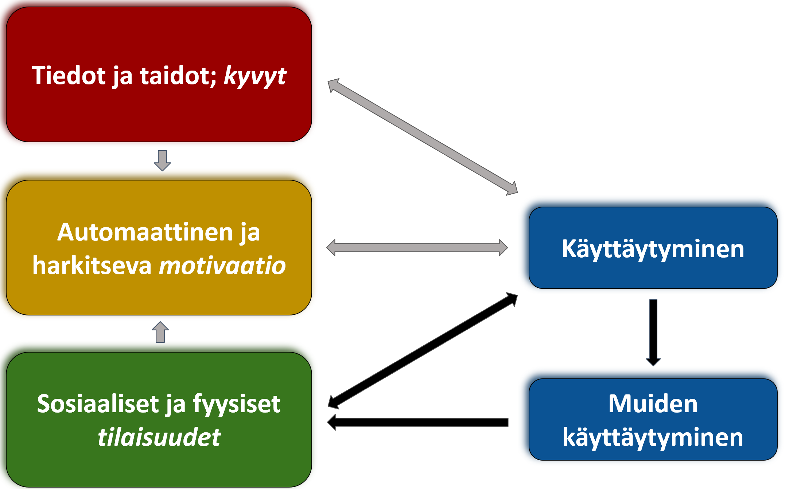
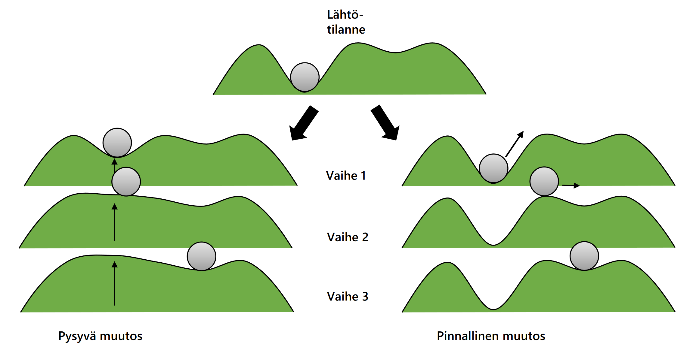

*Kirjoitus tiivistää artikkelissa [Itsekontrolli on yhteisöponnistus: Systeemisiä näkökulmia käyttäytymisen muutokseen](https://content-webapi.tuni.fi/proxy/public/2022-09/muutostentiet_heino-hankonen_v4.pdf) esiteltyjä perusajatuksia käyttäytymisen ymmärtämisestä ja muuttamisesta. Kannustan aiheesta kiinnostuneita tutustumaan Sosten julkaisuun [Muutosten tiet kietoutuvat yhteen](https://www.soste.fi/ajankohtaista/sosten-julkaisut/muutosten-tiet-kietoutuvat-yhteen/), jossa artikkeli ilmestyi.* *Perinteisen muutosjohtamisen ja kompleksisuuden yhteyksistä ja ristiriidoista kiinnostuneille suosittelen *keskustelukumppanini*, pitkän linjan muutosjohtaja Gary Wongin esityksiä ([1](https://www.youtube.com/watch?v=KE1RYBLRnGo), [2](https://www.youtube.com/watch?v=xI4sWoGQ3EM)).*

**Ihmisen toiminta on aikamme tärkeimpien turvallisuuden ja hyvinvoinnin haasteiden keskiössä; ilmastonmuutoksesta pandemiatorjuntaan ja sote-kriisiin, yhteisöllisyyttä ja osallisuutta unohtamatta. Inhimillinen toiminta koostuu *käyttäytymisistä*: kierrättäminen, liikkuminen, vuorovaikuttaminen, kotivaran ylläpito, kotona pysyminen sairaana, ja niin edespäin. Käyttäytymisen muutoksessa on kuitenkin kyse muustakin kuin oikeasta tiedosta.**

Ihmisten käyttäytymiset ovat kuin siemeniä metsässä. Suurin osa katoaa huomaamatta – varsinkin jos ne soveltuvat ympäristöönsä heikosti – mutta se ei tarkoita, etteikö joistakin itämään päässeistä siemenistä voisi muodostua koko ekosysteemin mullistava ilmiö. Itseohjautuvien ihmisjärjestelmien toimintalogiikka eroaakin merkittävästi insinöörilogiikan mukaan toimivista koneista, joissa sama syöte tuottaa toistuvasti saman lopputuloksen. Käyttäytymisen ymmärtämisen ja sen muuttamisen ytimessä on hahmottaa, että toimimme aina osana yhteenkietoutuneita järjestelmiä, ja olemme koostumukseltamme monitahoisia: emme ole vain yksilöitä, vaan kannamme päässämme osia perheestämme, naapurustostamme, kaupungistamme ja valtiostamme. Jokainen päätöksemme, jokainen käyttäytymisen muutos, vaikuttaa myös fyysisesti laajempaan kuvioon.

Koska ihminen ei ole eristetty olento, käyttäytymisen muutos ei yleensä ole asia, josta vain simppelisti päätetään, joka suunnitellaan ja lopuksi jalkautetaan. Tämä johtuu siitä, että meidän motivaatiomme, kykymme ja ympäristömme muodostavat järjestelmän, jossa eri osa-alueet saattavat olla ristiriidassa. Toisin sanoen, haluaisimme ehkä tehdä jotakin, mutta ympäristömme tai sosiaaliset paineet voivat estää sen. Tämä on hyvin konkreettista esimerkiksi turvallisuuden osalta. Jos haluamme lisätä turvallisuutta asuinalueellamme, voi olla helppo ratkaisu lisätä valvontaa ja koventaa rangaistuksia, mutta jos pahoinvoivista nuorista samanaikaisesti kasvaa jatkuvasti suureneva joukko pahoinvoivia aikuisia, taktiikasta jää käteen vain viheliäinen kierre. Kyse ei olekaan vain yksittäisten rikollisten käyttäytymisen muuttamisesta, vaan kokonaisvaltaisesta yhteisön toiminnasta, joka tuottaa yhteisöllisyyttä tai syrjäytymistä, osallisuutta tai osattomuutta, hyvinvointia tai pahoinvointia. Siksi riskinhallinnan kannalta on tärkeää paitsi ennakoida odottamattomia sivuvaikutuksia, myös olla valmis vahvistamaan positiivisia ja näivettämään negatiivisia odottamattomia kehityskulkuja. Tähän tarvitaan paitsi dataa asenneympäristöstä, myös uusia tapoja hahmottaa ongelmia.

Ihmisen toimintaa sisältävien ongelmien hahmottamisessa apuun tulee COM-B -malli, joka sisältää kolme pääosa-aluetta: motivaation, kyvykkyyden ja tilaisuudet. Mallin avulla voidaan hahmottaa, miten nämä osa-alueet vaikuttavat käsillä olevaan ongelmaan ja millaiset muutokset voisivat olla tehokkaita. Usein esimerkiksi ajatellaan, että tarjoamalla *oikeaa tietoa*, ihmisen toiminta muuttuu. Näemme kuitenkin mallista heti, että tämä on vain yksi muutoksen osatekijä. Joskus myös lukkiudumme ajatukseen, että ongelmassa on kyse *motivaation* puutteesta, jolloin ratkaisut typistyvät palkkioihin ja rangaistuksiin. Mutta jos ajattelemme ravintolatupakoinnin äkillistä loppumista, kyse oli enemmänkin siitä, että järjestelmä oli valmis ottamaan vastaan lain, joka poisti tupakoinnin *tilaisuudet* – mikä taas vaikutti motivaatioon ja vahvisti muuttunutta käyttäytymistä.

**Kuva 1.** COM-B -malli (Capability, Opportity, Motivation, Behaviour; Michie et al., 2011), johon on lisätty muiden käyttäytyminen. Mallia voidaan käyttää työkaluna toimenpiteiden suunnittelussa, vaikkei se sisälläkään todellisuuden kompleksisuutta.

Jos ajatellaan esimerkiksi kaupungin asukkaiden osallistamista elinympäristönsä kehittämiseen, niin ei myöskään riitä, että ihmisille annetaan *tilaisuus* osallistua. Heidän täytyy myös kokea, että heillä on riittävät *tiedot ja taidot* vaikuttamiseen; toiminta ei saa olla liian hankalaa suhteessa näihin. Lisäksi, heidän täytyy olla *motivoituneita* osallistumaan, ajatella toiminnan olevan merkityksellistä – mikä osaltaan syntyy sosiaalisista *tilaisuuksista*, eli kuinka paljon ajatellaan muiden välittävän osallistumisesta ja odottavan sitä itseltä.

Kuinka siis ymmärrämme ihmisten käyttäytymistä ja sen muuttamista? Meidän täytyy tarkastella käyttäytymisen muutosta ja huomioida toimintaan vaikuttavia tekijöitä laaja-alaisesti. Tämä tarkoittaa seuraavien osa-alueiden huomioimista:

1. **Motivaatio:** Ihmisten on oltava motivoituneita tekemään muutoksia. Tämä voi tarkoittaa, että he näkevät suoria hyötyjä toiminnastaan, kuten parempaa turvallisuutta, tai tunnistavat suurempaa merkitystä, kuten yhteisön hyvinvoinnin parantamisen. Motivaatio voi olla myös sisästä, kummuten halusta auttaa muita tai toiminnan miellyttävyydestä – tai kontrolloitua kuten sisäisestä tai ulkoisesta paineesta johtuvaa, mikä yleensä johtaa heikompiin lopputuloksiin.
2. **Kyky:** Ihmisten on kyettävä tekemään muutoksia. Tämä voi tarkoittaa vaikka uusien taitojen oppimista tai olemassaolevan asiantuntemuksen käyttöä uusiin asiayhteyksiin.
3. **Tilaisuus:** Ihmisillä on oltava sosiaalisia ja fyysisiä resursseja muutokseen. Tämä voi tarkoittaa resurssien tarjoamista tai esteiden poistamista, jotka voivat estää ihmisiä tekemästä muutoksia. Se voi myös merkitä yhteisön tuen ja sosiaalisen pääoman valjastamista tukemaan muutosta.

Kaiken kaikkiaan, muutos ei tapahdu yksinomaan yksilön tasolla. Yhteisö, jossa yksilöt elävät ja toimivat, on myös otettava huomioon. Olenkin kuvan COM-B -malliin lisännyt muiden käyttäytymisen korostaakseni sitä, että kun yksi ihminen toimii jollain tapaa, hän luo, poistaa tai ylläpitää samalla *muiden* ympärillään olevien ihmisten sosiaalisia tilaisuuksia toimintaan. Ja se muiden käyttäytyminen, jota tällä tavoin vaivihkaisesti vahvistetaan, taas vaikuttaa omaa käyttäytymistä koskeviin sosiaalisiin ja fyysisiin tilaisuuksiin. Kudelma, jossa monet erilaiset toimijat jatkuvasti sopeuttavat käyttäytymistään muuttuvassa motivaation, kykyjen ja tilaisuuksien toimintaympäristössään, kantaa nimeä *kompleksinen järjestelmä*. Tästä blogista löydät paljon aiheeseen liittyvää materiaalia, mutta jos asia ei ole lainkaan tuttu, aloita vaikka [täältä](https://mattiheino.com/2021/12/11/intro-complexity-bc/).

> Kompleksisessa järjestelmässä juuri kukaan ei oikeasti hallitse mitään, mutta jokainen vaikuttaa kaikkeen.
>
> Scott E. Page

Pähkinänkuoressa: kompleksisessa järjestelmässä asioiden väliset yhteydet ovat muuttuvaisia, monitulkintaisia ja vaikeasti hahmotettavia. Siksi esittelemäni muutosmalli on kompleksisessa järjestelmässä enemmänkin ketterä työkalu kokeilujen suunnitteluun, kuin realistinen malli siitä, miten muutokset syntyvät.

## Mitä muutoksessa tapahtuu?

Mikä sitten olisi muutoksen todellisuutta paremmin kuvastava viitekehys? Jotta voimme ajatella asiaa, meidän täytyy ymmärtää keskinäisriippuvuutta. Keskinäisriippuvuus tarkoittaa juuri sitä, mitä siinä sanotaan: järjestelmän (oli se yksilö, yhteisö tai yhteiskunta) komponenttien (useimmiten yksilöiden, tai heidän toimintansa) riippuvuutta toisistaan. Kun yhtä komponenttia muutetaan, moni muu palanen alkaa liikkumaan, usein vaikeasti ennakoitavin tavoin. Jotta voimme toimia kompleksisuuden kudelmassa, pyrimme yleensä löytämään suurimman ongelmamme tärkeimmät osatekijät, ja ratkomaan niihin vaikuttavia asioita. Mutta koska näitä vaikuttavia asioita on niin paljon, saatamme kaivata holistisempaa näkemystä siitä, mitä oikeastaan odotamme tapahtuvan. Tätä voimme ajatella muutosmaastojen avulla. Pitkä selitys aiheesta löytyy [tästä artikkelista](https://doi.org/10.1080/17437199.2022.2146598) (ks. myös [blogipostaus](https://mattiheino.com/2023/01/13/attractors/)), mutta parhaan kuvan saat, jos käytät seuraavaksi viisi minuuttia tämän [interaktiivisen demon](https://heinonmatti.github.io/attractors_fi/fi.html) läpi pelaamiseen. Muista liikuttaa kaikkia kuvien punaisia elementtejä!

Muutoksia kuvaillaan usein maastoissa, joissa on yksi tai useampi laakso, ja yhden laakson pohjalla sijaitsee pallo, jonka sijainti kuvastaa järjestelmän nykytilaa. Maaston muoto määrittyy kaikkien niiden yhteenkytkeytyneiden tekijöiden perusteella, jotka ilmiöön vaikuttavat.

**Kuva 2.** Äkillisten muutosten tapahtumisen tavat. Muutosmaasto sisältää kaksi vaihtoehtoista laaksoa jotka kuvastavat asioiden tilaa (esim. sota ja rauha). Pallon sijainti kuvastaa järjestelmän kunkinhetkistä tilannetta (esim. onko yhteiskunta tällä hetkellä sodan vai rauhan tilassa). Äkillinen muutos voi tapahtua keskellä olevan kummun – ns. keikahdus- tai leimahduspisteen – ylityttyä kahdella tavalla ("pysyvämpi" vs. "pinnallinen" muutosreitti).

Yksilötason esimerkkinä voimme yllä olevassa olevassa kuvassa ajatella johtajaa, joka pyrkii muuttamaan johtamistyyliään perinteisestä käskyttävästä mallista (vasen laakso) palvelevaan johtamiseen (oikea laakso). Pysyvämmän muutoksen reitillä johtajan mielenmaisema muuttuu ajan myötä ja ympäristötekijöiden kuten sosiaalisten verkostojen tukemana, mutta hän noudattaa vanhaa toimintamalliaan vaiheissa 1-2, kunnes vaiheessa 3 (alin rivi) hänen toimintansa muuttuu lähes itsestään. Tällöin paluu vanhaan ei enää tapahdu satunnaisten toimenpiteiden johdosta, vaan vaatii isompaa maaston muutosta. Pinnallisen muutoksen reitillä taas saattaa sattua tapahtuma kuten kertaluontoinen koulutus, joka saa johtajan muuttamaan käyttäytymistään palvelevan johtamisen tilaan vaiheessa 2. Kuitenkin vanhaan toimintatapaan on edelleen helppo palata, ellei maastoa aktiivisesti muovata syventämään opittua uutta toimintamallia.

Muita yksilötason esimerkkejä kahdesta laaksosta voisi olla vaikka "tarkastaa asunnon palovaroittimet säännöllisesti" vs. "ei tarkasta palovaroittimia", tai "auttaa naapureita aktiivisesti" vs. "ei auta naapureita". Sama malli toimii yhteisön tasolla: vasen laakso voisi tässä tapauksessa olla "yhteisössä osallistutaan aktiivisesti kaupungin kehittämiseen" ja oikea laakso "yhteisössä ollaan kiinnostuneita vain oman talouden sisäisistä asioista" – tai "yhteisössä on turvallista asua" vs. "yhteisössä asuminen on turvatonta".

Todellisissa tilanteissa sekä pysyvän muutoksen, että pinnallisen muutoksen reiteillä kuvattua muutosliikettä tapahtuu samanaikaisesti, vaihtelevin painotuksin: **pallo siirtyy laaksosta toiseen erilaisten tapahtumien voimasta, ja laaksojen pitovoima muuttuu ajassa pitkäjänteisempien muutosten vaikutuksista**. Tällä on kaksi tärkeintä seurausta:

1. Jotkin muutostoimenpiteet ovat vaikeita (korkea kumpu laaksojen välillä), ja **varsinaisen muutoksen aikaansaamisen sijaan pitäisikin keskittyä nykytilan hallittuun epävakauttamiseen** (laakson nostaminen) tai asiaa **epäsuorasti ympäröivien esteiden poistamiseen** (kummun mataloittaminen).
2. **Se, ettei muutoksia ole tapahtunut pitkään aikaan ei tarkoita, etteikö kaikki voisi tapahtua kerralla**, kun odottamaton tapahtuma äkillisesti työntää pallon keikahduspisteen toiselle puolen. Näin itse asiassa tapahtuu säännöllisesti, ja siksi palautumiskykyyn sijoitetut resurssit tulisi nähdä enemmän sijoituksia kuin kustannuksia.

## Kuka muutosta sitten johtaa?

Kompleksisen yhteiskunnan muutos on jatkuvaa, se ei lopu koskaan. Muutosmaasto järisee, uudet laaksot tulevat saataville tai vanhat katoavat, eikä kukaan voi ottaa mistään muutoksesta täysin kunniaa itselleen. Sosiaalipsykologiassa onkin pitkään ajateltu, että vaikka roolit ovat tärkeitä, johtaminen ei ole titteli vaan *tekemistä*. Verkostoituneessa maailmassa jokainen voi osallistumalla johtaa ja vaikuttaa, muttei koskaan täysin kontrolloida – edes itseään. Euroopan komission [kompleksisuuden johtamisen kenttäoppaasta](https://op.europa.eu/en/publication-detail/-/publication/712438d0-8c55-11eb-b85c-01aa75ed71a1) löytyy paljon työkaluja tilannekuvan ja koordinoidun yhteistyön luomiseen tällaisissä ympäristöissä.

Muuttuvan maailman haasteisiin vastataksemme tarvitsemme yhteisöresilienssiä, jota voimme vaalia kyvykkyys-, motivaatio- ja tilannetekijät huomioimalla. Jotta niiden tila taas voisi parantua, meidän on omaksuttava roolimme muutosagentteina, jotka alussa kuvatun mukaisesti enemmänkin kylvävät siemeniä kuin rakentavat koneita.
