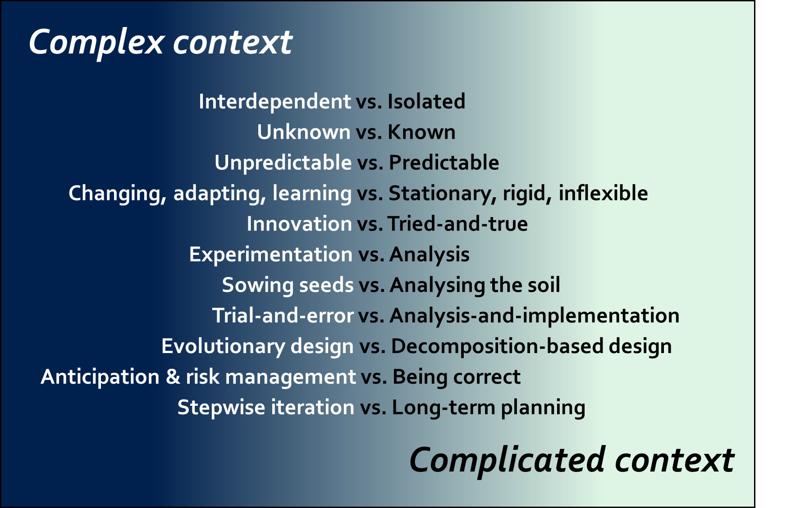
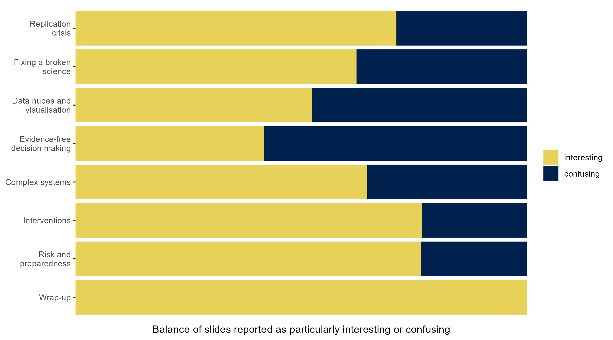

*This post introduces some recent training / education efforts I've been involved in. The underlying motivation is to build societal resilience and anticipation capacity to thrive in modern environments; constantly changing and subject to "black swan" risks stemming from rapid shifts.*

Surviving in a jungle, with training you've received in desert environments, is a tough task. In the same way many – particularly public sector – organisations are best adapted to handle tasks which are merely complicated instead of being "*complex*". Why is this a problem? It's because the right strategy for predictable contexts will not succeed in unpredictable ones. And the solution to repeated failures is not to do the wrong thing better ("We need to optimise *better*, with more data!"), but to ask a question: "What is it we're doing wrong?". The following quote illustrates the need to match tools with tasks:

> “A chain always breaks first in one particular link, but if the weight it is required to hold is too high, failure of the chain is guaranteed”
>
> - Yaneer Bar-Yam

In you're trying to pick up an airplane with a keychain, you won't succeed by continuously fortifying the weakest link that caused the previous failure. In a recent university course, *CARMA: Critical Appraisal of Research Methods and Analysis* (let's call it CARMA-23), I explain the difference between complex and complicated with the following slide. The presentations are open access so if you want, have a look at [this playlist](https://www.youtube.com/playlist?list=PLcKToLYD7YE3qcS2NsXer03bRaSQDOh4L), or [this](https://www.youtube.com/watch?v=A5Ni6ddcZRg&list=PLcKToLYD7YE3qcS2NsXer03bRaSQDOh4L&index=38), [this](https://www.youtube.com/watch?v=2qYPh6qzJjE&list=PLcKToLYD7YE3qcS2NsXer03bRaSQDOh4L&index=50) and [this](https://www.youtube.com/watch?v=8xah7o6cYT4&list=PLcKToLYD7YE3qcS2NsXer03bRaSQDOh4L&index=34) mini-lecture.

*Figure: Complex and complicated, two of four contextual domains depicted in something called the [Cynefin framework](https://cynefin.io/wiki/Cynefin).*

I ran CARMA for the first time in 2019 (let's call that one CARMA-19), and participants considered it [extremely useful](https://mattiheino.com/2019/09/04/carma/). My hope back then, as with the newer iteration, has been to contribute to the formation of more informed social science graduates, who might later become more informed policy makers. Lord knows we [direly need them](https://whn.global/scientific/cornerstone-of-pandemic-response/). CARMA is a decision-making course disguised as a research methodology course; as such, it introduces fundamentals of something called the crisis of confidence in social and life sciences, before going into behaviour change in applied settings. That's something civil servants are less interested to hear, and there's another training catered to them.

## Behavioural and complex systems insights

In 2022, our behaviour change and well-being research group ran a [training pilot](https://content-webapi.tuni.fi/proxy/public/2022-09/beha-koulutusesite_0.pdf) with more than 100 Finnish civil servants (let's call this one BEHA-22). Training was on behavioural and complex systems insights for human-centric public policy; a fusion of the "behaviour change in complex systems" theme from CARMA, and more traditional strands of [behaviour change science](https://www.cambridge.org/core/books/handbook-of-behavior-change/BD76D0E53DB1BC2EE8C53C1603D45E6A) as it currently stands. BEHA-22 introduced four major topics:

1. Behavior change science in a complex society: Moving past nudges, to self-organisation and tipping points
2. Bias-resilient decision making: Making mistakes work for you
3. Behaviour change interventions: Development and participatory annealing through iteration
4. Applying behavioural insights at the edge of chaos: Antifragile positioning and embracing crises

I've been spending a lot of time with the (mostly very positive) feedback we received, and used it to both hone delivery as well as inspire experimentation with some new pedagogical methods. That process fed into the reincarnation of CARMA-19.

## The return of CARMA

CARMA-23 progressed exploring the following goals (expanded upon in my [dissertation](https://mattiheino.com/2023/05/30/dissertation-trailer/)):

1. Becoming acquainted with the recent developments regarding the crisis of confidence in social and life sciences. Understanding what the research community is doing to improve the quality of published research.
2. Recognising the very crucial difference between *absence of evidence* and *evidence of absence*.
3. Understanding the rationale for visualising data, and what can be hidden when reporting summary statistics only. Learning to spot some common tricks used to visualise data in a favourable way to the presenter.
4. Understanding that decisions in the field do not need to rely on correct predictive statements, let alone scientific evidence: convexity and heuristics (something I dubbed "making evidence-free decisions", successfully confusing the hell out of people).
5. Becoming familiar with general features of so-called complex systems, including how interconnectedness, linearity, stationarity/stability, homogeneity etc. differ between complex and merely complicated contexts.
6. Understanding the rationale behind interventions and intervening in complex systems, particularly for societal change. Seeing a difference between decomposition-based planning/design, and complexity-based planning/design.

You may want to check out summaries of the mini-presentations: Students could choose the videos they considered the most interesting, and summarised them in one sentence. They were asked to put this summary as the headline of a card in our [course Padlet](https://padlet.com/mattitjheino/carma-critical-appraisal-of-research-methods-and-analysis-cz32pxu4izn91e3d), and elaborate in the card content.

https://padlet.com/mattitjheino/carma-critical-appraisal-of-research-methods-and-analysis-cz32pxu4izn91e3d

In the padlet, later parts of the course are to the left, and scrolling right will bring you towards the fundamentals explored in the beginning of the course. I also asked the students to list particularly interesting or confusing slides so I could develop the delivery of the ideas. Picture below shows what they said, when the slides are grouped by course section. Course starts from the top, proceeds downwards, forming a nice arc that hopefully conveys growing sense of confusion, with its eventual resolution:

*Figure: number of slides tagged* particularly *interesting, contra those tagged* particularly *confusing, per section. If you're wondering about "data nudes", see [here](https://mattiheino.com/2019/07/28/shitty-tables/) for a blog post and [here](https://www.youtube.com/watch?v=mQ7AsUWhSGQ&list=PLcKToLYD7YE3qcS2NsXer03bRaSQDOh4L&index=19) for the video obscenity.*

I've been playing around with narrative methodology recently, and in their final assignment, the students created narratives of their course experience after analysing it. A repeating theme is captured by this simple extract:

> *How have I been a university student for five years and this is the first time I’m learning about this?*
>
> - Viivi, a social policy major

## **In Reflection**

What's next? BEHA-23 is happening this fall in the form of a university course. I'm hoping to fuse what we've learned thus far, with some co-creation methodology I'm quite excited about at the moment. Hopefully, this will blossom as BEHA-24 available to larger audiences next year.

As we navigate the intricate terrains of modern decision-making, training becomes not just an asset but a necessity. The experiences with CARMA and BEHA iterations have showcased the evolving needs and aspirations of our public sector and society at large. As we prepare for the upcoming BEHA-23 and look forward to its potential in BEHA-24, the overarching goal remains unchanged: to equip individuals and organisations with the skills to not just survive but thrive amidst uncertainty. Whether you're a policymaker, a researcher, or a curious individual, it would be wonderful to receive feedback on the [lectures](https://www.youtube.com/watch?v=Bnbnp1cfOJI&list=PLcKToLYD7YE3qcS2NsXer03bRaSQDOh4L) or [summaries](https://padlet.com/mattitjheino/carma-cz32pxu4izn91e3d) of CARMA-23.

How are you preparing for the unpredictable challenges of the future?

---

## Epilogue

In the [post](https://mattiheino.com/2019/09/04/carma/) about the previous iteration of CARMA, I posted all attendee reviews in the end. There's a bit too much data now, but I wanted to include (with permission, slightly revised for grammar & brevity), a sample reflection essay from one of the participants in CARMA-23. It highlights very nicely the power of narratives and was a relatively pleasant pedagogical method for both the participants and yours truly. Here it is:

> At the beginning of the course the student was not really expecting anything. She was forced to choose the course because of changes in her life. She was disappointed to do the course without seeing the teacher and other students.
>
> But sometimes life surprises you – positively. The course opened her eyes to see what it was that she had felt bad about before. Going to university was the fulfilment of a youthful dream and she was so grateful for that, but she felt that something wasn't right – research was not as ethical as she expected it: teachers told you to just do *something* now and you can do things differently later.
>
> The course told her a different story: science can and should be done in a proper way... [Editorial note: omitted bits describing solutions to the replication crisis]
>
> She told her husband and friends about the course and how mind blowing it has been. And she was very angry and confused about the world, and everything is just happening without control and the winner is who lies the best. It even made her feel more bad that when she found in the course how in the research visualising the data can be done in the ways that it tricks the viewer, especially with bar plots. She also acknowledged that she was part of the problem wanting herself and her deeds to be seen in the good light – not “naked” like data.
>
> She was herself involved in decision making in politics so it was not surprising to her that it doesn’t always – and many times – rely on research. But the thing she learned is that it is ok to think that complex problems [often] should not and even can not be taken care of with slow processes of research. But still research has its own important place in serving the better society. And [we can study how to change things by not only looking at overt] behaviour, but the phenomena behind it, when it’s about complicated people living in a complicated society – as it always is!
>
> Even though the reason for attending the course was not learning, but the necessity to pass the university, the course had made the research "great again" in her mind. And she understood that the course had shown that there are a lot of people who see "the emperor has no clothes".
>
> After closing her laptop after the last assignment she felt empty because it was the last one in the masters program in the university. She was thinking about the future and how to manage it. She fell asleep and in the dream the teacher of the course said: "Remember the birds!”. And in the morning she felt that all she had was this moment and all she needed in the future was her open eyes and open mind.
>
> - Laura, a social policy major
