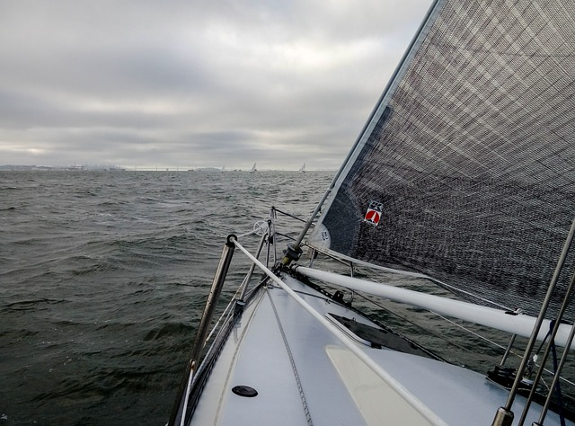

*Tiivistelmä: Ennen kuin ongelma muuttuu katastrofiksi, on usein olemassa hiljaisia signaaleja, jotka viestivät tulevista haasteista. Kun terveyspalveluiden käyttö, rikollisuus tai taloudelliset indikaattorit osoittavat äkillistä heikentymistä, yhteisöllisyyteen ja asenteisiin liittyvät varoitusmerkit ovat usein jo näkyneet pitkään. Nämä signaalit on elintärkeää tunnistaa ajoissa, jotta kehityskulku voidaan pysäyttää – kun se on vielä niin taloudellisesti kuin hyvinvoinninkin kannalta edullista.*

Niin kutsutut [mustat joutsenet](https://fi.wikipedia.org/wiki/Musta_joutsen:_Eritt%C3%A4in_ep%C3%A4todenn%C3%A4k%C3%B6isen_vaikutus) ovat harvinaisia tapahtumakulkuja, joilla on massiiviset vaikutukset ja joita on vaikea ennustaa. Jälkikäteen arvioituna ne kuitenkin näyttävät ilmiselviltä, eivätkä ne olleet vaikeasti ennustettavia *kaikille*. Esimerkiksi 9/11-iskut World Trade Centeriin eivät olleet mustia joutsenia terroristeille, tai edes kaikille tiedustelupalveluissa; niitä koskevat varoitukset eivät vain päässeet pinnalle tilannekuvaa muodostettaessa. Samoin maailman pysäyttävän ja huomattavasti COVID-19:ä vakavamman pandemian riski on ollut [tutkijoiden tiedossa](https://journals.aps.org/pre/abstract/10.1103/PhysRevE.73.020903) pitkään, mutta poliittinen tahto sen vaikutusten ennaltaehkäisemiseksi on puuttunut.

**Paikallisella tasolla** mustia joutsenia voivat olla kiusaamisen kärjistyminen koulusurmaksi, huumerikollisuuden tai asuntomurtojen räjähtäminen, tai jokin muu inhimillisesti traaginen kehityskulku, joka romahduttaa kaupungin veto- ja pitovoiman. Kuten markkinoinnin maailmassa tiedetään: brändejä rakennetaan pitkään, mutta ne romahtavat nopeasti.

**Monet tuntuvat pitävän osallisuutta** – eli asukkaiden mahdollisuutta vaikuttaa itselleen tärkeisiin asioihin ja tuntea yhteisöllisyyttä – **pehmeänä “hyvän mielen toimintona”**. Itse näen sen kuitenkin kiinteänä osana **turvallisuutta, resilienssiä ja kriisinkestävyyttä**. Tämä näkyi selvästi esimerkiksi Valtioneuvoston kanslian käyttäytymistieteellisen yksikön [varautumista koskevassa tutkimuksessa](https://vnk.fi/-/kayttaytymistieteellinen-selvitys-kyky-varautua-yhteisollisyys-ja-selkeat-toimintasuositukset-lisaavat-suomalaisten-kriisivalmiutta), jota olin mukana tuottamassa; odottamattomissa tilanteissa ihmiset tukeutuvat lähiyhteisöönsä. Omistajuutta elinympäristöstään kokevat ihmiset eivät tuhoa julkisia tiloja esimerkiksi rikkomalla lasia leikkipaikalle, tai sotkemisen ja ilkivallan keinoin vaikuta yleiseen viihtyvyyteen. **He** **kuluttavat vähemmän terveyspalveluita, heillä on vähemmän mielenterveyden ongelmia, ja heitä on myös vaikeampi rekrytoida rikolliseen toimintaan**. Myös kuntalaki kannustaa osallisuuden lisäämiseen, esimerkiksi sen työllisyys- ja hyvinvointivaikutusten vuoksi.

## Epävakauden ehkäiseminen

Tuoreessa [Hybridiuhkakeskuksen julkaisemassa raportissa](https://vnk.fi/-/keskustelupaperi-hybridivaikuttamiselta-suojautumisessa-on-tarkeaa-ymmartaa-sen-taustalla-vaikuttavia-psykologisia-tekijoita) käsittelemme yhteiskunnallisen epävakauttamisen mekanismeja hybridivaikuttajan näkökulmasta. Mikäli kolme inhimillisen itseohjautuvuuden mahdollistavaa psykologista perustarvetta – autonomia, kykenevyys ja yhteisöllisyys – eivät täyty osallisuuden kokemisen myötä, muodostuu vaje, jota pahantahtoiset toimijat voivat hyödyntää yhteiskunnallisten ja paikallisten instituutioiden heikentämiseen. Käsittelemme raportissa myös ns. keikahduspisteitä, jotka presidentti Sauli Niinistö jälleen tällä viikolla mainitsi [puheessaan](https://www.sttinfo.fi/tiedote/tasavallan-presidentti-sauli-niiniston-puhe-suurlahettilaskokouksessa-22.8.2023?publisherId=3981&releaseId=70004785&lang=fi).

Keikahduspisteistä olen kirjoittanut aiemmin esimerkiksi [käyttäytymisen muutosjohtamista](https://mattiheino.com/2023/06/05/kayttaytymisen-muutosjohtaminen/) käsitellessäni. Siitä on myös olemassa erinomainen, viiden minuutin [interaktiivinen johdanto](https://heinonmatti.github.io/attractors_fi/fi.html). Julkishallinnon käyttäytymistieteelliseen kontekstiin kiteytettynä: **siinä vaiheessa kun terveyspalveluiden kuluttamisessa, rikollisuudessa tai muussa taloudelliselta merkitykseltään tärkeässä indikaattorissa tapahtuu äkillinen keikahdus pahempaan, asenteita ja yhteisöllisyyttä koskevat hiljaiset signaalit ovat usein jo pitkään viestineet ongelmista**. Järjestelmän lopulta keikahtaessa, sitä ei noin vain keikauteta takaisin; muistanemme ennaltaehkäisyyn kannustavat sananlaskut *Parempi virsta väärää kuin vaaksa vaaraa*, sekä *Ei vara venettä kaada* – tai englanniksi *An ounce of prevention is worth a pound of cure*.

> Parhaiten ja kustannustehokkaimmin yhteiskunnan turvallisuutta ylläpidetään ennalta estävin toimenpitein, juurisyihin vaikuttamalla
>
> - Valtioneuvoston kanslian [raportti](https://julkaisut.valtioneuvosto.fi/handle/10024/161358): Kokonaisresilienssi ja turvallisuus, s. 97

## Osallisuustieto ja -toiminta päätöksenteon tehostajana

**Johtajan** on mahdollista välttää tilannetta, jossa tämä joutuu levittelemään käsiään ja toteamaan “Se oli musta joutsen; se johtui tapahtumista joita ei olisi voitu ennakoida”. **Huoltamaton laiva voi upota pienessäkin myrskyssä, jonka tiedettiin vielä matkan varrelle osuvan.** Kunnan tai kaupungin asukkaat ovat oman elinympäristönsä asiantuntijoita ja heillä on naapurustostaan tietoa, jota kenelläkään muulla ei ole – tätä tietoa voidaan kerätä ja hyödyntää hiljaisten signaalien kartoittamiseen, esimerkiksi [ihmissensoriverkostojen](https://cynefin.io/wiki/Human_sensor_network) tai perinteisempien kyselytyökalujen avulla. Osallisuutta kokemattomat ja syrjäytymisvaarassa olevat asukkaat eivät kuitenkaan välttämättä koe vastauksillaan olevan merkitystä ja siksi muita harvemmin vastaavat kyselyihin. Sen vuoksi tiedonkeruu ei yleensä voi rajoittua kaupungin sivuilla olevalla verkkolomakkeeseen, vaan esimerkiksi kouluja voidaan osallistaa tiedonkeruuseen ja ymmärryksen kasvattamiseen.

Osallisuus on riskinhallintaa myös toimenpiteiden suunnittelussa. Kun suunnitelmia yhteiskehitetään asukkaiden kanssa ja ideoita karaistaan heidän näkökulmillaan, niillä on **paremmat mahdollisuudet olla tuottamatta odottamattomia, ikäviä sivuvaikutuksia.** Samaa tarkoitusta varten tarvitsemme työskentelytapoja, joissa esimerkiksi kunnan eri toimialat voivat tehdä yhteistyötä siilorajat ylittävissä verkostoissa – myös organisaation rajat ylittäen, kuten hyvinvointialueilla toteutettavan pelastustoimen tapauksessa. **Osallistamisen keinovalikoimalla voidaan paitsi saada koko organisaation osaamispääoma käyttöön, myös lisättyä työtyytyväisyyttä ja itseohjautuvuutta.** Työn kokonaismäärä voi myös laskea, kun turhia asioita tehdään vähemmän.

> [K]ansalaisten tulisi olla osallisina käytännön turvallisuustyössä vahvemmin esimerkiksi siten, että kansalaisilta (paikallisesti) poimittaisiin yleistä huolta aiheuttavat ilmiöt ja kehityskulut.
>
> - *Valtioneuvoston kanslian [raportti](https://julkaisut.valtioneuvosto.fi/handle/10024/161358): Kokonaisresilienssi ja turvallisuus, s. 84*

Asukkailta kerättyä dataa voidaan käyttää myös yhteisymmärryksen rakentamiseen, nykyaikaisen [keskustelevan demokratian](https://fi.wikipedia.org/wiki/Deliberatiivinen_demokratia) kulttuuria kohti siirryttäessä. Yhtenä mahdollisuutena voisi olla toimenpidesuunnittelu niin, että paikalliset yritykset ovat mukana ideoimassa ansaintalogiikkaa, jolla toimenpide (esim. katutapahtuma tai nuorten kerho) rahoitetaan. Maailmalla on esimerkiksi käytetty mallia, jonka avulla kyselydatasta saadaan ideoita työpajaan, jossa kolmen henkilön ryhmät – kussakin nuori, seniori ja kaupungin päättäjä – rakentavat kokeilujen portfoliota.

Yhteenvetona: **osallisuuden lisääminen on niin taloudellisesti kuin sosiaalisestikin kannattavaa**. Kuuntelemalla asukkaitamme voimme **ennakoida tulevia haasteita, välttää kalliita virheitä ja rakentaa kestävämpiä, yhteisöllisempiä ja taloudellisesti vahvempia asuinalueita**. Tämä on välttämätöntä kasvavan epävarmuuden maailmassa menestymiseksi.

Osallistamisen monista tavoista lisätietoa saat [osallisuuden edistäjän oppaasta](https://www.julkari.fi/bitstream/handle/10024/146717/URN_ISBN_978-952-408-088-0.pdf?sequence=1&isAllowed=y) tai naapuruston ystävälliseltä käyttäytymistieteilijältäsi.

