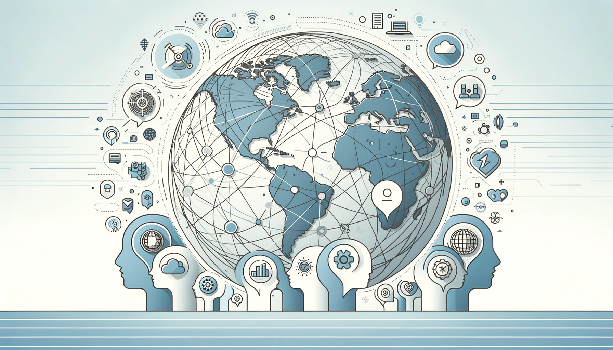

This piece has been originally published as: *Heino, M. T. J., Bilodeau, S., Fox, G., Gershenson, C., & Bar-Yam, Y. (2023). Crafting Policies for an Interconnected World. WHN Science Communications, 4(10), 1–1. <https://doi.org/10.59454/whn-2310-348>*

While our knowledge expands faster than ever, our ability to anticipate and respond to global challenges or opportunities remains limited. A political upheaval in one country, a technological innovation in another, or an epidemic in a far-away city – any of these can create a global change cascade with many unexpected repercussions. Why is this? A significant part of the answer lies in our increased global connectivity, which produces both new risks and novel opportunities for collaborative action.

In this rapidly evolving world, proactive and adaptive public policies are paramount, with a primary focus on human well-being, rights, and needs. The COVID-19 pandemic serves as a stark reminder that while traditional political and economic systems claim to represent public interests and allocate resources optimally, there’s often a gap between claim and reality. That people vote for political leaders doesn’t guarantee they will focus on public well-being or the availability of resources. A genuine human-centered focus on well-being, satisfaction, and quality of life becomes indispensable.

Reflecting on our pandemic response, mostly hierarchy-based and bureaucratic, we observed glaring [operational shortcomings](https://whn.global/scientific/cornerstone-of-pandemic-response/): delayed responses, disjointed actions, and ineffective execution of preparedness plans [[1]](https://whn.global/scientific/crafting-policies-for-an-interconnected-world/#1). However, what has been less discussed is the insight that the crisis offers into the role of uncertainty due to nonlinear risks in shaping policy outcomes.

Complex systems may present unseen, extreme risks that can spiral into catastrophic failures if left unaddressed early on. These failures can occur upon reaching instabilities and “tipping points,” that result in abrupt large-scale losses of well-being or resilience of a system, be it an ecosystem or a social system such as a nation [[2–4]](https://whn.global/scientific/crafting-policies-for-an-interconnected-world/#2).

The poor understanding of such non-linear risks is apparent through the ongoing  phases of the pandemic, where those who called for increased precaution were often accused of “fearmongering”. A misinterpretation of human reactions is a likely contributor: contrary to the common belief, people do not usually panic in emergencies. Instead, they tend to respond in constructive, cooperative ways, if given clear and accurate information. The widespread belief in a mass panic during disasters belongs to a group of misconceptions, studied in social psychology under the umbrella term of “disaster myths” [[5–7]](https://whn.global/scientific/crafting-policies-for-an-interconnected-world/#5). The real danger lies in creating a false sense of security. If such a sense is shattered due to an unexpected event and lack of preparation, the fallout can be far more damaging in terms of physical, mental, and economic impact, not to mention loss of trust. Thus, the general recommendation for communication is to not downplay threats.  Instead, authorities need to offer the public clear information about potential risks and, crucially, guidance on how to prepare and respond effectively. This guidance has the potential to transform anxiety and passivity into positive self-organized action [[8]](https://whn.global/scientific/crafting-policies-for-an-interconnected-world/#8).

Human action lies at the core of many contemporary challenges, from climate change to public health crises. After all, it is human behavior – collective and nonlinear – that fuels the uncertainty of the modern world. The recognition of how traditional approaches can fall short in our increasingly volatile and complex contexts has led to increased demand for “strategic behavioral public policy” [[9]](https://whn.global/scientific/crafting-policies-for-an-interconnected-world/#9).

How can we advance our understanding of human behavior linked to instabilities and tipping points and turn them into capabilities for policy makers? The key is to understand how networks of dependencies between people link behaviors across a system. Complex systems science [[10]](https://whn.global/scientific/crafting-policies-for-an-interconnected-world/#10), as a field of study, involves understanding how different parts of a system interact with each other, creating emergent properties at multiple scales that cannot be predicted by studying the parts individually: There is no tsunami in a water molecule, no trusting relationship in an isolated interaction, no behavioral pattern in a single act, and no pandemic in an isolated infection [[11]](https://whn.global/scientific/crafting-policies-for-an-interconnected-world/#11). Yet, the transformative potential of combining behavioral science with an understanding of complex systems science, a crucial tool for decision-making under uncertainty, remains largely untapped.

There are significant opportunities in weaving complex systems perspectives into human-centered public policy, infusing a deeper understanding of uncertainty into the heart of policy-making. A fusion of behavioral insights with an understanding of complex systems is not merely an intellectual exercise but a crucial tool for decision-making in crisis conditions and under uncertainty. As some examples:

1. It urges us to prepare for uncommon events, like pandemics with impacts surpassing those of major conflicts like World War II. This realization comes as we discover that what would be extremely rare events in isolated systems, can become relatively frequent in an interconnected world [[12–14]](https://whn.global/scientific/crafting-policies-for-an-interconnected-world/#12). A long-standing example is how economic crises, which many experts considered rare enough to be negligible, have repeatedly caught us off-guard.
2. It emphasizes the importance of adaptability in seizing unforeseen opportunities and minimizing potential damages. Central to this adaptability is the concept of “optionality.” This means maintaining a broad array of choices and opportunities, allowing for increased adaptability and selective application based on evolving circumstances. Recognizing that we cannot anticipate every twist and turn of the future, our best approach is indeed to embrace evolutionary strategies; creating *systems that effectively solve problems*, instead of trying to solve each unique problem separately [[15]](https://whn.global/scientific/crafting-policies-for-an-interconnected-world/#15). An important takeaway is that instead of over-optimizing for current conditions, investing in buffers and exploration – even if they seem redundant – becomes vital when the future is uncertain.
3. It empowers us to distribute decision-making power to [collaborative teams](https://necsi.edu/why-teams). This is because teams can solve many more high complexity problems than individuals can, and significant portions of the modern world are becoming too complex for even the most competent individuals to fully grasp [[16,17]](https://whn.global/scientific/crafting-policies-for-an-interconnected-world/#16).

However, integrating these insights is easier said than done. The shift requires significant capacity building among policymakers. It begins with understanding why novel approaches are necessary, and ensuring the adequate systems for preparedness are empowered. Training programs can help policymakers grasp the concepts of risk, uncertainty, and complex systems.

**Developing human-centric policies under uncertainty**

One recent training to improve competence in behavioral and complex systems insights [[18]](https://whn.global/scientific/crafting-policies-for-an-interconnected-world/#18), emphasized three factors of the policy development process: co-creation, iteration, and creativity. These are briefly outlined below.

- **Co-creation:** Ideal teams addressing complex challenges have members with a diversity of backgrounds and expertise, where everyone is able to contribute their knowledge to shared action. Much can be achieved by limiting the influence of hierarchy and enabling interaction between team members and other stakeholders; formal approaches include e.g. the implementation of “red teams” [[19]](https://whn.global/scientific/crafting-policies-for-an-interconnected-world/#19). Those who are most impacted by the plans, need to play a key role in the process. They are often citizens, who can provide critical information and expertise about the local environment [[20,21]](https://whn.global/scientific/crafting-policies-for-an-interconnected-world/#20).
- **Iteration:** Mistakes naturally occur as an intrinsic part of gaining experience, developing the ability to tackle complex challenges, and building organizations to address them.  In general, ideas and systems for responding to complex contexts need to be allowed to evolve through (parallel) small-scale experiments and feasibility tests in real-world contexts. Feasibility testing should leverage the aforementioned optionality, retaining the ability to roll back in case of unforeseen negative consequences – or to amplify positive aspects that are only revealed upon observing how the plan interacts with its context [[21,22]](https://whn.global/scientific/crafting-policies-for-an-interconnected-world/#21).
- **Creativity:**Excessive fear and stress impede innovation. If the design process is science-based, inclusive, and supports learning from weaknesses revealed by iterative explorations that can safely fail, we need not be afraid to try something different or outside of the box. In fact, this is where the most innovative solutions often come from.

Drawing on our earlier discussion on complex systems and human behavior, we understand that in the face of sudden threats, there is a critical need for nimbleness. Rapid response units, representing the frontline of our defense, should possess the autonomy to act, unencumbered by political hindrances. An example would be fire departments’ autonomy to respond to emergencies within pre-set and commonly agreed-upon protocols. The lessons from the pandemic and the insights from complex systems thinking underscore this. But how do we reconcile swift action with informed decision-making?

Transparent, educated communication, and trust based on the experience of success, can potentially bridge this gap. Science is how we understand the consequences of actions, and selecting the best consequences is essential for global risks. By ensuring policymakers and the public are informed and aligned, we can address risks head-on, anchored in commonly-held values and backed by science. As we lean into the practices discussed earlier, such as co-creation and iteration, our mindset too must evolve. Embracing new, sometimes unconventional, approaches will enable us to sidestep past policy pitfalls, especially those painfully highlighted by recent global events. Protecting rapid response teams from political interference upgrades our societal apparatus to confront the multifaceted challenges of our time.

**Learning anticipatory adaptation**

Our ultimate aim is clear: proactivity. Rather than reacting once harm is done, we need to anticipate, adapt, and equip policymakers with the necessary insights and tools using a multidisciplinary approach that includes behavioral and complexity sciences. We can respond to the unpredictable, ensuring society is robust and resilient. This necessitates a collective call-to-action, urging citizens and organizations to develop institutions and inform policy makers to empower communities to thrive amidst uncertainties.

**Bibliography**

[1] Heino MT, Bilodeau S, Bar-Yam Y, Gershenson C, Raina S, Ewing A, et al. Building Capacity for Action: The Cornerstone of Pandemic Response. WHN Sci Commun 2023;4:1–1. <https://doi.org/10.59454/whn-2306-015>.

[2] Scheffer M, Bolhuis JE, Borsboom D, Buchman TG, Gijzel SMW, Goulson D, et al. Quantifying resilience of humans and other animals. Proc Natl Acad Sci 2018:201810630. <https://doi.org/10/gfqjqr>.

[3] Heino M, Proverbio D, Resnicow K, Marchand G, Hankonen N. Attractor landscapes: A unifying conceptual model for understanding behaviour change across scales of observation 2022. <https://doi.org/10.31234/osf.io/3rxyd>.

[4] Scheffer M, Borsboom D, Nieuwenhuis S, Westley F. Belief traps: Tackling the inertia of harmful beliefs. Proc Natl Acad Sci 2022;119:e2203149119. <https://doi.org/10.1073/pnas.2203149119>.

[5] Clark DO, Patrick DL, Grembowski D, Durham ML. Socioeconomic status and exercise self-efficacy in late life. J Behav Med 1995;18:355–76. <https://doi.org/10/bjddw6>.

[6] Drury J, Novelli D, Stott C. Psychological disaster myths in the perception and management of mass emergencies: Psychological disaster myths. J Appl Soc Psychol 2013;43:2259–70. <https://doi.org/10.1111/jasp.12176>.

[7] Drury J, Reicher S, Stott C. COVID-19 in context: Why do people die in emergencies? It’s probably not because of collective psychology. Br J Soc Psychol 2020;59:686–93. <https://doi.org/10/gg3hr4>.

[8] Orbell S, Zahid H, Henderson CJ. Changing Behavior Using the Health Belief Model and Protection Motivation Theory. In: Hamilton K, Cameron LD, Hagger MS, Hankonen N, Lintunen T, editors. Handb. Behav. Change, Cambridge: Cambridge University Press; 2020, p. 46–59. <https://doi.org/10.1017/9781108677318.004>.

[9] Schmidt R, Stenger K. Behavioral brittleness: the case for strategic behavioral public policy. Behav Public Policy 2021:1–26. <https://doi.org/10.1017/bpp.2021.16>.

[10] Siegenfeld AF, Bar-Yam Y. An Introduction to Complex Systems Science and Its Applications. Complexity 2020;2020:6105872. <https://doi.org/10/ghthww>.

[11] Heino MTJ. Understanding and shaping complex social psychological systems: Lessons from an emerging paradigm to thrive in an uncertain world 2023. <https://doi.org/10.31234/osf.io/qxa4n>.

[12] Cirillo P, Taleb NN. Tail risk of contagious diseases. Nat Phys 2020;16:606–13. <https://doi.org/10/ggxf5n>.

[13] Rauch EM, Bar-Yam Y. Long-range interactions and evolutionary stability in a predator-prey system. Phys Rev E 2006;73:020903. <https://doi.org/10/d9zbc4>.

[14] Taleb NN. Statistical Consequences of Fat Tails: Real World Preasymptotics, Epistemology, and Applications. Illustrated Edition. STEM Academic Press; 2020.

[15] Bar-Yam Y. Engineering Complex Systems: Multiscale Analysis and Evolutionary Engineering. In: Braha D, Minai AA, Bar-Yam Y, editors. Complex Eng. Syst. Sci. Meets Technol., Berlin, Heidelberg: Springer; 2006, p. 22–39. <https://doi.org/10.1007/3-540-32834-3_2>.

[16] Bar-Yam Y. Why Teams? N Engl Complex Syst Inst 2017. <https://necsi.edu/why-teams> (accessed August 9, 2023).

[17] Bar-Yam Y. Complexity rising: From human beings to human civilization, a complexity profile. Encycl Life Support Syst 2002.

[18] Hankonen N, Heino MTJ, Saurio K, Palsola M, Puukko S. Developing and evaluating behavioural and systems insights training for public servants: a feasibility study. Julkaisematon Käsikirjoitus 2023.

[19] UK Ministry of Defence (MOD). Red Teaming Handbook. GOVUK 2021. <https://www.gov.uk/government/publications/a-guide-to-red-teaming> (accessed August 9, 2023).

[20] Tan Y-R, Agrawal A, Matsoso MP, Katz R, Davis SLM, Winkler AS, et al. A call for citizen science in pandemic preparedness and response: beyond data collection. BMJ Glob Health 2022;7:e009389. <https://doi.org/10.1136/bmjgh-2022-009389>.

[21] Joint Research Centre, European Commission, Rancati A, Snowden D. Managing complexity (and chaos) in times of crisis: a field guide for decision makers inspired by the Cynefin framework. Luxembourg: Publications Office of the European Union; 2021.

[22] Skivington K, Matthews L, Simpson SA, Craig P, Baird J, Blazeby JM, et al. A new framework for developing and evaluating complex interventions: update of Medical Research Council guidance. BMJ 2021;374:n2061. <https://doi.org/10.1136/bmj.n2061>.
