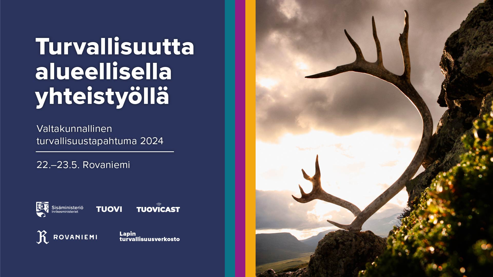

PÄIVITYS | Turvallisuustapahtumassa syntyneitä ajatuksia löytyy tästä postauksesta: [“Mistä tässä tilanteessa on kyse?”: Henkisestä kriisinkestävyydestä yhteisölliseen kriisitoimijuuteen](https://mattiheino.com/2024/05/29/turvallisuustapahtuma/).

Puhun [Sisäministeriön vuosittaisessa turvallisuustapahtumassa](https://sisainenturvallisuus.fi/valtakunnallinen-turvallisuustapahtuma-2024-rovaniemi) otsikolla *Riskinhallinta epävarmuuden aikoina: Väestön osallistaminen varautumis- ja ennakointimuotoiluun*. Esityksen kuvaus löytyy alta, ja diat tulevat valmistuessaan tälle sivulle. Laittakaa viestiä jos olette osallistumassa tapahtumaan!

> ### Puhujan kuvaus
>
> Matti T. J. Heino on sosiaalipsykologi, joka tutkii käyttäytymisen muutosta ja resilienssiä epävarmuuden toimintaympäristöissä. Häntä kiinnostaa erityisesti riskinhallinnan ja varautumisen teemat kompleksisissa järjestelmissä. Viime aikoina Heino on tutkimuksen ohella toiminut VNK:n käyttäytymistieteellisen ennakoinnin KETTU-yksikössä, kouluttanut julkishallintoa käyttäytymistiedon hyödyntämiseen yhteiskunnallisen kriisinkestävyyden lisäämiseksi, sekä soveltanut tutkimustietoa kotikuntansa turvallisuus-, hyvinvointi- ja osallisuustoimintaan.
>
> ### Esityksen sisältö
>
> Voiko resilienssiä rakentaa käyttäytymiseen liittyviä myyttejä purkamalla ja osallistamalla ihmisiä? Voidaanko väestön osaamispääomaa hyödyntää alueiden kehittämisessä nykyistä paremmin? Millaisia olisivat päätöksenteon tukijärjestelmät, jotka auttaisivat tässä, samalla kun tarjoaisivat mahdollisuuden tarttua ajoissa negatiivisiin kehityskulkuihin – ja kääntyisivät laajamittaisessa kriisissä ikkunoiksi kokemusmaailmaan, josta syntyy itseohjautuva yhteisövaste? Esityksessä pureudutaan viimeaikaisiin tieteellisiin ja käytännöllisiin edistysaskeliin. Ne avaavat uusia mahdollisuuksia resilienssin yhteistuotantoon, sekä kokemusperäisen tiedon hyödyntämiseen varautumisessa ja kriisinhallinnassa.
