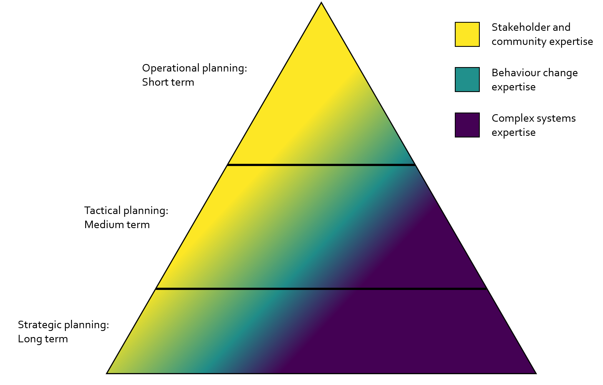

*Due to frequent misconceptions about the topic, I wanted to outline a via negativa description of this thing called behaviour change science: in other word*s, what is it not*?* *This is part of a series of posts clarifying the perspective I take in instructing* *[a virtual course on behaviour change in complex systems](https://necsi.edu/complex-social-psychological-systems)* *at the New England Complex Systems Institute (NECSI). The course mixes behaviour change with complex systems science along with practical collaboration tools for making sense of the world in order to* *act in it.*

Behaviour change science refers to an interdisciplinary approach, which often hails from social psychology, and studies changing human behaviour. The approach is motivated by the fact that many large problems we face today – be they about spreading misinformation, preventing non-communicable diseases, taking climate action, or preparing for pandemics – contain human action as major parts of both the problems and their solutions.

Based on many conversations regarding confusions around the topic, there is a need to clarify five points.

**First, "behaviour change" in the current context is understood in a broad sense of the term, synonymous with human action,** ***not*** **as e.g. behaviourism.** As such, it encompasses not only individuals, but also other scales of observation from dyads to small groups, communities and society at large. Social ecological models, for example, encourage us to think in such a multiscale manner, considering how individuals are embedded within larger systems. Methods for achieving change tend to differ for each scale; e.g. impacting communities entails different tools than impacting individuals (but we can also [unify these scales](https://www.tandfonline.com/doi/full/10.1080/17437199.2022.2146598)). And people I talk to in behaviour change, understand action arises from interaction (albeit they may lack the specific terminology).

**Second, the term *intervention* is understood in behaviour change context in a broader sense, than "nudges" to mess with people's lives.** A behaviour change intervention depicts any intentional change effort in a system, from communication campaigns to community development workshops and structural measures such as regulation and taxation. Even at the individual level, behaviour change interventions do not need to imply that an individual’s life is tampered with in a top-down manner; in fact, the best way to change behaviour is often to provide resources which enable the individual to act in better alignment with goals they have. Interventions can and do change environments that hamper those goals, or provide social resources and connections, which enable individuals to take action with their compatriots.

**Third, behaviour change is not an activity taken up by actors standing outside the system that’s being intervened upon.** Instead, best practices of intervention design compel us to work with stakeholders and communities when planning and implementing the interventions. This imperative goes back to Kurt Lewin’s action research, where participatory problem solving is combined with research activities. Leadership in social psychology is often defined not as the actions of a particular high-ranking role, but those available to any individuals in a system. Behaviour change practice is the same. To exaggerate only slightly: "Birds do it, bees do it, even educated fleas do it".

**Fourth, while interventions can be thought of as “events in systems”, some of which produce lasting effects while others wash away, viewing interventions as transient programme-like entities can narrow our thinking of how enablement of incremental, evolutionary, bottom-up behaviour change could optimally take place.** Governance is, after all, conducted by local stakeholders in constant contact with the system, with larger leeway to adjust actions without fear of breaking evaluation protocol, and hopefully “skin in the game” perhaps long after intervention designers have moved on.

**Fifth, nothing compels an intervention designer to infuse something novel into a system.** For example, *reverse translation* studies what already works in practice, while aiming to learn how to replicate success elsewhere. *De-implementation*, on the other hand, studies what does not work, with the goal of removing practices causing harm. In fact, “Primum non nocere”; first, do no harm, is the single most important principle for behaviour change interventions .

## Making sense of human action

Understanding and influencing human behavior is usually not a simple endeavor. Behaviors are shaped by a multitude of interacting factors across different scales, from the individual to the societal, and occur within systems of systems. Developing effective behavior change interventions requires grappling with this complexity. The approach taken in traditional behaviour change science uses behaviour change theories to make this complexity more manageable. I view these more akin to heuristic frameworks with practical utility – codification attempts of "what works for whom and when" – rather than *theories* in the natural science sense.

If you want a schematic of how I see behaviour change science, it might be something like the triangle below. It's a somewhat silly representation, but what the triangle tries to convey, is that complex systems expertise sets out strategic priorities: Which futures should we pursue, and what kinds of methods make sense to get us going (key word is often *evolution*).

Behaviour change science, on the other hand, is much more tactical, offering tools and frameworks to understand how to make things happen closer to where the rubber hits the road.

But we will also go nowhere, unless we can harness collective intelligence of stakeholders and organisation / community members. This is why collaboration methods are essential. I will teach some of the ones I've found most useful in the [course](https://necsi.edu/complex-social-psychological-systems) I mentioned in the intro.

If you want to learn more about the intersection of complex systems science and behaviour change, have a look at my [Google Scholar profile](https://scholar.google.fi/citations?hl=en&user=jrDugIgAAAAJ&view_op=list_works&sortby=pubdate), or see these posts:

- [Crafting Policies for an Interconnected World](https://mattiheino.com/2023/12/02/crafting-policies/)
- [Improving organisational capacity to operate under uncertainty: Start with training?](https://mattiheino.com/2023/08/08/training/)
- [What Does “Behaviour Change Science” Study?](https://mattiheino.com/2021/12/11/intro-complexity-bc/)
