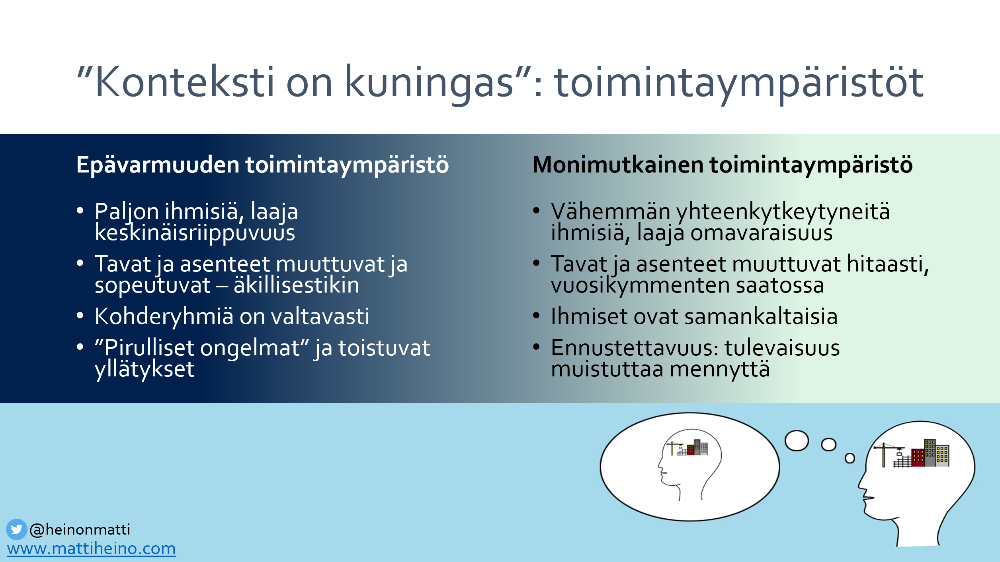
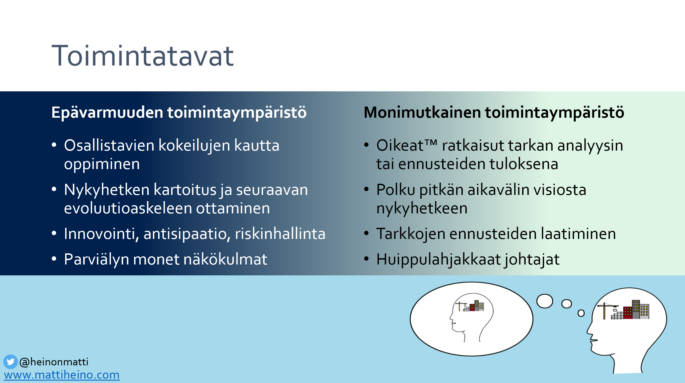
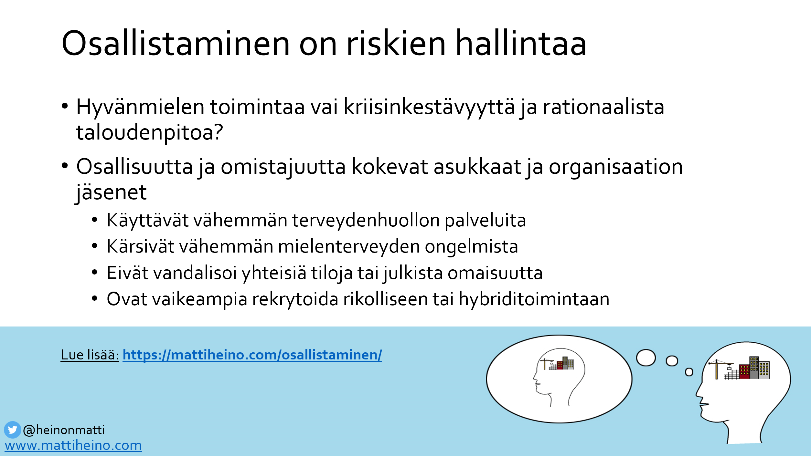
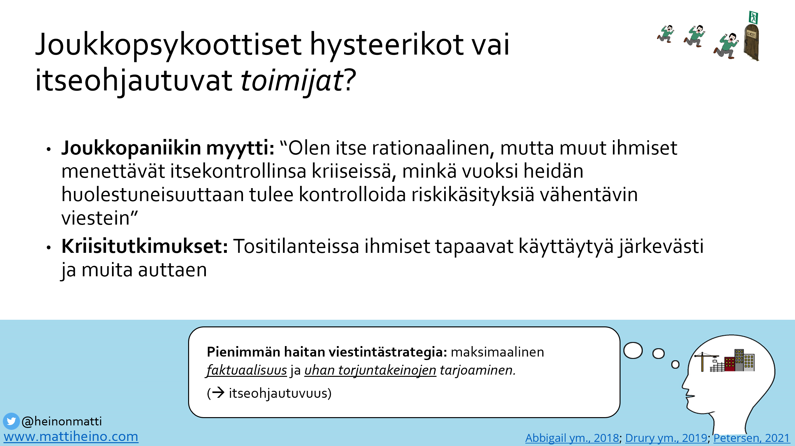

Olin [puhumassa varautumismuotoilusta](https://mattiheino.com/2024/04/15/varautumismuotoilu/) Sisäministeriön valtakunnallisessa turvallisuustapahtumassa, jonka teemana oli "Turvallisuutta alueellisella yhteistyöllä". Tapahtumassa käsiteltiin monipuolisesti turvallisuuden ja kriisinkestävyyden parantamista. Keskustelut ja puheenvuorot toivat esiin monia tärkeitä näkökulmia ja käytännön kokemuksia niin valtionhallinnon kuin kuntien, kaupunkien, pelastusviranomaisten ja vapaaehtoistoimijoiden maailmoista. Tässä kirjoituksessa nostan esiin keskusteluja, jotka itse koin tapahtumassa tärkeiksi.

#### **Ydinkysymys: "Mistä tässä tilanteessa on kyse?"**

Yksi tärkeimpiä huomioitani oli, miten kaiken yhteistoiminnan ytimessä on kysymys: "Mistä tässä tilanteessa on oikein kyse?". Kun Venäjä kertoo siirtävänsä vesirajoja, järjestetään kokous jossa tämä kysymys kysytään. Kun pelastusviranomaiset saavat tiedon onnettomuudesta, tämä kysymys kysytään. Kun alueen asukkaat näkevät uutisen merkittävistä säästötoimista, tämä kysymys kysytään.

Päätöksentekotutkimuksesta tiedämme, että yksilöinä tilannekuvakysymystä kysyttäessä selaamme ensin läpi aiempia kokemuksiamme. Sitten lukkiudumme ensimmäiseen asiantuntemuksemme pohjalta tilanteeseen sopivaan kokemukseen: “tämä tilanne on kuin [aiempi kokemus]”. Sen jälkeen tilannekuvan tarkentamisessa painotamme ennakkoajatuksemme puolesta puhuvia vihjeitä, jättäen valtaosan siihen sopimattomista vihjeistä huomiotta. Tämä ei tavallisesti ole ongelma, vaan säästää energiaa samalla tapaa, kuin emme kävellessäkään kiinnitä huomiota jokaiseen askeleeseen. Muutamme näkemystämme vasta kompastuessamme.

Voit kokea prosessin katsomalla alla olevan kahden minuutin videon. Huomaatko vastauksesi kysymykseen “Mistä tässä on kyse?” muuttuvan?

https://www.youtube.com/watch?v=Yt3GVbH\_uuE

#### **Toimintaympäristöjen luonne**

On ensisijaisen tärkeää ymmärtää erilaisten toimintaympäristöjen luonne. Monimutkaisissa (complicated) ympäristöissä ongelmat ovat usein selkeästi määriteltävissä, optimoitavissa ja ratkaistavissa tarkan analyysin ja asiantuntemuksen avulla. Kompleksisissa (complex), epävarmuuden ympäristöissä sen sijaan konteksti on jatkuvasti muuttuva ja ennalta-arvaamaton, mikä vaatii joustavaa ja mukautuvaa lähestymistapaa. VUCA-maailmassa (Volatility, Uncertainty, Complexity, Ambiguity) toimiminen edellyttää kykyä käsitellä epävarmuutta ja hyödyntää satunnaisuutta tulematta sen hämäämäksi.

Toiminta*ympäristöjä* koskeva dia esityksestäni. Ks. myös aihetta koskeva [kurssi](https://necsi.edu/complex-social-psychological-systems).

Varsinkaan epävarmuuden toimintaympäristöissä emme voi koskaan huomioida kaikkea, sillä yksityiskohtia on liikaa älykkäimmällekin yksilölle.  Koska taipumuksemme on jumiutua ensimmäiseen “mistä tässä on kyse?”-kysymykseen sopivalta tuntuvaan vastaukseen, tilannekuvan muodostus vaatii monien näkökulmien mukaan ottamista. Vain monipuolisen tilannekuvan avulla voidaan luoda kestäviä ja tehokkaita ratkaisuja VUCA-ympäristössä, välttyen [ryhmäajattelun](https://tieteentermipankki.fi/wiki/Sosiaalipsykologia:ryhm%C3%A4ajattelu) vaaroilta. Ikävä kyllä, vaikka olisikin hienoa pystyä aidosti “astumaan toisen saappaisiin”, ihmisen kyky tehdä sitä on rajallinen. Siksi toisten näkökulmat täytyy ottaa mukaan päätöksentekoon sellaisina, kuin ne tulevat *heiltä*.

Toiminta*tapoja* koskeva dia esityksestäni. Ks. myös aihetta koskeva [kurssi](https://necsi.edu/complex-social-psychological-systems).

Kiinnostava kysymys onkin, kuinka saamme moninaiset näkökulmat päätöksentekoon silloin, kun täytyy reagoida enemmän tai vähemmän kiireellisesti. Näissä tilanteissa kun on tapana kokoontua pienellä ydinpäättäjistä koostuvalla porukalla, ja laajempaan tilannekuvan muodostukseen jää usein vähäisesti aikaa. Tästä pääsemme reaaliaikaisen tiedon merkitykseen.

#### **Reaaliaikainen tieto päätöksenteon tukena?**

Eräässä puheenvuorossa korostettiin nopeasti saatavilla olevan tiedon merkitystä. Hektisissä tilanteissa ajoittainen kuulumisten vaihtaminen verkostoissa ei riitä, vaan tarvitaan jatkuvaa ja reaaliaikaista tietoa tilanteen kehittymisestä. Edellä kuvaamissani monimutkaisissa tilanteissa ydinasiantuntijoiden ymmärrys voi riittää, mutta kompleksisissa epävarmuuden ympäristöissä tarvitsemme laajemmin näkemyksiä. Tämä vaatii uusia tiedonkeruutapoja ja keskustelevuutta viestintään. Ministeriönkin edustaja muistutti, että jokainen meistä on turvallisuustoimija: turvallisuus ei ole vain viranomaisten vastuulla, vaan se on yhteinen tehtävä, joka vaatii kaikkien osallistumista ja yhteistyötä. “Yhteisöllisyys on kaiken pohja”, todettiin eräässä järjestötoimijan puheenvuorossa.

#### **Strategiatyön onnistuminen**

Samoin kuin tilannekuvan muodostamisessa, onnistuminen strategiatyössä edellyttää monen näkökulman huomioimista. Uskaltaisin väittää, että strategiaa ei voi jalkauttaa, vaan se jalkautuu niiden toimesta, jotka kokevat siitä omistajuutta – eli jotka kokevat olevansa aidosti sen osa. Tähän taas vaikuttaa osallisuuden kokemus. “Kulttuuri syö strategioita aamupalaksi” oli väittämä, jota koeteltiin eräässä keskustelupaneelissa, eikä kulttuuria voida muuttaa ylhäältä tulevalla päätöksellä. Tämä tarkoittaa, että organisaation jäsenet tai asukkaat ja muut paikalliset toimijat – kuten järjestöt – tulisi ottaa mukaan suunnitteluun ja päätöksentekoon.

#### **Houkuttelevimmat säästökohteet**

Tapahtumassa korostettiin myös ennaltaehkäisevän työn merkitystä. Vaikka “ennaltaehkäisevä työ on edullisinta työtä”, kuten monesti kuului, säästöpaineiden alla hyvinvointi, terveys ja turvallisuus ovat usein ensimmäisinä leikkauslistalla. Keskusteluissa huomioitiin myös se, ettei kukaan säästöjä toteuttava taho kuitenkaan väitä em. asioiden olevan vähäarvoisia; “niihin ei vain ole varaa”. Pitkällä aikavälillä toki on enemmän kuin vähän hankalaa, jos kustannuksia siirretään tulevaisuuteen samalla heikentäen yhteisöjen kykyä vastata häiriötilanteisiin.

Monissa menestyvissä yrityksissä työntekijät saavat käyttää osan työajastaan omiin, itselleen tärkeisiin projekteihin. Tämä itseohjautuvuus voi tuntua houkuttelevalta säästökohteelta vakaissa oloissa, mutta epävarmoissa tilanteissa se luo tarpeellista diversiteettiä ja työkaluja, joita yhdistelemällä voidaan luoda ennalta-arvaamattomia ratkaisuja ennalta-arvaamattomiin tilanteisiin.

Tämä periaate voisi hyödyttää myös julkista sektoria ja vapaaehtoistoimijoita. Kuinka voisimme resursoida moninaisia näkökulmia päätöksentekoon tuottavaa verkostotyötä enemmän, kun sen arvo usein mitataan vasta kriisitilanteessa, joka ei noudata budjetointisykliä?

#### **Henkinen kriisinkestävyys vs. yhteisöllinen kriisitoimijuus**

Yksi keskeisistä aihepiireistä tapahtumassa oli *henkinen kriisinkestävyys*. Sosiaalipsykologian näkökulmasta on tärkeää huomioida, että kriiseissä yhteisövasteet ja sosiaaliset (turva)verkot ovat olennaisempia kuin yksilön kestävyys. Siksi pohdinkin, olisiko henkisen kriisinkestävyyden rinnalla – tai sen sijaan – hyödyllistä puhua "yhteisöllisestä kriisitoimijuudesta"? Tämä korostaisi yksilöiden sietokyvyn sijaan yhteisön roolia ja kollektiivisia toimintatapoja kriisien hallinnassa ja niistä selviämisessä.

Vastikään julkaistussa [tutkimusartikkelissani](https://www.frontiersin.org/journals/psychology/articles/10.3389/fpsyg.2024.1346542/full) kuvaan sitä, kuinka turvallisuuden tunnetta ei ole yleensä hyödyllistä parantaa *tunteeseen* vaikuttamalla, vaan vaalimalla yhteisöjen kykyä *vastata* turvallisuusuhkiin. Asiaa avataan myös VNK:n *käyttäytymistieteellinen ennakointi ja tieto tulevaisuuden hallinnossa* -työryhmämme raportissa: [Varautumisosaaminen, yhteisöllisyys ja selkeät toimintasuositukset lisäävät kriisivalmiutta](https://api.hankeikkuna.fi/asiakirjat/2a086d9c-2eef-454c-b430-1a7cc5aff6d9/df72fd3b-a482-4fde-b652-7573b5335a5a/RAPORTTI_20220412130449.pdf).

#### **Riskinhallinta epävarmuuden aikoina**

Oma esitykseni [Riskinhallinta epävarmuuden aikoina: Väestön osallistaminen varautumis- ja ennakointimuotoiluun](https://mattiheino.com/2024/04/15/varautumismuotoilu/) käsitteli sitä, kuinka väestön osallistuminen ja uudet tiedonkeruutavat voivat auttaa kysymykseen *mistä tässä tilanteessa on oikein kyse?* vastaamisessa. Esittelin pilottihankkeita, joita olemme toteuttaneet ns. mikronarratiivimenetelmällä. Kirjoitan näistä tarkemmin myöhemmin.

Esityksessäni kerroin muun muassa kokeilusta Kymenlaaksossa, jossa asukkaita rekrytoidaan kehittäjäverkostoon. Tämä "ihmissensoriverkosto" sitouttaa jäseniään alueen kehittämiseen ja tuottaa vakaina aikoina monipuolisia näkemyksiä yhteisön kehityskuluista, auttaen tunnistamaan hiljaisia signaaleja ja ennakoimaan tulevia haasteita. Häiriö-/kriisitilanteessa verkoston taas voi pivotoida tuottamaan reaaliaikaista dataa kentältä tilannekuvan muodostamisen ja päätöksenteon tueksi.

#### **Hybridivaikuttaminen ja resilienssi**

Hybridiuhkiin liittyen kävin tapahtumassa keskusteluja siitä, kuinka hybriditoimijat hyödyntävät satunnaisuutta “heittämällä savea seinään ja katsomalla, mikä tarttuu". Tähän voisi vastata muokkaamalla järjestelmäämme niin, että se hyötyisi satunnaisuudesta: miten valjastaisimme saven hyötykäyttöön? Hybridivaikuttamisen ytimessä on epämääräisyys, joka jälleen pakottaa meidät tehokkaasti muodostamaan laajan joukon vastauksia kysymykseen *mistä tässä tilanteessa oikein on kyse?*

Mikäli hybridivaikuttamisen psykologiset mekanismit kiinnostavat, aiheesta löytyy Hybridiuhkakeskuksen kanssa yhteistyössä kirjoitettu [raportti](https://julkaisut.valtioneuvosto.fi/handle/10024/165103), jota olin mukana kirjoittamassa.

Resilienssistä puhuttaessa korvaani särähti sen määrittely kyvyksi “palata normaaliin häiriön jälkeen”. On tärkeää huomioida, että aidosti kestävät järjestelmät eivät vain palaa vanhaan normaaliin toimintaympäristön muuttuessa, vaan ne mukautuvat ja kehittyvät. Evoluutio on avainasemassa *antihauraissa* järjestelmissä, jotka vahvistuvat kriiseistä; myös tätä kuvaan edellä mainitsemassani [tutkimusartikkelissa](https://www.frontiersin.org/journals/psychology/articles/10.3389/fpsyg.2024.1346542/full).

#### **Entä pandemiat?**

Meneillään oleva pandemia oli omasta näkökulmastani suurin yhteistä tilannekuvaa koskeva puute. Olen työskennellyt aiheen parissa viime vuodet Suomen Akatemian kriisinkestävyyttä ja huoltovarmuutta tutkineessa [Kansalaissuoja](http://citizenshield.fi)-hankkeessa, ja lisäksi olen mukana pian alkavassa pandemian oppeja kartoittavassa, Valtioneuvoston [Pandemiakriisin opetukset](https://valtioneuvosto.fi/-/10616/valtionavustus-koronakriisin-oppeja-tarkastelevaan-tutkimukseen-myonnetty-turun-yliopistolle)-hankkeessa. Olenkin hyvin kiinnostunut siitä, miksi meidän on ollut niin vaikeaa olla moniäänisiä *Mistä tässä on oikein kyse?* -kysymykseen vastaamisessa.

Aihetta koskevissa keskusteluissa ihmiset tuntuivat yllättyvän siitä tosiasiasta, että esimerkiksi ilmahygieniatoimin [estettävissä olevat](https://mattiheino.com/tartuntojen-torjunta) COVID-19 tartunnat nakertavat edelleen resilienssiämme, pitkäkestoinen koronavirustauti [haastaa terveydenhuollon palvelupolkuja](https://mattiheino.com/palvelupolut/), ja [toistaiseksi vakavimmat tuhot koituivat 2023 lopputalvesta](https://www.laakarilehti.fi/mielipide/koronakuolemien-synkin-hetki-oli-syystalvella-2023/?public=8a3ea570ce9da292c9a1783caa841229). Onko tilannekuvamme yliriippuvainen siitä, millaiset aiheet mediaa sattuvat kiinnostamaan?

#### **Yhteenveto**

Sisäministeriön turvallisuustapahtumassa tuotiin esiin monia tärkeitä teemoja, jotka korostavat yhteistoiminnan ja ennaltaehkäisevän työn merkitystä turvallisuuden ja kriisinkestävyyden parantamisessa. *Mistä tässä on oikein kyse?* tuntuu olevan monen teeman keskiössä. Yhteisöllinen kriisitoimijuus, reaaliaikainen tiedonkeruu ja itseohjautuva verkostotoiminta ovat avainasemassa, kun pyritään rakentamaan aidosti kestävää yhteiskuntaa. Kuuntelemalla organisaatiomme jäseniä, asukkaita ja paikallisia toimijoita voimme muodostaa parempaa tilannekuvaa, välttää kalliita virheitä ja rakentaa turvallisempaa tulevaisuutta kaikille.
