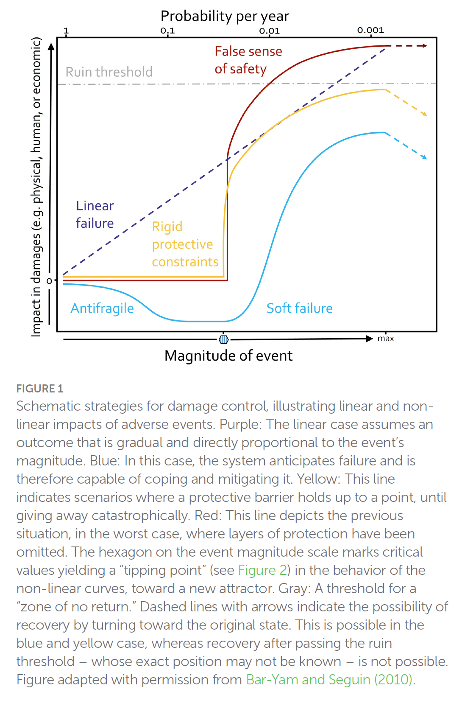
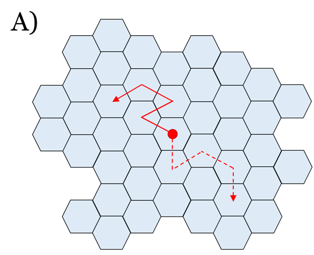
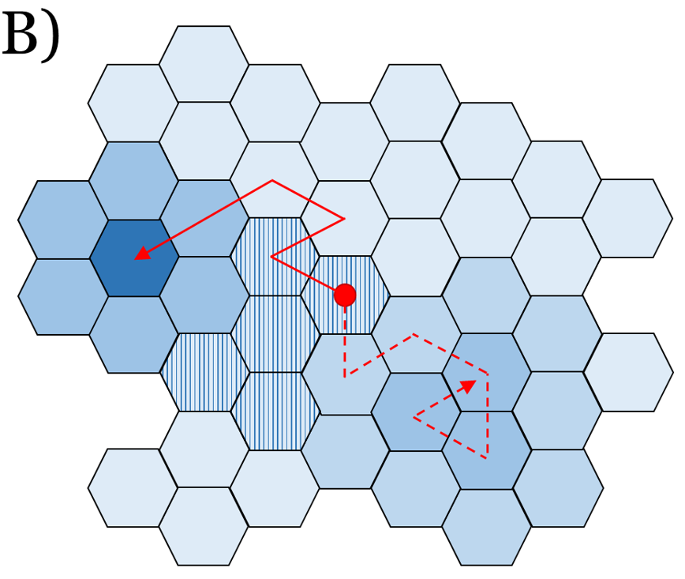
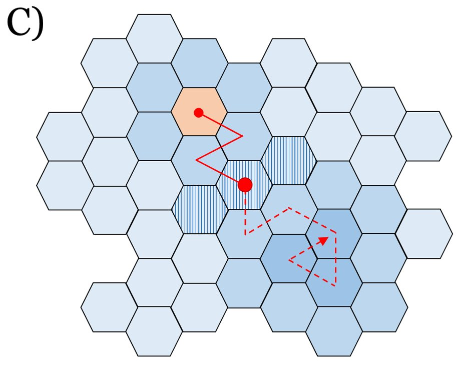
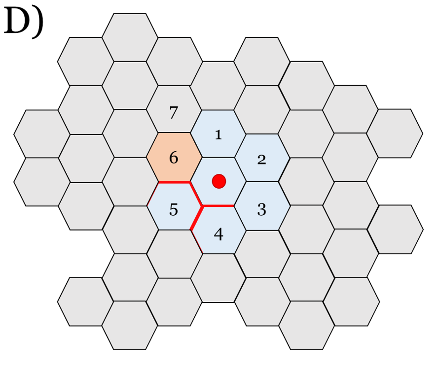
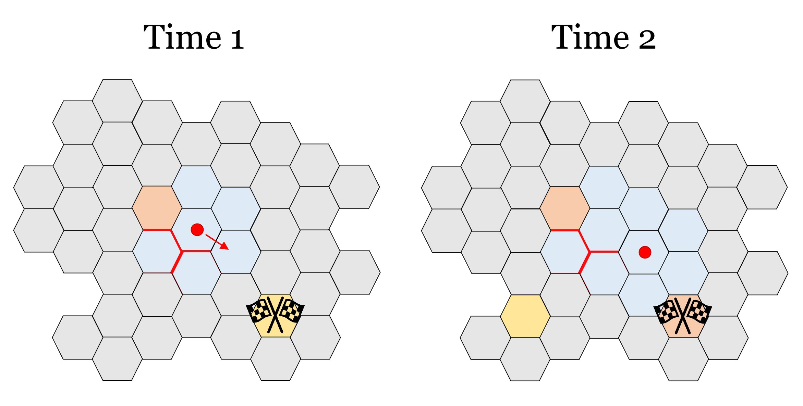

Understanding how people act in crises and how to manage risk is crucial for decision-makers in health, social, and security policy. In a [new paper published in the journal Frontiers in Psychology](https://www.frontiersin.org/journals/psychology/articles/10.3389/fpsyg.2024.1346542/full), we outline ways to navigate uncertainty and prepare for effective crisis responses.

The paper is part of a special issue called *From Safety to Sense of Safety*. The title is a play on this topic, which superficially interpreted can lead to a dangerous false impression: that we ought to intervene on people's feelings instead of the substrate from which they emerge.

Nota bene: In June 2024, this topic is part of an [online course for the New England Complex Systems Institute](https://necsi.edu/complex-social-psychological-systems), and have some discount codes for friends of this blog. Do reach out!

### The Pitfall of a False Sense of Safety

In the paper we first of all argue that we should understand so-called disaster myths, a prominent one being the myth of mass panic. This refers to the idea that people tend to lose control and go crazy during crises when they worry or fear too much, which implies we need to intervene on risk perceptions. But in fact, no matter what disaster movies or news reports show you, actual panic situations are rare. During crises, people tend to act prosocially. Hence, decision-makers should shift their focus from mitigating fear and worry – potentially leading to a false sense of safety – towards empowering communities to autonomously launch effective responses. This approach fosters resilience rather than complacency.

### Decision Making Under Uncertainty: Attractor Landscapes

Secondly, we represent some basic ideas of decision making under uncertainty, via the concept of [attractor landscapes](http://At-tractor what-tractor? Tipping points in behaviour change science, with applications to risk management). I now hope we would've talked about stability landscapes, but that ship already sailed. The idea can be understood like this: Say your society is the red ball, and each tile a state it's in (e.g. "revolt", "thriving", "peace", etc.) The society moves through a path of states.

These states are not equally probable; some are more "sticky" and harder to escape, like valleys in a landscape. These collections of states are called attractors. The area between two attractors is a tipping point (or here, kind of a "tipping ridge").

I wholeheartedly encourage you to spend five minutes on Nicky Case's interactive introduction to attractor landscapes [here](https://ncase.me/attractors/). It's truly enlightening. The main thing to know about tipping points: as you cross them, nothing happens for a long time... Until everything happens at once.

### The Dangers of Ruin Risks

All attractors are not made equal, though. For some, when you enter, you'll never escape. These are called "ruin risks" (orange tile). If there is possibility of ruin in your landscape, probability dictates you will eventually reach it, obliterating all future aspirations.

As a basic principle, it does not make sense to see how close to the ledge you can walk and not fall. In personal life, you can take ruin risks to impress your friends or shoot for a Darwin Award. But keep your society away from the damned cliff.

As Nassim Nicholas Taleb teaches us: Risk is ok, ruin is not.

### Navigating the Fog of War

In reality, not all states are visible from the start. Policymakers often face a "fog of war" (grey areas). Science can sometimes highlight where the major threats lie ("Here be Dragons"), but the future often remains opaque.

To make things worse for traditional planning, as you move a step from the starting position, the tiles may change. So you defined an ideal state, a Grand Vision (yellow) and set the milestones to reach it? If you remain steadfast, you could now be heading at a dead end or worse. Uh-oh.

(nb. due to space constraints, this image didn't make it to the paper)

This situation, described in Dave Snowden's [Cynefin](https://www.youtube.com/watch?v=47uaDW9hI5U) framework, is "complex." Here, yesterday's goals are today's stray paths, so when complexity is high, you focus on the present – not some imaginary future. The strategy should be to take ONE step in a favourable direction, observe the now-unfolded landscape, and proceed accordingly.

### The Cynefin Framework and Complex Systems

> Sensemaking is a motivated, continuous effort to understand connections (which can be among people, places, and events) in order to anticipate their trajectories and act effectively.
>
> [Gary Klein](https://ieeexplore.ieee.org/document/1667957)

Sensemaking (or sense-making, as Dave Snowden defines it as a verb) refers to the attempt or capacity to make sense of an ambiguous situation in order to act in it. This is what we must do in complex situations, where excessive analysis can lead to paralysis instead of clarity.

Cynefin is a sense-making framework designed to enable conversations about such a situation, and offers heuristics to navigate the context. In the paper, we propose some tentative mappings of attractor landscape types to the Cynefin framework.

In general, our paper offers proposals for good governance, drawing from the science of sudden transitions in complex systems. Many examples pertain to pandemics, as they represent one of the most severe ruin risks we face (good contenders are of course wars and climate change).

By understanding the concepts illustrated here, policymakers could better navigate crises and build resilient societies capable of adapting to sudden changes.

If you want a deeper dive, please see the paper discussed in this post: [At-tractor what-tractor? Tipping points in behaviour change science, with applications to risk management](https://mattiheino.com/2023/01/13/attractors/)

NOTE: There's another fresh paper out, this one in Translational Behavioural Medicine: [How do behavioral public policy experts see the role of complex systems perspectives? An expert interview study](https://academic.oup.com/tbm/advance-article/doi/10.1093/tbm/ibae024/7679984). Could be of interest, too!
