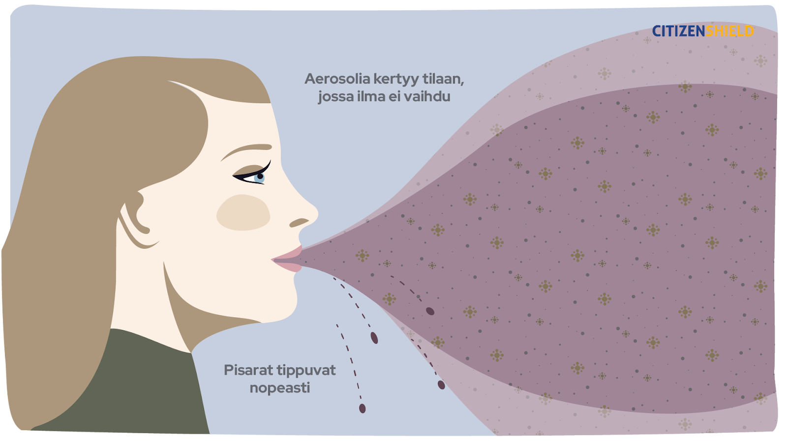

Ilmahygieniaa koskeva tiede on edennyt valtavin harppauksin viime vuosina. Tämä sivu sisältää Suomen Akatemian kriisinkestävyyden ja huoltovarmuuden tutkimusrahoituksesta tuotetun [Citizen Shield – Kansalaissuoja](https://citizenshield.fi/) -hankkeen materiaaleja. Olen tuottamassa näitä monitieteellisessä yhteistyössä eri alojen osaajien kanssa, ja näet alla ensimmäisen version. Olet aloitussivulla, ja muut sivut löydät täältä:

- [Miksi ilmanvaihto ja -puhdistus? Terveempää arkea pienillä teoilla](https://mattiheino.com/2024/08/05/ilmahygienia-miksi/)
  - *Muistatko, kun elokuvateattereissa ja busseissa sai tupakoida vapaasti? Nyt moinen tuntuisi omituiselta. Onkin todennäköistä, että 20 vuoden päästä ihmetellään, miten tunkkaisissa ja huonon ilmanlaadun tiloissa suomalaiset jaksoivat toimia vielä 2020-luvulla. Jokaiselle on keinoja parantaa sisäilman laatua.*
- [Työkalut pandemiaturvalliseen ilmanvaihtoon](https://mattiheino.com/2024/08/05/ilmahygienia-ilmanvaihto/)
  - *Mistä tiedän, onko ilmanvaihto riittävää? Miten mitoittaa ilmanvaihto niin, että se on riittävää tautien leviämisen vähentämiseksi? Tautien leviämisen ehkäisemiseksi ilmanvaihto on hyvä mitoittaa oikein. Jos koneellinen ilmanvaihto ei ole riittävää, sitä voidaan täydentää ilmanpuhdistimilla.*
- [4 + 1 keinoa parantaa ilmanvaihtoa – jokaiselle!](https://mattiheino.com/2024/08/05/ilmahygienia-keinot/)
  - *Keinot ilmanlaadun parantamiseen eivät välttämättä vaadi erillisiä hankintoja. Voit ottaa keinoja käyttöön riippumatta asumismuodostasi. Ilmanvaihdon ja -puhdistuksen hyödyt turhien sairastumisten ehkäisyssä perustuvat tutkimukseen. Turhat sairastumiset tuottavat harmia monille. Siksi…*
- [Ilmanvaihto kunnossa? Kerro siitä asiakkaille!](https://mattiheino.com/2024/08/05/ilmahygienia-asiakkaat/)
  - *Esimerkiksi influenssa ja koronavirus leviävät ilmateitse. Asiakkaiden turvallisuus mietityttää. Puhdas sisäilma voi olla myös kilpailuvaltti! Belgiassa tulee voimaan lainsäädäntö, jonka mukaan julkisissa tiloissa tulee mitata ja viestiä asiakkaille ilmanlaadusta. Nyt on mahdollisuus olla edelläkävijä!*
- [Testaa tietosi!](https://mattiheino.com/2024/08/05/ilmahygienia-testaa-tietosi/)

Tutkimustiedon karttuessa, myös nämä tiedot saattavat edelleen päivittyä. Eräs näiden sivujen tarkoitus on altistaa materiaaleja yhteiskunnallisen parviälyn huomioille. Kommentit ja kehitys-/korjausehdotukset voi osoittaa [minulle](mailto:matti.tj.heino@mattiheino.com)!

