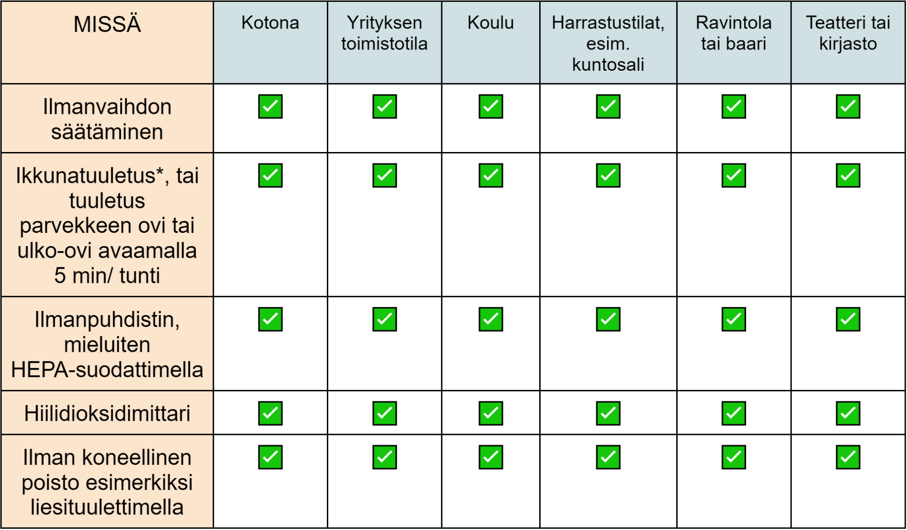

Ilmahygieniaa koskeva tiede on edennyt valtavin harppauksin viime vuosina. Tämä sivu sisältää Suomen Akatemian kriisinkestävyyden ja huoltovarmuuden tutkimusrahoituksesta tuotetun [Citizen Shield – Kansalaissuoja](https://citizenshield.fi/) -hankkeen materiaaleja. Olen tuottamassa näitä monitieteellisessä yhteistyössä eri alojen osaajien kanssa, ja näet alla ensimmäisen version. Löydät muut sarjan sivut [täältä](https://mattiheino.com/ilmahygienia-aloitus) ja tästä:

- [Opi torjumaan viruksia ja parantamaan sisäilman laatua!](https://mattiheino.com/2024/08/05/ilmahygienia-aloitus/)
- [Miksi ilmanvaihto ja -puhdistus? Terveempää arkea pienillä teoilla](https://mattiheino.com/2024/08/05/ilmahygienia-miksi/)
- [Työkalut pandemiaturvalliseen ilmanvaihtoon](https://mattiheino.com/2024/08/05/ilmahygienia-ilmanvaihto/)
- [Ilmanvaihto kunnossa? Kerro siitä asiakkaille!](https://mattiheino.com/2024/08/05/ilmahygienia-asiakkaat/)
- [Testaa tietosi!](https://mattiheino.com/2024/08/05/ilmahygienia-testaa-tietosi/)

Tutkimustiedon karttuessa, myös nämä tiedot saattavat edelleen päivittyä. Eräs näiden sivujen tarkoitus on altistaa materiaaleja yhteiskunnallisen parviälyn huomioille. Kommentit ja kehitys-/korjausehdotukset voi osoittaa [minulle](mailto:matti.tj.heino@mattiheino.com)!

---

*4 + 1 keinoa parantaa sisäilman laatua - jokaiselle!*

Keinot ilmanlaadun parantamiseen eivät välttämättä vaadi erillisiä hankintoja. Voit ottaa keinoja käyttöön riippumatta asumismuodostasi. Ilmanvaihdon ja -puhdistuksen hyödyt turhien sairastumisten ehkäisyssä perustuvat tutkimukseen.

Turhat sairastumiset tuottavat harmia monille. Siksi keinot puhdistaa ilmaa ja ehkäistä sairastumisia voivat olla tervetulleita ehdotuksia myös juhlissa, kuntosalilla ja työpaikalla. Tästä löydät ideoita, kuinka voit parantaa ilmanvaihtoa useissa tilanteissa.

**1. Varmista tilan hyvä ilmanvaihto**

Selvitä, onko rakennuksessa riittävä ilmanvaihto ja onko järjestelmä huollettu asianmukaisesti. [Asuinkerrostaloissa ja rivitaloissa ota yhteys isännöitsijään tai hallitukseen](https://www.sisailmayhdistys.fi/Perustietoa-sisailmasta/Sisailmaston-tarkastuslistat/Hyvan-ilmanvaihdon-tuntomerkit), mikäli ilmanvaihto on riittämätön.

Lisätietoa ilmanvaihdosta löytyy esimerkiksi [THL:n](https://thl.fi/fi/web/ymparistoterveys/sisailma/hengitystievirukset-ja-sisailma)**,** [Hengitysliiton](https://www.hengitysliitto.fi/kodin-sisailma-ja-kunnossapito/ilmanvaihto/)ja [Sisäilmayhdistys ry:n sivuilta](https://www.sisailmayhdistys.fi/Perustietoa-sisailmasta/Sisailmaston-tarkastuslistat/Hyvan-ilmanvaihdon-tuntomerkit).

**2. Poista epäpuhtauksia ilmanpuhdistimella**

Ilmanpuhdistin on laite, jolla voidaan poistaa sisäilmasta epäpuhtauksia ja hiukkasia, kuten pölyä, bakteereja ja aerosolihiukkasia. [Ilmanpuhdistimilla ei voi korvata huonosti toimivaa ilmanvaihtoa](https://www.hengitysliitto.fi/kodin-sisailma-ja-kunnossapito/sisailman-laatu/sisailman-epapuhtaudet-ja-hajut/ilmanpuhdistimet/). Ne eivät korjaa hometta tuottavia rakenteita tai lisää ilmaan happea.

Ilmanpuhdistimen kanssa tärkeintä on varmistaa, että se tuottaa riittävästi puhdasta ilmaa kyseessä olevaan tilaan. Huomioi myös ilmanpuhdistimen tyyppi: [ionisaattoreista ei ole vastaavaa hyötyä virustautien leviämisen torjunnassa](https://www.hengitysliitto.fi/hengitys-sairaudet/hengityssairaudet-ja-koronavirus/tietoa-koronasta/). Voit lukea lisää [erilaisista ilmanpuhdistimista](https://www.hengitysliitto.fi/hengitys-sairaudet/hengityssairaudet-ja-koronavirus/tietoa-koronasta/#) ja saada [neuvoja laitteen valintaan](https://www.hengitysliitto.fi/kodin-sisailma-ja-kunnossapito/sisailman-laatu/sisailman-epapuhtaudet-ja-hajut/ilmanpuhdistimet/) Hengitysliiton sivuilta.

|  |
| --- |
| **Mikä on HEPA-suodatin?**  HEPA-suodatin poistaa ilmasta tehokkaasti esimerkiksi pölyä ja hengittäessä syntyneitä aerosolihiukkasia. Tarkemmin sanoen, [suodatin poistaa ilmasta 99,97% hiukkasista, joiden halkaisija on 0,3 mikrometriä](https://doi.org/10.1016/j.envint.2020.106001). Ilmanpuhdistinten lisäksi HEPA-suodattimia on esimerkiksi joissakin ilmalämpöpumpuissa. |

**3. Avaa ikkuna kerran tunnissa muutamaksi minuutiksi**

Sisäilma kulkeutuu ulos avoimesta ikkunasta ja tilalle tulee ulkoilmaa. [Jos ilmassa on virushiukkasia, myös niitä kulkeutuu ulos](https://citizenshield.fi/2021/12/17/ikkuna-auki-virukset-ulos-vaihtoehtoja-koronaturvallisempaan-sisaoleiluun-pandemian-aikana/).

Tuuletusajan ei tarvitse olla pitkä: ilma vaihtuu tehokkaasti ristivedon avulla. Erityisesti talvella lyhytkin tuuletus riittää. Suuremman lämpötilaeron vuoksi ilma vaihtuu sisä- ja ulkotilan välillä nopeammin.

Voit tehostaa ilman vaihtumista asettamalla [tuulettimen puhaltamaan ulospäin](https://www.cdc.gov/coronavirus/2019-ncov/prevent-getting-sick/improving-ventilation-home.html) avonaisesta ikkunasta. Älä aseta tuuletinta osoittamaan ihmisiä päin.

**4.  Ilman koneellisen poiston tehostaminen esimerkiksi liesituulettimella**

Useissa tiloissa ilmanvaihtoa on mahdollista tehostaa. Yksi kotikonsti ilman koneellisen poiston tehostamiseksi on liesituuletin.

Jos sinulla käy vieraita, [liesituulettimen päällä pitäminen](https://www.cdc.gov/coronavirus/2019-ncov/prevent-getting-sick/Improving-Ventilation-Home.html) tunnin verran heidän lähtönsä jälkeen auttaa poistamaan mahdollisesti jäljellä olevia virushiukkasia.

**+1 Mitä tehdä, jos sisäilma kotijuhlissa, harrastuksessa, konserttisalissa tai näyttelyssä on huono?**

Jos sisäilmaa ei ole mahdollista puhdistaa, sairastumisen riskiä voi pienentää hengityssuojainten käytöllä. Erityisesti FFP2- ja FFP3 -hengityssuojaimet suojaavat aerosolihiukkasilta. Suojaimen tulee istua kasvoilla tiiviisti. Katso lisäohjeita [täältä](https://citizenshield.fi/2021/08/19/tiivis-maski-on-paras-maski/). [TTL:n sivuilla on kerrottu suojainten teknisistä ominaisuuksista](https://hyvatyo.ttl.fi/koronavirus/ohje-suu-ja-nenasuojus).

## Keinot sopivat moneen tilaan!

\*Ota huomioon kunkin tilan omat ohjeistukset siitä, saako ikkunoita avata itsenäisesti.
