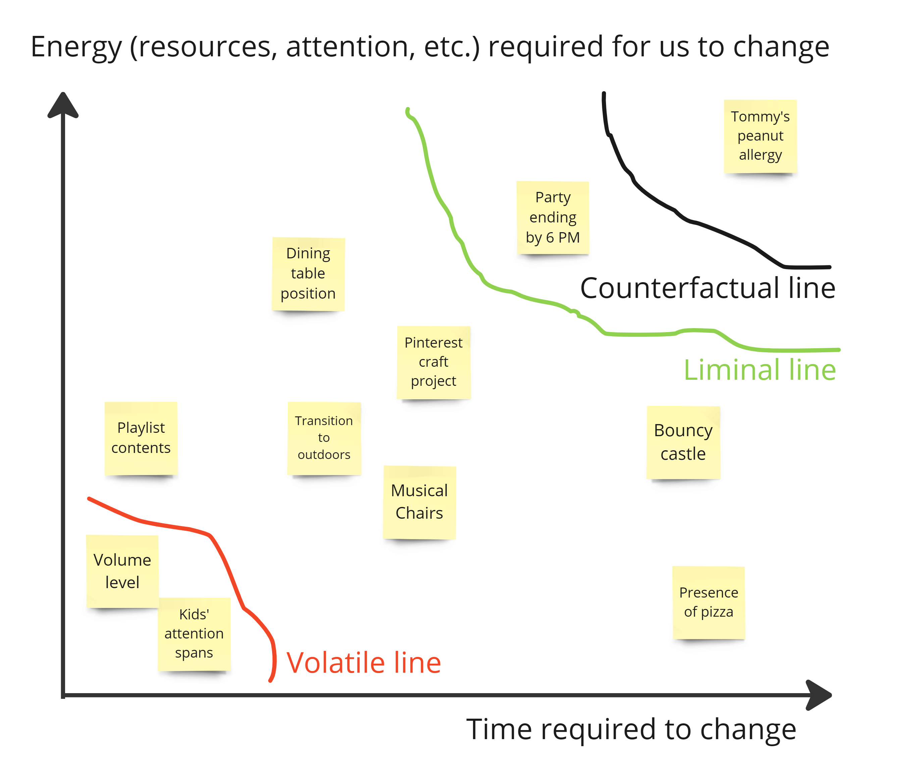

*I've recently followed with interest Dave Snowden's development of ["Estuarine Mapping", also known as "Affordance Mapping"](https://cynefin.io/wiki/Estuarine_framework). The process is based on a complex systems framework to design and de-risk change initiatives (see link in the end of this post). After taking part in training sessions and facilitating some mapping exercises with groups, I found myself in want of a metaphor that didn't require an understanding of coastal geography.*

*Enter the world of children's parties. Snowden has a [famous anecdote about organising a party for kids](https://cynefin.io/wiki/Children%27s_Party_story), which brilliantly illustrates the folly of applying traditional management techniques to complex systems. Inspired by this tale, I've reimagined it here as a simplified depiction of the Affordance Mapping process. So here we go.*

Picture yourself tasked with organising a birthday bash for a group of energetic seven-year-olds. But instead of reaching for a conventional party-planning checklist, you decide to employ the Affordance Mapping process. What would you do?

First, you'd start by surveying the party landscape. You'd identify all the elements that could influence the party – from the near-immovable dining table to the ever-shifting moods of the kids. We'll call these our party elements.

Next, you'd create a map of these elements. On one axis, you'd have how much energy it takes to change each element – moving the dining table would be high energy, while changing the music playlist would be low. On the other axis, you'd have how long it takes to make these changes – getting pizza delivered, or setting up a bouncy castle might take an hour, while changing a game rule could be instant.

Now, you'd draw a line in the top right corner. Everything above this line is beyond your control – things you absolutely can't change, like the fact that Tommy's allergic to peanuts. You'd also draw a second line for things that are outside your control, but amenable in collaboration with other parents, like how the party should end by 6 PM. You'd also mark a zone in the bottom left corner, for elements that change too easily and might need stabilising, like the kids' attention spans or the volume level.

The result might look something like this:

The exciting part is the middle area. Here's where you can actually make changes to improve the party; the things you can manage. But you can also try to make some elements more manageable via (de)stabilisation efforts, or remove some altogether.

For example, you might decide to:

1. Keep some elements as they are (the classic musical chairs game)
2. Remove others that aren't fun (the complicated crafts project your spouse found on Pinterest)
3. Modify some to make them more enjoyable (have kids organise themselves into a line arranged by height, when moving outdoors after the cake is done with)

You'd come up with small experiments to test these ideas. Maybe you'll try introducing a new party game like "freeze dance" to alleviate boredom in waiting for transitions from one activity to the next, or rearranging the gift-opening area. You'd also think about how changing one element might affect others – will having a water balloon toss right before snack time lead to damp clothes?

Finally, you'd plan how to amplify emergent positive side-effects, and mitigate negative ones. You'll also redraw your party map before next year's party. This way, you're always working towards a more fun and dynamic party, understanding that some elements will always be shifting (like the kids' favorite songs) while others stay constant (like the need for cake).

*Technical note. The items on the map, in the lingo of the complex systems philosopher Alicia Juarrero, represent "[constraints](https://direct.mit.edu/books/oa-monograph/5600/Context-Changes-EverythingHow-Constraints-Create)"; things that modulate a system's behaviour. In complex systems, these are intertwined in such deep ways, that their effects are seldom amenable to an analysis of linear causality. To change a system's macro-level state, you execute multiple parallel micro-interventions that aim to affect these constraints. For a recent open access book chapter outlining the rationale, see here: [As through a glass darkly: a complex systems approach to futures](https://www.elgaronline.com/edcollchap-oa/book/9781035301607/book-part-9781035301607-11.xml).*
