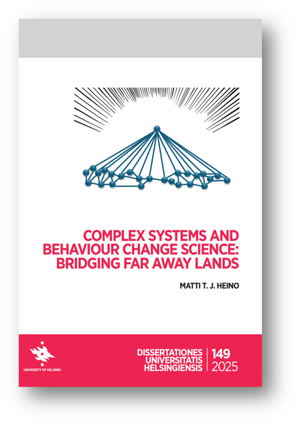
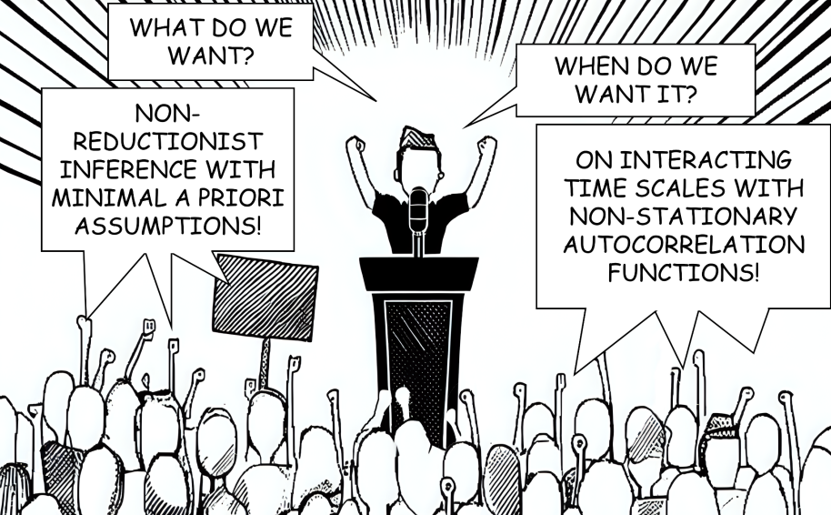
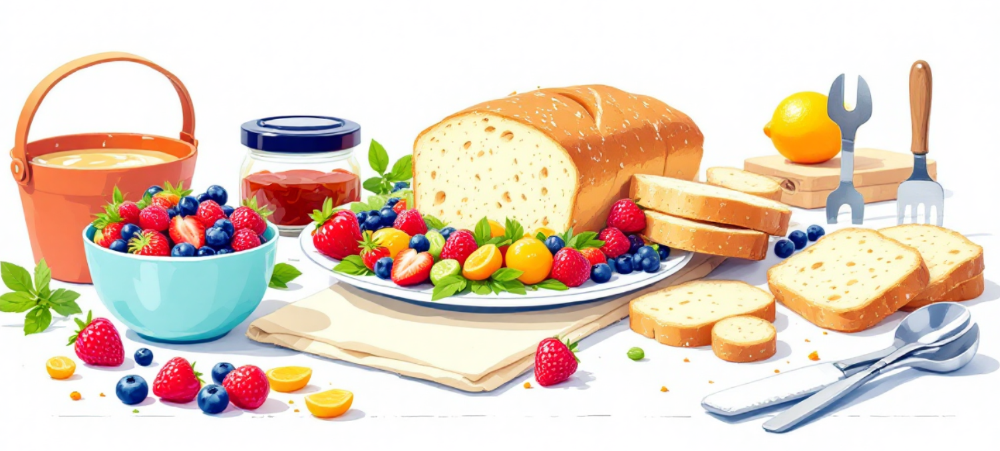
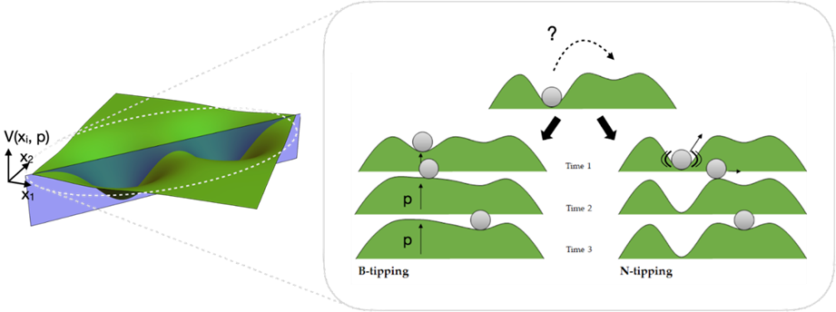
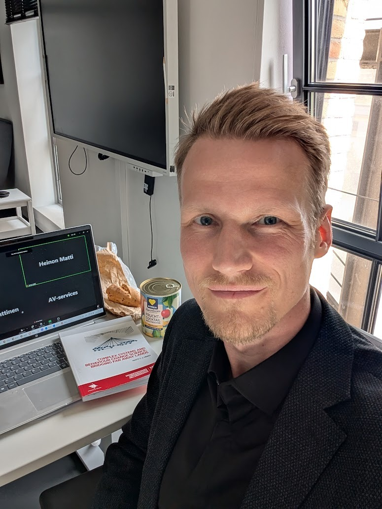

**New perspectives from my doctoral research, "Complex Systems and Behaviour Change: Bridging Far Away Lands."**

On May 16, 2025, I finally defended my doctoral dissertation – a side-project in the making for the last 9 years or so. I was pretty confident that this would have happened two years ago already when I submitted [a rogue version of the dissertation summary](https://mattiheino.com/2023/05/30/dissertation-trailer/) for pre-examination. It was titled *"Understanding and Shaping Complex Social Systems: Lessons from an emerging paradigm to thrive in an uncertain world"*, which is also the name of a [course I later started teaching](https://necsi.edu/complex-social-psychological-systems) in the New England Complex Systems Institute. The preprint was quickly downloaded almost 1000 times, and people reached out to me to thank for the clear exposition. But this version turned out to be a bit *too* rogue for one of the pre-examiners, and I rewrote the whole thing in 2024 – to be much more technical, and stylistically more conventional.

The defence was a success and here we are, the dissertation finally accepted by the academic establishment. Published summary can be downloaded [here](http://hdl.handle.net/10138/594566). The implicit promise is that after reading the work, you'll be able to understand this cartoon, which you might recognise to have a relationship with the cover image:

As is traditional in the Finnish system, I began the occasion with a *Lectio Praecursoria* – an introductory speech. This talk introduced the groundwork for my research, exploring the often-overlooked connections between two seemingly distant scientific fields: complex systems and behaviour change.

This blog post adapts that initial speech, inviting you to explore these ideas with me.

### The Core Idea: Why We Need to Rethink Behaviour Change

The research I present explores the intersection of two scientific domains that might seem, at first glance, quite distant. But what I want to do is share why building bridges between complex systems and behaviour change is not merely an academic curiosity, but, as I argue in this work, a vital step towards deepening our understanding of human action in our increasingly interconnected world, and ultimately, towards building a more robust basic science of behaviour change. [Side note: you can find my perspective to what behaviour change is NOT [here](https://mattiheino.com/2024/04/25/behaviour-change-via-negativa/), and connections to risk management [here](https://mattiheino.com/2025/11/10/tail-events/) and [here](https://mattiheino.com/2024/05/30/sense-of-safety/).]

### The "Fruit Salad vs. Bread" Analogy: Understanding Different Types of Systems

To begin, let us talk about the difference between making fruit salad and baking bread. I am well aware of how ludicrous this sounds, but I believe that confusing these two processes consistently causes well-meaning efforts, particularly those aimed at changing behaviour, to stumble. So please bear with me.

Imagine making fruit salad for a bunch of children. You gather fruits you enjoy – perhaps pineapple, peach, and cherries. You're fairly confident that if you like them separately, you'll like them together. You chop them, combine them, and serve them. Now, if a child finds that cherries look too strange to be edible – and leaves them behind – it's no catastrophe. They can still consume the pineapple and peach, which every reasonable person enjoys. The uneaten cherries can be consumed by someone else later. In fruit salad, we can combine ingredients, analyse the **parts** somewhat independently, and predict the outcome of the **whole** with reasonable certainty. With many ingredients, fruit salad can become **complicated** – a word whose origins (as pointed out by Dave Snowden) can be taken to mean "folded." And what has been folded, can often also be unproblematically unfolded.

Now, think about baking bread. You combine yeast, flour, water, and salt. You’ve heard that olive oil is healthy, so you add a bit of that in. You mix, knead, let it rise, bake. The final loaf emerges. But what if the children dislike the taste of olive? **You cannot simply remove the oil.** Or what if you put in too much salt? The ingredients have interacted, transformed. The bread is an emergent product, something entirely new, fundamentally **different from the mere sum of its parts**. The whole portion intended for the children, not just the offending component, might have to be passed to an omnivorous family member. This process is better described not as complicated, but as ***complex***, a word with roots that can be interpreted as "entangled" or "interwoven."

Unlike with folding, what is interwoven cannot easily be disentangled without fundamentally changing its nature.

### The Two Key Disciplines: Behaviour Change and Complex Systems

With this analogy in mind, let's turn to the disciplines central to my research.

**Behaviour change science** is an inherently interdisciplinary field drawing from psychology, sociology, public health, and more. It strives to understand the web of factors – personal, social, environmental – that shapes our actions. Its goal is to help foster changes needed to tackle major societal challenges: from noncommunicable diseases (entailing, for example, **physical activity behaviours**) and sustainable work-life (entailing, for example, **job crafting behaviours**) to climate action and pandemic preparedness (entailing **risk management behaviours**). **Human action** is a core thread in all these pressing issues.

The other discipline central to this work is **complex systems science**. It originally grew out of physics, chemistry, and biology, but its principles increasingly reach into the psychological and social world. It studies systems composed of many interacting parts, where these interactions often dominate the system's overall behaviour. A key insight is that the **relationships between components can be more critical than the components themselves** in determining the system's properties. Think of water: ice, liquid, and steam involve the same H₂O molecules, but their differing interconnectivity leads to vastly different behaviours. Steam can make a sauna feel warm; ice can make swimming difficult afterwards. But the components remain the same.

### Are We Using Fruit-Salad Tools for Bread-Like Problems?

When it comes to systems, some are more **component-dominant**, like fruit salad, while others are more **interaction-dominant**, like bread. My research argues that many phenomena central to behaviour change science – like motivation dynamics, the spread of social norms, or how people respond to interventions – are **far more like bread than fruit salad**. They occur as parts of complex, interaction-dominant systems.

The main contributions of my dissertation relate to the development of basic science. Early theories in behaviour change were driven by practitioners aiming to understand issues they faced. And practitioners are often very good at working with complexity, although their terminology to describe the phenomena at play might sometimes be limited. But still, many of the **quantitative tools** that were relied upon in developing these theories implicitly treated behaviour change phenomena **like fruit salad**. For instance, while linear regression analysis can incorporate simple interaction terms to account for some forms of interdependence, its main usage is to assign values to variables such as norms, intentions, and attitudes, assuming they are independent from each other – implying separability. Furthermore, there's a common, often implicit, assumption that findings derived from group-level data directly translate to understanding how individuals change over time.

So, the central question becomes: If behaviour change is often entangled and emergent like bread dough, should our primary tools be those best suited for slicing separable fruit?

### Beyond Linearity: Embracing the Complexity of Change

I argue that this potential mismatch – analysing bread with fruit salad tools – can hinder our understanding of behaviour change as a complex evolving process. Complex systems science suggests that variability, which might look like messiness or error from a purely **linear** perspective, is often not just noise; it can be the inherent signature of the dynamic system itself.

A key characteristic of these systems, which I investigated conceptually and empirically, is **non-linearity**. Imagine pushing a boulder near a hilltop:

*You push a little, the boulder moves a little.*

*You push a little, the boulder moves a little.*

*You push a little...* and the boulder tumbles dramatically into a new valley.

Perhaps now scientists rush to the scene to investigate what was distinct in your technique for the last push. And they will inevitably find results. But the magic was not in the push, but the relationship between the push, the boulder's position, and the landscape. This kind of abrupt, disproportionate change is known as a **critical transition**.

### Mapping Change: The Power of Attractor Landscapes

Complex systems science offers a powerful conceptual tool to map transition dynamics: the **attractor landscape**. Imagine a pool table with a single billiard ball. Each position on the table represents a possible state for the system, and the current status is represented by the location of the billiard ball. Now imagine the surface isn’t flat, but contains hills and valleys. The valleys represent stable patterns – the [attractors](https://mattiheino.com/2023/01/13/attractors/), collections of similar states that “trap” the ball. It's easy for the ball to settle into a valley; it requires more effort or perturbation to push it out. The ridges between valleys are called tipping points.

*A slice of an attractor landscape showing two major ways systems can shift abruptly (from [an article](https://doi.org/10.1080/17437199.2022.2146598) included in the dissertation)*

Think of smoking, where dispositions in the North Atlantic world shifted gradually if at all for many decades. Imagine this as a landscape: one valley where smoking is socially acceptable, and another where it is frowned upon. There was little change for a long time, until a tipping point was reached, leading to widespread disapproval and significant policy changes. Pushing the system over the ridge requires effort or a significant nudge, but once crossed, it naturally settles into a new attractor valley, a new stable pattern. However, this landscape isn't necessarily static; it can transform and be reshaped. Think of this like the hills and valleys of the pool table rising and falling over time.

Notice how different this landscape representation is from conventional flowcharts suggesting neat, linear causes and effects. It shifts focus towards understanding the system's **dispositions**, its underlying **tendencies** and **stabilities**. It encourages a focus on **nurturing the conditions**, **tending the substrate**, **working the soil**, from which desired behaviours – in deeper, more stable valleys – can emerge, and sustain themselves more naturally.

### Evidence in Action: From Work Motivation to Public Health

In my research, I used analytical techniques adapted from dynamical systems theory to investigate empirical evidence for such attractor states and shifts within fine-grained, moment-to-moment work motivation data. I also explored its applicability to societal-level data on COVID-19 protective behaviours. This work suggests the landscape metaphor is not just a useful theoretical vehicle; these patterns can be observed and studied in real-world behaviour change contexts.

In addition to non-linearity, some of the patterns of complex systems I examined in this research were "non-stationarity" and "non-ergodicity". In my work, I clarify these terms in the behaviour change context and demonstrate how to study them empirically in time series data, with methods such as cumulative recurrence network analysis.

### The Key Takeaway: Complexity as a Feature, Not a Bug

In essence, the core message of this work is that the bread-like complexity of human behaviour change isn't just noise or a problem to be simplified away. It's a fundamental characteristic we must embrace and understand scientifically if we want our science to accurately reflect the phenomena it studies. Complex systems science provides concepts and tools that acknowledge interdependence, emergence, and context-sensitivity of change phenomena. And we aim not to eliminate this complexity, but to *enlist* it.

### Looking Ahead: Building a Bridge to a More Robust Science of Human Action

By building bridges between behaviour change science and complex systems science, the research presented here argues that a complex systems perspective can help us build a more robust and realistic science of human action – one that recognises behaviour not just as a collection of separable ingredients like a fruit salad, but as an emergent, interwoven process like baking bread.

This, I believe, is crucial. It is crucial for developing a science better equipped to understand the intricate dynamics of behaviour change. It is crucial for us to seize the opportunities that arise when we learn to converse with complex systems, instead of just trying to push them around. And it is crucial for navigating the critical policy challenges of our time, which invariably involve understanding and enabling human action.

---

*What are your thoughts? Leave a comment or reach out. My current research interests mainly revolve around risk management (see paper described [here](https://mattiheino.com/2024/05/30/sense-of-safety/)) – particularly, understanding and shaping communities' capacities to respond, recover, and adapt from shocks. I'm a [72hours.fi](https://72hours.fi) trainer, and would be happy to collaborate in e.g. projects to make the EU's new preparedness strategy a feasible reality.*

Picture of me doing a sound check before the doctoral defense. It was held in Zoom as I was in Germany, the chair was in Finland, and the opponent in the U.S. 😅
