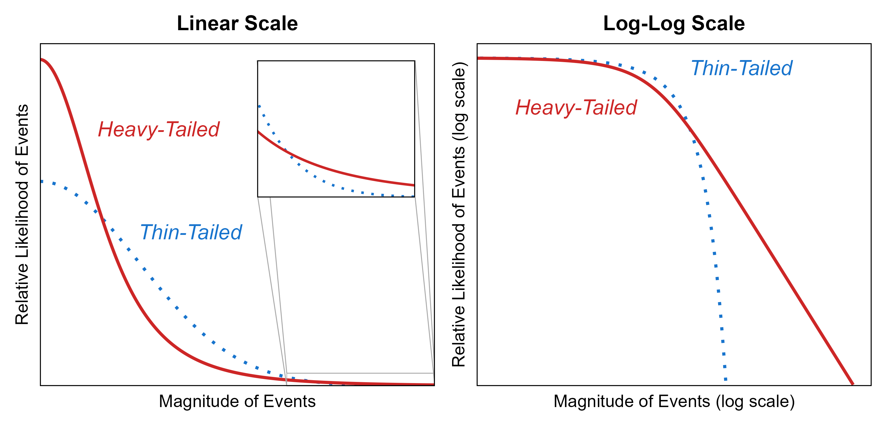

***Context:*** *This post outlines a manuscript in preparation and exhibits some of its visualisations, partly also presented at the European Public Health Conference (November 2025). If a blog format isn't your poison, you can also see* *[this video](https://youtu.be/j3G8X1nCcnU)* *or* *[this one-pager](https://drive.google.com/uc?export=download&id=1DRFi-fA3ImKE6ewjtaE8F_sqvDnm0wD2)* *(conference poster).*

---

It's April 2025. Red Eléctrica, the electricity grid provider for the Iberian Peninsula, [declares](https://x.com/RedElectricaREE/status/1910005438080254103?lang=en): "There exists no risk of a blackout. Red Eléctrica guarantees supply."

Twenty days later, a massive blackout hits Portugal, Spain, and parts of France.

What the hell happened?

To understand this, we need to talk about ladders.

## The Ladder Thought Experiment

Let's take an example outlined in the wonderful article [An Introduction to Complex Systems Science and Its Applications](https://doi.org/10.1155/2020/6105872): Imagine 100 ladders leaning against a wall. Say each has a 1/10 probability of falling. If these ladders are independent, the probability that two fall together is 1/100. Three falling together: 1/1000. The probability of all 100 falling simultaneously becomes astronomically small – negligible, essentially zero.

Now tie all the ladders together with rope. You've made any individual ladder safer (less likely to fall on its own), but you've created a non-negligible chance that all might fall together.

This is cascade risk in interconnected systems.

## Two Types of Risk

From a society's perspective, we can understand risks as falling into one of two categories:

**Modular risks (thin-tailed)** don't endanger whole societies or trigger cascades. A traffic accident in Helsinki won't affect Madrid or even Stockholm. These risks have many typical precedents, slowly changing trends, and are relatively easy to imagine. We can use evidence-based risk management because we have large samples of past events to learn from.

If something is present daily but hasn't produced an extreme for 50 years, it probably never will.

**Cascade risks (fat-tailed)** pose existential threats through domino effects. Pandemics, wars, and climate change fall here. They're abstract due to rarity, with few typical precedents – events tend to be either small or catastrophic, with little in between.

If something hasn't happened for 50 years in this domain, we might have just been lucky, and it might still hit us with astronomical force.

Consider these examples:

- Workplace injuries
- Street violence
- Non-communicable diseases
- Nuclear plant accidents
- Novel pathogens
- War

Before reading on, give it a think. Which are modular? Which are cascade risks?

I'd say most workplace injuries and street violence are modular (unless caused by organised crime or systemic factors like pandemics). Non-communicable diseases are also modular, although can be caused by systemic issues. Mega-trends perhaps, but you wouldn't expect a year when they suddenly doubled, or became 10-fold.

[Novel pathogens](http://www.sciencedirect.com/science/article/pii/S0169207020301230) and [wars](https://linkinghub.elsevier.com/retrieve/pii/S0378437116000923) are cascade risks that spread across borders and trigger secondary effects. These are the ladders tied together with a rope. Nuclear plants kind of depend; nowadays people try to build many modular cores instead of one huge reactor, so that failure of one doesn't affect the failure of others. But as the mathematician Raphael Douady put it: *"Diversifying your eggs to different baskets doesn't help, if all the baskets are on board of T*itanic" (see Fukushima disaster).

## Is That a Heavy Tail, or Are You Just Happy to See Me?

Panels A) and B) below show pandemic data ([data source](https://www.nature.com/articles/s41567-020-0921-x), [image source](https://figshare.com/s/ab624cb863eb5df72d77), alt text for details) – with casualties rescaled to today's population. The Black Death around the year 1300 caused more than 2.5 billion deaths in contemporary terms. Histograms on the right show the relative number of different-sized events. The distribution shows tons of small pandemics and a few devastating extremes, with almost nothing in between (panel A, vertical scale in billions). We see a similar shape even when we get rid of the two extreme events (panel B, vertical scale in millions).

[![Panel A: “Paretian” dynamics of a systemic risk, illustrated by casualties from pandemics with over 1000 deaths, rescaled to contemporary population, with years indicating the beginning of the pandemic (Data from Cirillo & Taleb, 2020; COVID-19 deaths are presented until June 2024 according to model by The Economist & Solstad, S., 2021). Panel B: Same as panel A, zooming into the events with less than 1B deaths. This illustrates how the variance remains vast, even when the scale of events is much smaller. Panel C: Casualties from traffic accidents in Finland, illustrating the dynamics of a “thin-tailed”, localised risks. In this case, it would not be reasonable to expect a sudden increase to 10 000 casualties, whereas in the prior examples such jumps are an integral part of the occurrence dynamic. ](./images/tail-events/histograms_pandemics_traffic_combined-1.png)](https://mattiheino.wordpress.com/wp-content/uploads/2025/11/histograms_pandemics_traffic_combined-1.png)

Compare this to Panel C), Finnish traffic fatalities. Deaths cluster together predictably. You wouldn't expect 10 000 road deaths in a single year – even 2 000 would be shocking.

Moving from observations to theory: The figure below compares mathematical "heavy-tailed" distributions to "thin-tailed" distributions. Heavy-tailed distributions depict:

- Many more super-small events than thin-tailed distributions: Look at the very left side of the left panel below, where red line is above the blue one
- Fewer mid-size events: Look at the middle portion of the left panel below, where blue line is higher than red
- Extreme events of a huge magnitude that remain plausible: Look at the inset, which zooms into the tail (in thin-tailed distributions, mega-extremes are practically impossible like the ladders without a rope)

When we look at the right panel of the image above, thin-tailed distributions (like traffic deaths) should drop suddenly when plotted on a logarithmic scale. Fat-tailed distributions (like pandemics) should create a straight line, meaning very large events remain statistically plausible.

Or, at least that's the theory, based on mathematical abstraction. Let's see what the real data shows.

And here we go: The tail of actual pandemics looks like a straight line, while the tail of traffic deaths curves down like an eagle's beak. Pretty neat, huh?

## Evidence Lives in the Past, Risk Lives in the Future

In the interests of time, I'm going to skip a visualisation you see in the video ([26:45](https://youtu.be/j3G8X1nCcnU?si=PFL6MzEFAJ6WZUph&t=1603)). Main point is that for thin-tailed modular risks, we extrapolate from past data. For heavy-tailed cascade risks, we must form plausible hypotheses from current, weak, and incomplete signals.

This is the difference between induction (everything that happened before has these features, so future events will too) and abduction (reasoning to the most sensible course of action given limited information). All data is data *from the past*, and if the past isn't a good indicator of the future, we need different ways of acting:

> ***The mantra of resilience is early detection, fast recovery, rapid exploitation.***  
> - [Dave Snowden](https://thecynefin.co/the-mantra-of-resilience/?srsltid=AfmBOoolLgAfhwWb-8T8A3b2KIbC0_Dps3SEUPLIYtIYrpl3Zco9v4hK)

We need to detect weak signals early. The longer we wait, the bigger the destruction.

## A Practical (piece of a) Solution: Participatory Community Surveillance Networks

In our research group, we're developing networks of trusted survey respondents who participate regularly (see [article](https://pubmed.ncbi.nlm.nih.gov/40719852/)), akin to the idea of "[citizen sensor networks](https://thecynefin.co/how-to-create-a-citizen-sensor-network/?srsltid=AfmBOootSYP1lqNZC0gIw9Dx7Uqm_dLx4Qb4Dg5oJYd-NPjznDeLsrk6)" also presented in the EU field guide [Managing complexity (and chaos) in times of crisis](https://data.europa.eu/doi/10.2760/353). With such a network in place, during calm times, you can collect experiences and feedback on policy decisions. When crisis hits, you can pivot to gain rich real-time data from the field.

Why? Because nobody can see everything, and we see what we expect to see. If you don't believe me, see if you can solve [this mystery](https://www.youtube.com/watch?v=LRFMuGBP15U).

> **Given enough eyeballs, all bugs are shallow**  
> - Eric S. Raymond

The process:

1. Set up a network of trusted responders
2. Collect experiences continuously
3. Pivot when crisis takes place to gather data on how the disruption shows up in lived experience
4. Avoid the trap of post-emergency mythmaking, and do a "lessons learnt" analysis with data collected *during* the disruption

### Example: Inhabitant Developer Network

We developed an idea in a Finnish town, where new inhabitants would join the network as part of a "welcome to town" package. We could ask:

- "What's better here than where you lived before?" → relay to marketing
- "What's worse here than where you lived before?" → relay to development

When crisis occurs, we could pivot, asking about how the disruption shows up in people's lived experience:

- "What happened?"
- "Give your description a title"
- "How did this affect things important to you?"
- "How well did you do during and after?" (1-10 scale)
- "How prepared were you?" (1-10 scale)
- ... etc.

Respondents self-index these experiential snippets with quantitative indicators, giving us both qualitative richness and quantitative patterns. We can then e.g. examine situations where people were well-prepared but didn't do well, or did well despite being unprepared – and filter e.g. by tags like rescue service involvement. This gives us rich data from the field to inform local decision makers.

### From Experiences to Action

The beauty of collecting people's lived experience is that they can later be used for citizen or whole-of-workforce engagement workshops. You can ask Dave Snowden's iconical question: "How could we get more experiences like this, and fewer like those?"

This question holds an outcome "goal" lightly, allowing journeys to start with direction rather than rigid destination. It is understandable regardless of education level, and gives communities agency in developing solutions. This approach enables:

**Anticipation**: Use tailedness analysis as a diagnostic; use networks to detect weak signals before they explode.

**Formulation**: Design adaptive interventions with the community – interventions that are change instead of being fragile to the first unexpected shock.

**Adoption**: Build agency, legitimacy and buy-in through participatory processes. People support what they own or help create.

**Implementation & Evaluation**: Monitor in real-time, learn continuously, act accordingly. No more waiting six months for a report, or getting a quantitative result ("life satisfaction fell from 3.9 to 3.2") only to need another research project to learn *why*: You can just look at the qualitative data to understand context.

## Why This Matters

When Red Eléctrica declared "there exists no risk," they were thinking in a thin-tailed world where past data predicts future outcomes. But interconnected systems – like them tied-together ladders – create heavy-tailed risks. For cascade risks, precaution matters more than proof. If you face an existential risk and fail, you won't be there to try again.

As Nassim Nicholas Taleb puts it: Risk is acceptable, ruin is not (more in [this post](https://mattiheino.com/2024/05/30/sense-of-safety/)). And [no individual human](https://necsi.edu/complexity-rising-from-human-beings-to-human-civilization-a-complexity-profile) is capable of understanding our modern, interconnected environments alone.

Bring forth the eyeballs.

---

## Related Posts

**[From Fruit Salad to Baked Bread: Understanding Complex Systems for Behaviour Change](https://mattiheino.com/2025/05/17/fruit-salad/)** – Why treating behaviour change like assembling fruit salad instead of baking bread leads well-meaning efforts to stumble.

**[From a False Sense of Safety to Resilience Under Uncertainty](https://mattiheino.com/2024/05/30/sense-of-safety/)** – On disaster myths, attractor landscapes, and why intervening on people's feelings instead of their response capacity is dangerous.

**["Mistä tässä tilanteessa on kyse?": Henkisestä kriisinkestävyydestä yhteisölliseen kriisitoimijuuteen](https://mattiheino.com/2024/05/29/turvallisuustapahtuma/)** (In Finnish) – From individual resilience to collective crisis agency: reflections from Finland's national security event.

**[Riskinhallinta epävarmuuden aikoina: Väestön osallistaminen varautumis- ja ennakointimuotoiluun](https://mattiheino.com/2024/04/15/varautumismuotoilu/)** (In Finnish) – Risk management under uncertainty through participatory anticipatory design.

---

*For deeper exploration of these concepts, I recommend Nassim Nicholas Taleb's books: Fooled by Randomness, The Black Swan, and Antifragile, as well as the aforementioned EU field guide [Managing complexity (and chaos) in times of crisis](https://data.europa.eu/doi/10.2760/353).*
