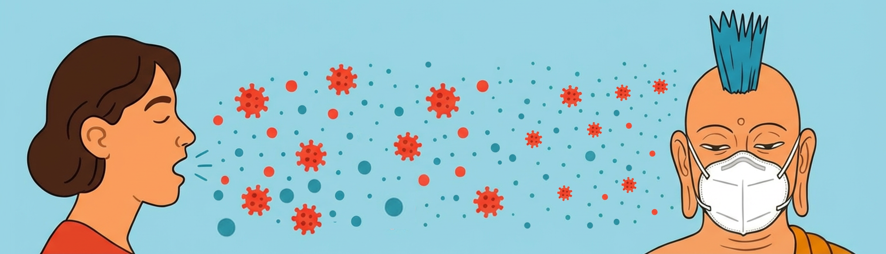

*This is an English translation of a Finnish [post](https://tietokayttoon.fi/-/pisaroista-pienhiukkasiin-pandemia-muutti-ymmarryksen-infektioiden-leviamisesta) outlining some learnings from our government funded consortium of 5 universities, studying what we can learn from the COVID-19 pandemic response. The interdisciplinary collaboration has significantly influenced how I think of pathogen spread, and I found the post quite enlightening. I hence wanted to share this with a larger audience, because auto-translate tools still don't work well for Finnish. Original authors are [Lotta-Maria Oksanen](https://helda.helsinki.fi/items/d1bcea38-b808-4efc-a664-7c82841ab9cb), [Tuomas Aivelo](https://www.linkedin.com/in/tuomas-aivelo-3592a154/), [Viktor Zöldi](http://www.linkedin.com/in/viktor-zoldi), and [Tarja Sironen](https://www.linkedin.com/in/sironen-tarja-4b975b39/).* *I am grateful to the first author for providing feedback on the translation, but all mistakes in the final text are mine – please report if you see any.*

---

Throughout time, people have pondered how infections spread and how they should be combated. The pandemic changed how we think pathogens in the respiratory tract spread.

Exposure occurring through [the air](https://cdn.who.int/media/docs/default-source/documents/emergencies/global-technical-consultation-report-on-proposed-terminology-for-pathogens-that-transmit-through-the-air.pdf) is no longer seen as rare or exceptional. It is now viewed as a daily transmission route for respiratory infections in normal social interaction.

Research on the topic is being conducted in the Government-funded [Lessons from the Pandemic Crisis (PAKO) project](https://tietokayttoon.fi/valtionavustushanke-koronakriisin-opeista), which investigates COVID-era actions across different sectors to prepare for future crises. The University of Helsinki [medical faculty]'s sub-study forms a comprehensive picture of the understanding that prevailed in Finland. The study focuses on the view about transmission routes and the changes it faced, and the protection guidelines introduced. It also produces an analysis of the variants observed in Finland during the pandemic, their characteristics, and their speed of arrival.

## **The Historical View: Droplets at the Center of Infection**

Before the pandemic, it was thought that respiratory infections spread via large droplets generated when a symptomatic person coughs or sneezes. These droplets cause infection when hitting the recipient's mucous membranes, i.e., the eyes, nose, or mouth.

Over a hundred years ago, medicine was living through a time of [change](https://onlinelibrary.wiley.com/doi/10.1111/ina.13070). It began to be understood that diseases are caused by pathogens. There was a desire to get rid of old beliefs, such as miasma – polluted air that originated from rotting sources and was believed to cause diseases. Dried saliva mixed with dust was also believed at that time to have great significance in the spread of diseases. Indeed, public spaces read: "Do not spit on the floor." Studies were conducted in which test subjects, for example, swirled a solution containing bacteria in their mouths and read aloud. Dishes were placed on the floor in front of them, revealing how far the bacteria spread. Bacteria grew especially on the dishes that were close by. In the studies, the significance of fresh secretions was understood, and attention focused on large droplets.

The role of air as a carrier of infections lost apparent credibility even further, when a leading public health scientist Charles Chapin (1856-1941) criticised airborne transmission in his key [textbook](https://archive.org/details/sourcesmodesofin00ch/page/n5/mode/2up). He proposed that contact infection is the most central and obvious transmission route. The idea of contact and droplets as dominant modes of transmission lived strong for decades, and thus hand washing and droplets became familiar to everyone in pandemic guidelines as well.

## **The** **New View: Respiratory Infections Spread Via the Air**

The problem with droplet thinking was that smaller particles remain in the air and do not settle on the dish. The old technology simply was not sufficient to observe these. Especially regarding viruses, technical challenges exist [even today](https://royalsocietypublishing.org/doi/full/10.1098/rsif.2024.0018). Airborne transmission has, however, proven to be [central](https://www.science.org/doi/10.1126/science.abd9149) in many [transmission events](https://academic.oup.com/jid/article/230/4/e824/7675302). Advanced measurement methods have shown that nearly all [particles we produce](https://www.sciencedirect.com/science/article/pii/S0021850222001380) are very small and that we produce [infectious particles also when breathing](https://www.nature.com/articles/s41598-023-47829-8). In animal experiments, other transmission routes have been ruled out, demonstrating that infection must have occurred via the air – for example, a seminal research setup that demonstrated the airborne nature of tuberculosis has been [replicated also with SARS-CoV-2](https://academic.oup.com/ofid/article/12/4/ofaf196/8102227).

Human experiments have also yielded interesting results. In a [study](https://academic.oup.com/jid/article-abstract/156/3/442/806507?redirectedFrom=fulltext&login=false) examining Rhinovirus, laboratory-infected "donors" and susceptible volunteers sat playing cards for 12 hours, sitting at a distance of 1.5-2m from each other. Some of the participants had their hands tied so that it was impossible for them to touch their faces, making infection possible only through the air. Infections were equally common among hands-tied and untied groups. In a separate branch of the experiment, where the cards were thoroughly soiled with the infectors' nasal secretions, but the infectors did not participate in the game, no infections occurred at all.

Correspondingly, many pandemic-era super-spreader events – such as various [concert](https://www.mtvuutiset.fi/artikkeli/naistenpaivan-surullisenkuuluisa-konsertti-oli-luultuakin-pahempi-viruslinko-jopa-sata-ihmista-sai-koronan-ja-tartutti-sita-viela-eteenpain-olihan-se-aivan-erityinen-tilaisuus/7844414) and [choir events](https://www.cdc.gov/mmwr/volumes/69/wr/mm6919e6.htm), many of which [observed safety distances](https://journals.plos.org/plosone/article?id=10.1371/journal.pone.0302250) – a significant portion of participants still fell ill. Such transmission events are only possible through airborne transmission. While it was previously thought that close proximity was proof of contact infection, it is now understood that exposure to small particles is also highest at [close range](https://academic.oup.com/pnasnexus/article/1/5/pgac223/6750016).

## **Infection Through the Air: Threat or Opportunity?**

Traditionally, air has been considered difficult to control. Modern technologies, such as ventilation, air purification, and respirator-grade masks, however, make it possible to target actions precisely at smaller particles and thus reduce infection risk. The UN held its first [Conference on Healthy Indoor Air](https://webtv.un.org/en/asset/k1v/k1vv2t3bma) on 23 September 2025, and safe indoor air was defined as a key objective. Indeed, new international [ventilation standards](https://www.ashrae.org/technical-resources/bookstore/ashrae-standard-241-control-of-infectious-aerosols) that take infection risks into account, have been proposed for new construction and renovation projects.

Taking airborne infection into account also opens an excellent opportunity to improve patient and occupational safety in social and health care. With awareness, this infection risk can be monitored and combated. Until now, protective guidelines have mainly concerned droplets, leaving a central part of the exposure unnoticed. Noting the airborne nature enables use of personal protective equipment that protects against it. An example would be recognising that the effect of [screens](https://onlinelibrary.wiley.com/doi/10.1111/ina.13165) or [curtains](https://onlinelibrary.wiley.com/doi/10.1111/ina.13110) is minimal on respiratory infection in a shared room without other additional measures – such as air purifiers – especially during prolonged exposure.

## **The Role of Information and the Challenge of Distortion**

The pandemic has also made visible another phenomenon: the distortion of information. In the era of social media and rapid communication, research information and carefully collected evidence compete for attention with false information, partisan interpretation, and outright disinformation.

The phenomenon is global, but it escalated, for example, in the United States. Sharp dividing lines regarding e.g. the use of masks and vaccines emerged both spontaneously, and were created purposefully, during the pandemic. Information became a tool for political and ideological maneuvering – instead of a shared foundation for decision making.

Information alone is not enough. Structures and processes are also needed that enable the flow of information and support trust in experts, authorities, and research, as well as dialogue between these actors. Without this trust, even the best possible research information does not translate into action.

The pandemic showed how one can change course in the middle of a crisis if basic trust exists: Finns, for example, [quickly adopted masking or kept their distance](https://valtioneuvosto.fi/kansalaispulssi/yhteenvedot?p_p_id=com_liferay_asset_publisher_web_portlet_AssetPublisherPortlet_INSTANCE_KWjnMB6zVzy5&p_p_lifecycle=0&p_p_state=normal&p_p_mode=view&_com_liferay_asset_publisher_web_portlet_AssetPublisherPortlet_INSTANCE_KWjnMB6zVzy5_redirect=%2Fkansalaispulssi%2Fyhteenvedot&_com_liferay_asset_publisher_web_portlet_AssetPublisherPortlet_INSTANCE_KWjnMB6zVzy5_delta=10&p_r_p_resetCur=false&_com_liferay_asset_publisher_web_portlet_AssetPublisherPortlet_INSTANCE_KWjnMB6zVzy5_cur=5) when the authorities recommended it. Conversely, new ideas do not end up in practice if the opportunity to bring new information to the decision-making table is lacking. Discussion must continue and trust must be built between crises; then the structures will be ready.

## **Looking Forward**

From the history of medicine, we know that it takes a long time before new information changes practices. The [necessity of hand washing](https://www.ajog.org/article/S0002-9378(18)30943-8/fulltext) between handling the deceased and treating living surgeries or deliveries was once difficult to accept. Nowadays, medical breakthroughs are considerably faster, but questioning old ways still often leads to negative reactions first. Over time, through education and dialogue, new information begins to gain a foothold.

Change is an [opportunity](https://www.science.org/doi/10.1126/science.adp2241). With advanced knowledge, we can bring different fields to the same table to solve the problem. For example, we can enhance measures that reduce infection risk in indoor air already in building design, and simultaneously reduce other exposure to particles. In this change, digitalisation and sensor technology offer new possibilities. Smart buildings can adjust ventilation energy-efficiently using real-time data. Collected data, in turn, helps visualise risky spaces and target corrective measures exactly where they are needed most – making healthy indoor air the new norm.

This means that in future epidemics, we will have more means at our disposal than just prohibitions and restrictions. What if in the next pandemic we didn't have to greet the elderly from behind a window, but could hug them while wearing a respirator-grade mask? Often, it is precisely large structural hygiene changes, such as the cold chain or water purification, that bring significant public health benefits in the long run – is clean indoor air the next great change that also increases everyday health security?

It is time to ask: are we ready to invest in behaviours, technology, and structures that make our workplaces, hospitals, schools, and homes healthier?

---

**Original authors:**

[Lotta-Maria Oksanen](https://tietokayttoon.fi/ajankohtaista/blogi/lotta-maria-oksanen), Postdoctoral Researcher, University of Helsinki

[Tuomas Aivelo](https://tietokayttoon.fi/ajankohtaista/blogi/tuomas-aivelo), Assistant Professor, Leiden University, Academy Research Fellow, University of Helsinki

[Viktor Zöldi](https://tietokayttoon.fi/ajankohtaista/blogi/viktor-zoldi), Postdoctoral Researcher, University of Helsinki

[Tarja Sironen](https://tietokayttoon.fi/ajankohtaista/blogi/tarja-sironen), Professor, University of Helsinki
